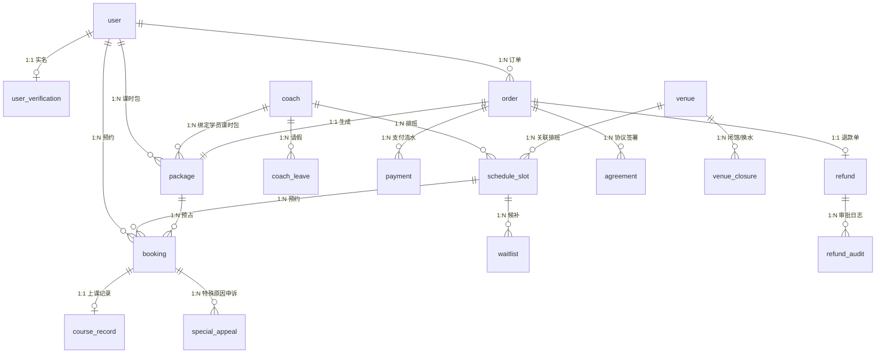

# 【乐游】游泳约课系统 - 身份模型与套餐规范（最终版）

> **本文件性质**：身份与套餐主题的最终落档规范，自包含，不引用其他文档。
>
> **Phase 标签**：
> - `[MVP]` = MVP（第一阶段）必须实现
> - `[P2]` = 第二阶段实现
> - `[P3]` = 第三阶段实现
> - `[All]` = 全阶段通用规则
>
> **不实现项**（Out of Scope）：固定搭档 / 一对多拼课 / 评价反馈 / 周期预约 / 视频上传 / AI 分析 / 应用内即时通讯 / 营销活动 / 多场馆
>
> **生效优先级**：本文件与未来规则冲突时，以本文件为准。

---

## 1. 概述

### 1.1 文档目的
定义本系统中：
- 用户身份体系（状态机驱动）
- 教练与用户的绑定关系
- 套餐类型、状态、扣减规则
- 数据模型（ERD v0.1）
- 5 项管理端数据看板
- 退款、取消、改约、请假等核心业务规则

### 1.2 适用范围 `[MVP]`
本文档适用于 MVP 范围内的所有用户、教练、管理员相关功能。不涉及多场馆、固定搭档、AI 视频分析等 P2/P3 阶段才实施的能力。

### 1.3 核心设计原则 `[All]`

| 原则 | 含义 |
|------|------|
| **单一数据源** | 身份 = 套餐存在性派生，不存在独立的"用户标签"表 |
| **状态机驱动** | 身份和套餐都通过状态机管理，转换规则集中 |
| **解耦教练绑定** | 用户同时仅 1 名教练（active 套餐约束），但该教练下可多份套餐 |
| **自助式消费** | 取消"续费"概念，改为"购买新套餐"，无前置条件限制 |
| **事件 + 兜底** | 状态变更由应用层事件触发（≤1s），定时任务兜底（≤1h） |

### 1.4 核心概念速览

| 术语 | 定义 |
|------|------|
| **用户** | 注册后的系统使用主体，唯一身份标识为 user_id |
| **教练** | 独立角色账号（与用户不重叠），提供教学服务 |
| **身份** | 游客 / 注册用户 / 学员，由状态机派生 |
| **套餐** | 用户购买的课时包，是身份的"驱动力" |
| **预约** | 用户对教练某时段发起的约课请求 |
| **课时扣减** | 套餐内课时的预占、消耗、释放、回滚操作 |

---

## 2. 用户身份体系

### 2.1 身份类型 `[All]`

系统中存在 **三种用户身份**：

| 身份 | 定义 | 触发条件 | 可访问功能 |
|------|------|----------|-----------|
| **游客** | 未注册访问者 | 未登录 | 浏览公开信息（教练列表、套餐、公告） |
| **注册用户** | 已注册无有效套餐 | 注册成功，0 个 active 套餐 | 注册、实名认证、购课 |
| **学员** | 已注册有有效套餐 | ≥1 个 active 套餐 | 上述 + 预约课程、查看课时、查看记录 |

**关键说明**：
- 游客与注册用户是**互斥**状态（同一时间只能一个）
- 注册用户与学员是**同一主体**的不同状态（可切换）
- 教练是**独立角色**，不与用户身份重叠
- 系统管理员也是独立角色

### 2.2 身份状态机 `[MVP]`

```
                   [注册成功]
[游客] ─────────────────────→ [注册用户] ←──┐
   ↑                                 │      │ [主动注销/封禁/账户失效]
   │                                 │      │
   │                                 │ [购买+支付成功] │ [退订所有 active]
   │                                 ↓      │      ↓
   │                            [学员] ─────┘      │
   │                                 │             │
   │ [全部 active 套餐失效]            │ [新增同教练 active] │
   └─────────── [注册用户] ←──────────┘             │
                                                    │
   [教练切换] 学员 → [退订所有 active] → 注册用户 → [购新教练] → 学员
                                                  (必经中转)
```

**图例**：
- `→` 单向转换
- `[动作]` 触发动作
- 教练切换必经"注册用户"中转，不可直接跳转

### 2.3 转换触发条件 `[MVP]`

| 转换 | 触发动作 | 后置状态 |
|------|----------|----------|
| 游客 → 注册用户 | 微信 OAuth / 手机号注册 | 注册成功 |
| 注册用户 → 学员 | 支付成功 + 创建 package（active）| 身份 = 学员 |
| 学员 → 注册用户 | **所有** active 套餐满足以下任一：<br>① status=refunded（用户发起退款）<br>② status=expired（过期）<br>③ reserved+consumed+available=0 且不在 active 状态 | 身份回退 |
| 学员 → 学员（同教练加课） | 购买该教练的额外套餐 | 身份保持学员，套餐数 +1 |
| 学员 → 注册用户 → 学员（**教练切换**，必经中转） | (1) 退订所有 active 套餐 → (2) 购买新教练套餐 | 身份经"注册用户"中转，**不直接跳转** |
| 学员 → 学员（封禁） | 管理员后台封禁 | 身份保持"学员"标签但所有操作拒绝 |
| 学员 → 学员（主动注销） | 用户主动注销 | 保留订单/套餐历史 90 天，超期匿名化 |
| 学员 → 学员（教练离职） | coach.status 变为"已离职" | 身份保持，提示"绑定教练已离职" |
| 学员 → 学员（套餐耗尽） | 单个 active 套餐 reserved+consumed+available=0 → exhausted | 身份保持（如有其他 active） |
| 注册用户 → 注册用户 | 已购套餐已全部失效 | 保持 |

### 2.4 关键约束 `[MVP]`

- **"有效套餐"** 定义：`package.status = active` AND `(reserved + consumed + available) > 0` AND `now() < expire_at`
- **同一时间仅 1 名教练**：用户购买新套餐时校验"是否已有 active 套餐中包含其他教练"，如有则**强制**先退款
- **退级触发机制（应用层事件 + 定时任务兜底）**：
  - **应用层事件**：package status 变更时（active→exhausted/expired/refunded）通过消息队列（如 Kafka）触发身份重算，事件入队 ≤ 100ms
  - **定时任务兜底**：每小时巡检一次身份视图与 `package` 实际状态差异，修正遗漏（防事件丢失）
  - **最大延迟**：事件路径 ≤ 1 秒，兜底路径 ≤ 1 小时
  - **幂等保证**：身份重算用 `user_id` 作幂等键，重跑结果一致
- **退级不可跳过**：达到退级条件时事件**立即入队**（非阻塞），无需用户操作

### 2.5 退款状态期间身份判定 `[MVP]`

| 订单状态 | package.status | 用户身份 | UI 文案 |
|---------|---------------|---------|---------|
| 已支付-正常 | active | 学员 | "当前有效套餐 N 节" |
| 退款申请中 | active | 学员 | "退款处理中，预计 3-7 工作日到账" |
| 退款审批中 | active | 学员 | "退款处理中，管理员 3 工作日内决定" |
| 争议退款处理中 | active | 学员 | "争议处理中，3 工作日内反馈结果" |
| 已退款 | refunded | 注册用户（如无其他 active 套餐）| "退款已到账，您的套餐已失效" |
| 退款被拒 | active | 学员 | "退款未通过，原因为：{reason}" |

**关键约束**：
- 退款申请提交后，package.status 仍为 active，**直到"已退款"才变**
- 中间状态身份保持"学员"（包未真退），但 UI **必须**显式提示"退款处理中"
- "已退款"触发时，身份重算（异步事件）
- "退款被拒"时，package.status 回 active，身份无变化，UI 提示原因

### 2.6 边界场景处理 `[MVP]`

| 场景 | 处理 | 备注 |
|------|------|------|
| 用户被管理员封禁 | 身份保持"学员"，所有操作拒绝 | 需记录封禁原因和解封时间 |
| 用户主动注销 | 身份冻结，订单/套餐历史保留 90 天 | 90 天后匿名化 |
| 教练离职 | 用户身份保持，提示"绑定教练已离职" | 提供"换教练"快捷入口 |
| 单个套餐耗尽 | status: active → exhausted | 身份按"是否还有其他 active"判定 |
| 套餐过期 | status: active/exhausted → expired | 定时任务触发 |
| 退款完成 | status: active → refunded | 身份重算 |

### 2.7 用户身份相关 Phase 标签汇总

| 能力 | Phase |
|------|-------|
| 微信 OAuth 注册 | `[MVP]` |
| 手机号注册 | `[MVP]` |
| 实名认证 | `[MVP]` |
| 三种身份状态机 | `[MVP]` |
| 状态机事件触发 | `[MVP]` |
| 状态机兜底定时任务 | `[MVP]` |
| 身份被封禁 | `[MVP]` |
| 主动注销 | `[MVP]` |
| 教练离职处理 | `[MVP]` |
| 用户画像分析 | `[P2]` |
| 营销标签（VIP/新用户） | `[P2]` |
| 多端身份同步 | `[P2]` |

---

## 3. 套餐模型

### 3.1 套餐类型 `[MVP]`

| 类型 | 数量约束 | 有效期 | 备注 |
|------|----------|--------|------|
| 体验套餐 | 1 份/用户（active 状态）| 30 天 | 价格较低，1 课时 |
| 正式套餐（一对一） | 多份/用户 | 灵活（购买时选） | 同一教练 |

**套餐扣减规则**：
- **FIFO 自动扣减**：最早 active 套餐先扣，用户预约时**不可手动选套餐**
- 理由：避免用户选过期近的套餐导致其他套餐"卡死"
- **体验课优先级**：先扣体验套餐（因为 30 天过期），再扣正式套餐
- 后期可优化为"用户手动选 + 提示"

### 3.2 套餐状态机 `[MVP]`

```
         [支付成功]
[无] ─────────────→ [active]
                       │
        ┌──────────────┼──────────────┐
        │              │              │
        ↓              ↓              ↓
   [exhausted]    [expired]      [refunded]
   (课时耗尽)     (时间过期)      (用户退款)
        │              │
        └──────┬───────┘
               ↓
           (终态，不再变化)
```

| 状态 | 含义 | 转换触发 |
|------|------|----------|
| active | 有效 | 订单支付成功 |
| **exhausted** | **已耗尽** | **应用层事件：reserved+consumed+available=0 时自动转换** |
| expired | 过期 | 定时任务：expire_at 到期自动 |
| refunded | 已退款 | 退款流程完成 |

**状态终态**：`expired` / `refunded` / `exhausted`（超过 expire_at 后）= 终态，**不再转换**。

### 3.3 套餐字段 `[MVP]`

```
package:
  package_id PK
  user_id FK
  coach_id FK        -- 1 名教练约束
  package_type       -- 0=体验 / 1=正式
  total_hours
  reserved_count
  consumed_count
  available_count    -- = total - reserved - consumed
  expire_at
  status             -- active / exhausted / expired / refunded
  purchased_at
  exhausted_at       -- 耗尽时间（status=exhausted 时填入）
  refunded_at        -- 退款时间（status=refunded 时填入）
```

### 3.4 关键不变量 `[MVP]`

```
# 数量不变量
reserved_count + consumed_count + available_count = total_hours

# 状态不变量
status = active     → (reserved + consumed + available) > 0 AND now() < expire_at
                      AND exhausted_at IS NULL AND refunded_at IS NULL
status = exhausted  → reserved_count + consumed_count = total_hours
                      AND available_count = 0
                      AND exhausted_at IS NOT NULL
status = expired    → now() >= expire_at (或 previous status ∈ {active, exhausted})
status = refunded   → refunded_at IS NOT NULL AND consumed_count 已 freeze

# 状态自动转换（应用层事件 + 定时任务）
active → exhausted: 应用层事件检测 (reserved + consumed + available) = 0 时触发
active → expired:   定时任务每小时巡检，now() >= expire_at
exhausted → expired: 定时任务每小时巡检，now() >= expire_at
任何状态 → refunded: 退款流程

# 教练不变量
用户在任意时刻，所有 active 套餐的 coach_id 必须相同
（exhausted/expired/refunded 状态的套餐不参与约束）

# 体验不变量
package_type = 体验 → 用户名下同类型 active 套餐不超过 1 份
（exhausted/expired 状态的体验课不占用"1 份"名额，可再次购买）
```

### 3.5 体验课特殊规则 `[MVP]`

| 场景 | 行为 |
|------|------|
| 首次购买体验课 | 允许，状态：active，30 天有效 |
| 体验课已 active 状态时再次购买 | 拒绝（"您已有体验套餐"） |
| 体验课耗尽（status=exhausted）| 允许再购（作为"第二次体验"） |
| 体验课过期（status=expired）| 允许再购 |
| 体验课退款（status=refunded）| 允许再购 |

**扣减优先级**：体验套餐 > 正式套餐（先扣体验课，避免过期浪费）。

### 3.6 套餐过期与续期 `[MVP]`

**过期处理**：
- 定时任务每小时巡检 `now() >= expire_at` 的 active/exhausted 套餐
- 状态转换为 expired
- 触发通知："您的 XX 套餐已过期"
- 触发身份重算（如该套餐是最后一个 active，用户退级为注册用户）

**续期处理**（v10 取消"续费"概念）：
- 不再有"续费"按钮
- 用户在套餐过期后/前，可随时购买新套餐
- 新套餐与旧套餐可共存（同一教练下多份 active 套餐合法）
- 购买时选择教练 + 课时数，无前置条件

### 3.7 套餐相关 Phase 标签汇总

| 能力 | Phase |
|------|-------|
| 体验套餐（1 节/30 天）| `[MVP]` |
| 正式套餐（一对一）| `[MVP]` |
| 同教练多份套餐 | `[MVP]` |
| 套餐状态机（active/exhausted/expired/refunded）| `[MVP]` |
| FIFO 自动扣减 | `[MVP]` |
| 体验课优先扣减 | `[MVP]` |
| 套餐过期定时任务 | `[MVP]` |
| 教练切换（先退后买）| `[MVP]` |
| 套餐退款 | `[MVP]` |
| 课时包合并/拆分 | `[P2]` |
| 跨教练套餐 | `[P3]`（当前不实施）|
| 套餐转让 | `[P3]` |

---

## 4. 数据模型（ERD v0.1）

### 4.1 ERD 概览 `[MVP]`



### 4.2 核心实体 `[MVP]`

#### 4.2.1 `user`（注册用户）

| 字段 | 类型 | 索引 | 备注 |
|------|------|------|------|
| user_id | BIGINT PK | UK | 雪花 ID |
| phone | VARCHAR(20) | UK | 手机号（脱敏存储） |
| wechat_openid | VARCHAR(64) | UK | 微信开放 ID |
| nickname | VARCHAR(64) | | 昵称 |
| avatar_url | VARCHAR(255) | | 头像 |
| status | TINYINT | IDX | 0=正常 1=软删除 2=封禁 |
| created_at | DATETIME | IDX | |
| updated_at | DATETIME | | |

#### 4.2.2 `user_verification`（实名认证，1:1）

| 字段 | 类型 | 索引 | 备注 |
|------|------|------|------|
| user_id | BIGINT PK,FK | | |
| real_name_enc | VARCHAR(128) | | AES-256 加密 |
| id_card_enc | VARCHAR(256) | | AES-256 加密 |
| id_card_hash | CHAR(64) | UK | SHA-256 用于唯一性校验 |
| auth_status | TINYINT | | 0=待审核 1=通过 2=驳回 |
| reject_reason | VARCHAR(255) | | |
| submitted_at | DATETIME | | |
| reviewed_at | DATETIME | | |
| reviewer_id | BIGINT FK→admin | | |

#### 4.2.3 `coach`（教练档案，独立角色，与 user 不重叠）

| 字段 | 类型 | 索引 | 备注 |
|------|------|------|------|
| coach_id | BIGINT PK | | |
| phone | VARCHAR(20) | UK | |
| name | VARCHAR(64) | | |
| avatar_url | VARCHAR(255) | | |
| certificates_json | JSON | | 证书列表 |
| years_teaching | INT | | |
| total_students | INT | | |
| total_hours | INT | | |
| intro | TEXT | | |
| rate | DECIMAL(2,1) | | 评分（0-5） |
| price_per_hour | DECIMAL(10,2) | | 课时单价 |
| status | TINYINT | IDX | 0=待审核 1=已通过 2=驳回 3=已离职 |
| created_at | DATETIME | | |

#### 4.2.4 `schedule_slot`（教练排班时段）

| 字段 | 类型 | 索引 | 备注 |
|------|------|------|------|
| slot_id | BIGINT PK | | |
| coach_id | BIGINT FK | IDX | |
| venue_id | BIGINT FK | | |
| start_time | DATETIME | IDX | |
| end_time | DATETIME | | |
| status | TINYINT | IDX | 0=未发布 1=待预约 2=已锁定 3=已预约 4=已关闭 |
| release_at | DATETIME | | 释放到"待预约"的时间 |

#### 4.2.5 `booking`（预约）

| 字段 | 类型 | 索引 | 备注 |
|------|------|------|------|
| booking_id | BIGINT PK | | |
| slot_id | BIGINT FK | IDX | |
| user_id | BIGINT FK | IDX | |
| coach_id | BIGINT FK | | 冗余便于查询 |
| package_id | BIGINT FK | | 关联课时包 |
| status | TINYINT | IDX | 见预约状态机 |
| lock_expire_at | DATETIME | | 锁定中（< 3s）超时 |
| course_type | TINYINT | | 0=体验课 1=正价课 |
| created_at | DATETIME | | |
| updated_at | DATETIME | | |

#### 4.2.6 `package`（课时包，**核心不变量**）

| 字段 | 类型 | 索引 | 备注 |
|------|------|------|------|
| package_id | BIGINT PK | | |
| user_id | BIGINT FK | IDX | |
| coach_id | BIGINT FK | IDX | 同时仅 1 个 active 正价包 |
| order_id | BIGINT FK | | 关联订单 |
| package_type | TINYINT | | 0=体验 1=正式一对一 |
| total_hours | INT | | 总课时 |
| reserved_count | INT | | 预占中 |
| consumed_count | INT | | 已消耗 |
| available_count | INT | | 可用 = total - reserved - consumed |
| expire_at | DATETIME | IDX | |
| status | TINYINT | IDX | active/exhausted/expired/refunded |
| purchased_at | DATETIME | | |
| exhausted_at | DATETIME | | status=exhausted 时填入 |
| refunded_at | DATETIME | | status=refunded 时填入 |

**不变量**：
```
reserved_count + consumed_count + available_count = total_hours  -- 事务内校验
```

#### 4.2.7 `order`（订单）

| 字段 | 类型 | 索引 | 备注 |
|------|------|------|------|
| order_id | BIGINT PK | | |
| user_id | BIGINT FK | IDX | |
| package_id | BIGINT FK | | 生成课时包后回填 |
| coach_id | BIGINT FK | | |
| amount | DECIMAL(10,2) | | |
| course_type | TINYINT | | 0=体验课 1=正价一对一 |
| status | TINYINT | IDX | 见订单状态机 |
| payment_method | TINYINT | | 0=微信 1=支付宝 |
| created_at | DATETIME | | |
| paid_at | DATETIME | | |
| closed_at | DATETIME | | |

#### 4.2.8 `payment`（支付流水，幂等）

| 字段 | 类型 | 索引 | 备注 |
|------|------|------|------|
| payment_id | BIGINT PK | | |
| order_id | BIGINT FK | IDX | |
| idempotency_key | VARCHAR(64) | UK | 订单号 + 操作类型 |
| channel | TINYINT | | 0=微信 1=支付宝 |
| channel_trade_no | VARCHAR(64) | UK | 第三方流水号 |
| amount | DECIMAL(10,2) | | |
| status | TINYINT | | 0=待支付 1=成功 2=失败 3=已退款 |
| paid_at | DATETIME | | |

#### 4.2.9 `refund`（退款单）

| 字段 | 类型 | 索引 | 备注 |
|------|------|------|------|
| refund_id | BIGINT PK | | |
| order_id | BIGINT FK | UK | 1:1 |
| reason | VARCHAR(500) | | |
| amount | DECIMAL(10,2) | | |
| type | TINYINT | | 0=标准 1=争议 |
| status | TINYINT | IDX | 见退款状态机 |
| applicant_id | BIGINT FK→user | | |
| handler_id | BIGINT FK→admin | | |
| created_at | DATETIME | | |
| completed_at | DATETIME | | |

#### 4.2.10 `agreement`（协议签署记录）

| 字段 | 类型 | 索引 | 备注 |
|------|------|------|------|
| agreement_id | BIGINT PK | | |
| user_id | BIGINT FK | IDX | |
| agreement_type | TINYINT | | 0=隐私 1=用户须知 2=健康承诺 3=免责 |
| version | VARCHAR(32) | | 版本号（如 v1, v1.1） |
| signed_at | DATETIME | | |
| ip_address | VARCHAR(45) | | 审计 |

#### 4.2.11 `notice`（首页通知栏）

| 字段 | 类型 | 索引 | 备注 |
|------|------|------|------|
| notice_id | BIGINT PK | | |
| type | TINYINT | | 0=开放 1=换水 2=释放 3=紧急 |
| priority | TINYINT | | 0=普通 1=提醒 2=紧急 |
| title | VARCHAR(64) | | |
| content | TEXT | | |
| visible_scope | VARCHAR(32) | | all / student / coach |
| start_at | DATETIME | | |
| end_at | DATETIME | | |
| created_by | BIGINT FK→admin | | |

#### 4.2.12 `audit_log`（操作日志，append-only）

| 字段 | 类型 | 索引 | 备注 |
|------|------|------|------|
| log_id | BIGINT PK | | |
| actor_type | TINYINT | | 0=user 1=coach 2=admin 3=system |
| actor_id | BIGINT | IDX | |
| action | VARCHAR(64) | IDX | |
| target_type | VARCHAR(32) | | |
| target_id | BIGINT | IDX | |
| before_json | JSON | | |
| after_json | JSON | | |
| ip_address | VARCHAR(45) | | |
| created_at | DATETIME | IDX | |

### 4.3 状态机强制约束 `[MVP]`

```sql
-- 状态机 CHECK 约束（PG 12+/MySQL 8.0.16+ 支持）
ALTER TABLE package ADD CONSTRAINT chk_package_status CHECK (
  (status = 'active'
    AND (reserved_count + consumed_count + available_count) = total_hours
    AND exhausted_at IS NULL
    AND refunded_at IS NULL)
  OR
  (status = 'exhausted'
    AND (reserved_count + consumed_count) = total_hours
    AND available_count = 0
    AND exhausted_at IS NOT NULL)
  OR
  (status = 'expired')
  OR
  (status = 'refunded' AND refunded_at IS NOT NULL)
);

-- 体验套餐全局唯一（PostgreSQL 专用，partial index）
CREATE UNIQUE INDEX idx_user_one_experience 
ON package(user_id) 
WHERE package_type = 0 AND status = 'active';

-- MySQL 兼容方案：应用层唯一性校验
-- 事务中执行：
--   SELECT COUNT(*) AS cnt FROM package 
--   WHERE user_id = ? AND package_type = 0 AND status = 'active' FOR UPDATE;
--   若 cnt > 0 则拒绝购买并返回"您已有体验套餐"

-- 单教练约束（应用层校验，DB 仅索引辅助）
CREATE INDEX idx_user_active_coach 
ON package(user_id, coach_id) 
WHERE status = 'active';

-- 状态转换触发（应用层事件 + 定时任务，不在 DB 层）
-- 1. 应用层事件: package status 变更 → 消息队列 → 异步重算 v_user_status
-- 2. 定时任务: 每小时巡检 active → exhausted 和 active/exhausted → expired
```

### 4.4 身份状态视图 `[MVP]`

```sql
CREATE OR REPLACE VIEW v_user_status AS
SELECT
    u.user_id,
    CASE
        WHEN COUNT(p.package_id) > 0 THEN 1  -- 学员
        ELSE 0                                -- 注册用户
    END AS status,
    COUNT(p.package_id) AS active_package_count,
    MAX(p.updated_at) AS last_status_change_at
FROM user u
LEFT JOIN package p
    ON u.user_id = p.user_id
    AND p.status = 'active'
    AND p.expire_at > NOW()
    AND (p.reserved_count + p.consumed_count) < p.total_hours
GROUP BY u.user_id;
```

**视图字段说明**：
- `user_id`: BIGINT
- `status`: TINYINT（0=注册用户 1=学员）
- `active_package_count`: INT（当前 active 套餐数）
- `last_status_change_at`: DATETIME（最后状态变更时间）

### 4.5 性能优化 `[P2]`

```sql
-- 物化视图（数据量 > 10w 用户时启用）
CREATE MATERIALIZED VIEW mv_user_status AS SELECT ... ;  -- 同 v_user_status 结构
REFRESH MATERIALIZED VIEW CONCURRENTLY mv_user_status;  -- 每小时刷新
```

### 4.6 数据模型相关 Phase 标签汇总

| 能力 | Phase |
|------|-------|
| 12 个核心实体 | `[MVP]` |
| 状态机 CHECK 约束 | `[MVP]` |
| 身份状态视图 | `[MVP]` |
| 物化视图 | `[P2]` |
| 跨表分库分表 | `[P3]` |
| 多租户数据隔离 | `[P3]` |

---

## 5. 数据看板

### 5.1 5 项看板一览 `[MVP]`

| # | 看板名称 | 图表类型 | 刷新频率 | 数据源 |
|---|---------|----------|----------|--------|
| 1 | 游泳高峰期 | 折线图（24h 分布） | 每小时 | v_booking_hourly |
| 2 | 学习游泳高峰期 | 折线图（24h 分布） | 每小时 | v_booking_hourly |
| 3 | 每月总课时 + 各教练课时 | 柱状图 | 每日 | course_record |
| 4 | 教练评分 | 排行榜 | 每日 | coach.rate |
| 5 | 学员画像 | 饼图（多维度） | 每日 | v_user_status + user |

### 5.2 看板指标 SQL 草案 `[MVP]`

**指标 1: 游泳高峰期（体验课）**

```sql
SELECT 
    HOUR(b.start_time) AS hour_of_day,
    COUNT(*) AS booking_count
FROM booking b
WHERE b.start_time BETWEEN ? AND ?
    AND b.status IN (3, 4, 5)  -- 已预约/上课中/已完成
    AND b.course_type = 0       -- 体验课
GROUP BY HOUR(b.start_time)
ORDER BY hour_of_day;
```

**指标 2: 学习游泳高峰期（正价课）**

```sql
SELECT 
    HOUR(b.start_time) AS hour_of_day,
    COUNT(*) AS booking_count
FROM booking b
WHERE b.start_time BETWEEN ? AND ?
    AND b.status IN (3, 4, 5)
    AND b.course_type = 1       -- 正价课
GROUP BY HOUR(b.start_time)
ORDER BY hour_of_day;
```

**指标 3: 每月总课时 + 各教练课时**

```sql
SELECT
    DATE_FORMAT(p.consumed_at, '%Y-%m') AS month,
    c.coach_id,
    c.name,
    SUM(cr.hours) AS total_hours
FROM course_record cr
JOIN booking b ON cr.booking_id = b.booking_id
JOIN package p ON b.package_id = p.package_id
JOIN coach c ON b.coach_id = c.coach_id
WHERE cr.completed_at BETWEEN ? AND ?
GROUP BY month, c.coach_id;
```

**指标 4: 教练评分**

```sql
SELECT
    coach_id,
    name,
    rate,
    total_students,
    total_hours
FROM coach
WHERE status = 1  -- 已通过
ORDER BY rate DESC
LIMIT 50;
```

**指标 5: 学员画像（5 子指标）**

```sql
-- 5.1 学员总数
SELECT 
    DATE(last_status_change_at) AS date,
    COUNT(*) AS student_count
FROM v_user_status
WHERE status = 1
GROUP BY DATE(last_status_change_at)
ORDER BY date DESC;

-- 5.2 学员 vs 注册用户 转化漏斗
SELECT 
    '已注册' AS stage, COUNT(*) AS cnt FROM user
UNION ALL
SELECT 
    '有 active 套餐' AS stage, COUNT(*) AS cnt FROM v_user_status WHERE status = 1
UNION ALL
SELECT 
    '有 2 份+ 套餐' AS stage, COUNT(*) AS cnt FROM v_user_status WHERE active_package_count >= 2;

-- 5.3 学员持套餐数分布
SELECT 
    active_package_count, COUNT(*) AS user_count
FROM v_user_status
WHERE status = 1
GROUP BY active_package_count
ORDER BY active_package_count;

-- 5.4 单教练下学员分布（top 10）
SELECT 
    c.coach_id, c.name, 
    COUNT(DISTINCT p.user_id) AS student_count
FROM coach c
JOIN package p ON c.coach_id = p.coach_id
WHERE p.status = 'active' AND p.expire_at > NOW()
GROUP BY c.coach_id, c.name
ORDER BY student_count DESC
LIMIT 10;

-- 5.5 体验套餐 vs 正式套餐 占比
SELECT 
    CASE WHEN package_type = 0 THEN '体验套餐' ELSE '正式套餐' END AS type,
    COUNT(*) AS package_count,
    SUM(total_hours) AS total_hours_sum
FROM package
WHERE status = 'active' AND expire_at > NOW()
GROUP BY package_type;
```

### 5.3 看板相关 Phase 标签汇总

| 能力 | Phase |
|------|-------|
| 5 项基础看板 | `[MVP]` |
| 看板导出 CSV | `[MVP]` |
| 看板权限管理 | `[MVP]` |
| 高级数据分析 | `[P2]` |
| AI 趋势预测 | `[P3]` |
| 实时大屏 | `[P3]` |

---

## 6. 业务规则

### 6.1 退款规则 `[MVP]`

#### 6.1.1 退款触发场景

| 触发方 | 场景 | 处理 |
|--------|------|------|
| 用户 | 主动申请退款 | 标准退款流程 |
| 用户 | 24h 内取消被教练拒绝 + 特殊原因申诉 | 争议退款流程（3 工作日内处理）|
| 教练 | 课程质量问题 / 教练请假导致课程取消 | 触发自动退款 |
| 平台 | 场馆闭馆 / 教练离职 / 系统异常 | 强制退款 |
| 管理员 | 订单异常审核 | 强制退款 |

#### 6.1.2 退款金额计算

```
可退金额 = 套餐价 × (未消耗课时 / 总课时)
        = 套餐价 × (available + reserved) / total_hours
其中：
  - available: 可用课时
  - reserved: 预占中（退款申请时全部释放）
  - consumed: 已消耗（不参与退款）
```

#### 6.1.3 退款手续费 `[MVP]`

**MVP 阶段暂不收取任何手续费**：

| 触发原因 | 退款时点 | 手续费 |
|---------|---------|--------|
| 学员个人原因 | 任意 | **0** |
| 教练原因 | 任意 | **0** |
| 平台原因（场馆闭馆 / 教练离职）| 任意 | **0** |

**系统行为**：
- **不弹窗**提示手续费
- 退款金额 = 套餐价 × 未消耗课时比例
- 客服在退款审批中**可手动调整金额**，但**不**强制手续费

**未来启用**：如需启用手续费，需先修改本节档位表 → 在管理端开启开关 → 法务审核 → 通过《用户须知》变更通知所有用户。

#### 6.1.4 退款到账时效

- 微信支付 / 支付宝**原路退回**
- 时效：**3-7 工作日**（v10 沿用行业标准）

### 6.2 取消与改约 `[MVP]`

#### 6.2.1 取消时间窗

| 距开课时间 | 规则 |
|-----------|------|
| ≥ 24h | 用户可自由取消，预占课时直接释放（无需教练审批）|
| < 24h | 需教练审批（24h 内未处理视为拒绝）|
| < 2h（特殊原因）| 用户可在预约详情页提交"特殊原因申诉"（必填原因 + 证明材料）|

#### 6.2.2 特殊原因申诉（24h 内被拒后）

```
[学员 24h 内发起取消]
    ↓
    ├─ 提交申请 → 进入 [待教练审批 24h]
    │     ├─ 教练同意 → 释放课时 ✓
    │     ├─ 教练拒绝 → 状态保持 [已预约]
    │     └─ 教练超时 → 视为拒绝
    │
    └─ [被教练拒绝/超时] 后，学员可在 2h 阈值（默认 2h，后台可配置）内
       在「预约详情页」提交"特殊原因申诉"（必填原因 + 证明材料）
       → 进入 [争议退款处理中]
       → 管理员 3 工作日内决定
```

**关键约束**：
- 3 条机制**串行触发**，不互斥
- "特殊原因申诉"仅在教练拒绝/超时**之后**才能发起，不能跳过教练审批
- 24h 外取消**不进入**此流程，直接释放课时

### 6.3 请假处理 `[MVP]`

| 请假方 | 触发 | 处理 |
|--------|------|------|
| 学员 | 学员请假 | 走 6.2 取消流程 |
| 教练 | 教练请假 | 系统自动取消课程 + 释放预占 + 通知学员改约 |
| 场馆 | 场馆闭馆 / 换水 | 系统自动取消课程 + 释放预占 + 通知学员改约 |

**关键约束**：
- 教练请假和换水都是**主动取消**，预占必须**释放**
- "保留"操作**不进入**自动化流程，仅管理员手动延期时使用

### 6.4 教练切换 `[MVP]`

教练切换是必经"注册用户"中转的两步操作：

```
[学员想换教练]
    ↓
[1. 退订当前教练的所有 active 套餐]
    → 触发身份重算 → 退级为"注册用户"
    ↓
[2. 购买新教练的套餐]
    → 触发身份重算 → 升级为"学员"
```

**关键约束**：
- 退订 + 购买**不并发**，用户必须二选一
- 不允许"过渡期"（同时持有 2 名教练的 active 套餐）
- 换教练的退款按 6.1 退款规则

### 6.5 套餐续期 `[MVP]`

- **不再有"续费"按钮**（v10 取消该概念）
- 用户在套餐过期前/后，可随时"购买新套餐"
- 新套餐与旧套餐可共存（同一教练下多份 active 套餐合法）
- 购买时选择教练 + 课时数，无前置条件

### 6.6 业务规则相关 Phase 标签汇总

| 能力 | Phase |
|------|-------|
| 标准退款流程 | `[MVP]` |
| 退款金额计算 | `[MVP]` |
| 退款手续费（暂不收）| `[MVP]` |
| 24h 取消 + 教练审批 | `[MVP]` |
| 特殊原因申诉 | `[MVP]` |
| 教练请假处理 | `[MVP]` |
| 场馆闭馆处理 | `[MVP]` |
| 教练切换 | `[MVP]` |
| 套餐续期（购买新套餐）| `[MVP]` |
| 周期性预约 | `[P2]` |
| 转赠套餐 | `[P3]` |
| 套餐合并/拆分 | `[P2]` |

---

## 7. 决策清单

### 7.1 MVP 阶段决策 `[MVP]`

| 编号 | 决策 | 状态 |
|------|------|------|
| D1 | 用户身份 = 状态机（游客/注册用户/学员），无独立标签表 | **新增** |
| D2 | 学员身份 = 至少 1 个有效套餐 | **新增** |
| D3 | 退级条件 = 所有 active 套餐都失效 | **新增** |
| D4 | 同时仅 1 名教练 | **保留** |
| D5 | 同教练可多份套餐 | **新增** |
| D6 | 体验套餐仅 1 份（active 状态，耗尽/过期后允许再购）| **新增** |
| D7 | 取消"续费"概念，改为"购买新套餐" | **新增** |
| D8 | 换教练必经"注册用户"中转（先退旧 → 购新）| **新增** |
| D9 | 体验课耗尽/过期后允许再购 | **新增** |
| D10 | 套餐扣减 FIFO 自动，体验课优先 | **新增** |
| D11 | 套餐状态机 = active → exhausted → expired（终态）/ refunded | **新增** |
| D12 | 退级双机制（应用层事件 ≤ 1s + 定时任务兜底 ≤ 1h）| **新增** |
| D13 | 退款中间状态保持"学员"，UI 显式提示"处理中" | **新增** |
| D14 | 24h 内取消需教练审批，超时视为拒绝 | **保留** |
| D15 | 2h 阈值（特殊原因申诉，后台可配置）| **新增** |
| D16 | 特殊原因申诉 → 争议退款 → 管理员 3 工作日处理 | **新增** |
| D17 | 退款原路退回，3-7 工作日 | **保留** |
| D18 | MVP 不收取退款手续费 | **新增** |
| D19 | 套餐可包含 6/8/10/自定义课时 | **保留** |
| D20 | 实名认证后方可预约与购课 | **保留** |
| D21 | 12 个核心实体（无 user_tag 表）| **新增** |
| D22 | 5 项管理端数据看板 | **新增** |
| D23 | 教练请假 → 自动取消 + 释放预占 + 通知改约 | **新增** |
| D24 | 套餐过期前 7 天通知用户 | **保留** |
| D25 | 套餐过期后保留历史 90 天 | **保留** |

### 7.2 第二阶段决策 `[P2]`

| 编号 | 决策 |
|------|------|
| P2-D1 | 引入"用户标签"体系（VIP/新用户/老带新资格等营销标签）|
| P2-D2 | 物化视图 mv_user_status 启用（数据量 > 10w 时）|
| P2-D3 | 高级数据分析（续费率、转化漏斗深度分析）|
| P2-D4 | 周期性预约 / 固定课程 |
| P2-D5 | 退款 / 退课流程自动化（含手续费档位）|
| P2-D6 | 发票 / 收据管理 |
| P2-D7 | 教练绩效与收入结算 |
| P2-D8 | 评价与反馈闭环 |
| P2-D9 | 学员等级与能力评估体系 |
| P2-D10 | 课时包合并/拆分 |
| P2-D11 | AI 数据查询助手 |
| P2-D12 | 多端身份同步 |

### 7.3 第三阶段决策 `[P3]`

| 编号 | 决策 |
|------|------|
| P3-D1 | 固定搭档 / 一对多拼课 |
| P3-D2 | AI 视频动作分析 |
| P3-D3 | 学员画像与教练推荐 |
| P3-D4 | 营销裂变（老带新、拼团、优惠券）|
| P3-D5 | 社区 / 打卡 / 内容库 |
| P3-D6 | 物联网硬件联动（闸机、手环、智能柜）|
| P3-D7 | 多场馆支持 |
| P3-D8 | 跨教练套餐 |
| P3-D9 | 套餐转赠 |
| P3-D10 | 多租户数据隔离 |

---

## 8. 变更日志

| 版本 | 日期 | 变更 |
|------|------|------|
| v1.0 | 2026-07-28 | 初版：身份与套餐规范（自包含最终版） |
| v1.1 | 2026-07-28 | 修复：补充 exhausted 状态、退款身份矩阵、教练切换中转、看板 SQL、FIFO 扣减、MySQL 兼容方案、状态机 CHECK 约束 |
| v1.2 | 2026-07-28 | 规范化：参考 v7 格式，加 MVP/P2/P3 Phase 标签，自包含（不引用其他文档）|

---

## 附录 A 待您审阅确认事项

| 编号 | 待确认 | 涉及章节 | 建议裁决 |
|------|--------|---------|----------|
| Q1 | exhausted 状态是否保留（vs 直接转 expired） | §3.2/3.4 | **保留**（区分"耗尽"和"过期"两种终态） |
| Q2 | 退级兜底定时任务间隔（1h vs 30min） | §2.4 | 建议 1h（v10 默认） |
| Q3 | 教练切换必经"中转"是否需要 UI 提示 | §2.3 | 建议"先退款 → 看到'正在换教练'loading → 购买新教练" |
| Q4 | 套餐扣减 FIFO 是否需要"到期优先" | §3.1 | 建议体验课先扣（30 天过期） |
| Q5 | 营销话术如何调整（取消"续费"后）| §3.6 | 建议"再购一份"、"加量"、"同教练加课" |
| Q6 | 物化视图启用阈值（10w vs 50w）| §4.5 | 建议 10w（保守估计） |

---

## 附录 B 术语表

| 术语 | 英文 | 含义 |
|------|------|------|
| 游客 | Visitor | 未注册访问者 |
| 注册用户 | Registered User | 已注册，0 个 active 套餐 |
| 学员 | Student | 已注册，≥1 个 active 套餐 |
| 套餐 | Package | 用户购买的课时包 |
| 体验套餐 | Experience Package | 1 节/30 天的特价套餐 |
| 正式套餐 | Regular Package | 一对一课时包 |
| 预约 | Booking | 用户对教练时段的约课 |
| 候补 | Waitlist | 时段满员后排队 |
| 课时预占 | Reserve | 预约成功时锁定 1 节课时 |
| 课时消耗 | Consume | 课程完成时扣除 1 节课时 |
| 课时释放 | Release | 取消/退款时释放预占课时 |
| 退级 | Demote | 学员 → 注册用户 |
| 升级 | Promote | 注册用户 → 学员 |
| 状态机 | State Machine | 状态转换规则集合 |
| 物化视图 | Materialized View | 预计算并存储的视图 |
| 幂等键 | Idempotency Key | 防重复操作的唯一标识 |

---

**文档结束**
