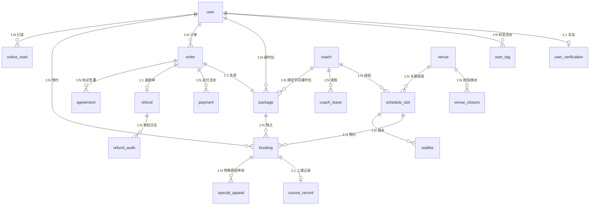

# 【乐游】游泳约课系统 - v9 闭环补充（PRD Closure）

> 本文件是 `readme_v7.md` + `readme_v8_mvp_supplement.md` 的闭环补丁，专门解决 v7/v8 审计中暴露的 **8 处规则冲突** 与 **3 类缺失产物**。
>
> **使用顺序**：v7 §1-10 → v8 §1-11 → **v9（本文）** → 启动 §9 SDD 工作流第 [1] 步。
>
> **不修改**：v7 任何已确认决策（70 条）、v8 §1-9 范围冻结 / 状态机 / 课时模型。
> **仅在确有冲突时**以"v9 裁决"覆盖并标注 `supersedes`，被覆盖条款在 v7/v8 中保留原文并加 `[v9 覆盖]` 角标。

---

## 0. 变更说明

| 新增 | 章节 | 用途 |
|------|------|------|
| 8 处规则冲突澄清 | §1 | 给出 v9 唯一裁决，结束 v7/v8 内部不一致 |
| ERD v0.1 | §2 | 13 个核心实体的字段、外键、不变量；§9 第 [3] 步 plan.md 必备 |
| 5 项数据看板定义 | §3 | v8 §9.3 第 17 项"5 项基础"的具体内容与 SQL 草案 |
| 退款手续费规则 | §4 | 覆盖 v7 决策 4 + v8 §3 的规则缺口 |
| 启动 §9 前置条件清单 | §5 | 进入 SDD 工作流前必须勾选的事项 |
| v6→v7 废弃条款墓碑 | 附录 A | 防止后续开发误用 v6 已被 v7 否决的条款 |
| v9 变更日志 | 附录 B | 版本管理 |

---

## 1. 8 处规则冲突澄清

> 每条统一格式：**问题 → v7/v8 表述 → 冲突性质 → v9 裁决 → 回填位置 → 标注 [待您审阅确认]**。

### C1 — 24h 内取消的三条机制边界（资金风险 ⭐⭐⭐）

**问题**：24h 内取消涉及 3 条独立规则，存在重复触发风险。

| 来源 | 规则 |
|------|------|
| v7 §4.4.2(9) | 24h 内取消需教练审批，超时视为拒绝 |
| v7 §4.4.2(9) + 决策 61 | 开课前 N 小时（如 2h）可提交"特殊原因取消"工单 |
| v8 §10.1 | 24h 内取消被教练拒绝 → "申请客服介入" |

**v9 裁决**：

```
[学员 24h 内发起取消]
    ↓
    ├─ 提交申请 → 进入 [待教练审批 24h]（v7 §4.4.2(9)）
    │     ├─ 教练同意 → 释放课时（v7 决策 35）✓
    │     ├─ 教练拒绝 → 状态保持 [已预约]（v7 决策 19）✓
    │     └─ 教练超时 → 视为拒绝（v7 决策 19）✓
    │
    └─ [被教练拒绝/超时] 后，学员可在 2h 阈值（v7 决策 61，默认 2h，后台可配置）内
       在「预约详情页」提交"特殊原因申诉"（必填原因 + 证明材料，v8 §10.1）
       → 进入 [争议退款处理中]（v8 §5 订单状态机）
       → 管理员 3 工作日内决定（v7 决策 27）
```

**关键约束**：
- 3 条机制**串行触发**，不互斥
- "特殊原因申诉"仅在教练拒绝/超时**之后**才能发起，不能跳过教练审批
- 24h 外取消**不进入**此流程，直接释放课时（v7 §4.4.2(9)）

**回填位置**：v7 §4.4.2(9) 末尾补"24h 内取消的完整流程按 v9 §C1 执行"；v8 §10.1 表格第 5 行已覆盖，本节不重复。

**标注**：[待您审阅确认] 2h 阈值是否合适？后台可配置但需要默认值。

---

### C2 — 预占课时在请假 / 换水 / 过期场景的处理

**问题**：预占课时在 3 个场景下的处理不一致。

| 来源 | 规则 |
|------|------|
| v7 §6.7 教练请假 | 自动取消课程，发送通知给学员，学员可改约或保留 |
| v8 §6.4 教练请假行 | ✅ 释放预占 |
| v8 §11.3 套餐过期 | 已预占的预约 → 通知改约或保留 |
| v8 §4 预约状态机 | "已取消-教练请假" = 否（已释放） |

**冲突点**：v7 说"改约或保留"，v8 说"释放"。两者矛盾。

**v9 裁决**（与 v8 §6.4 表格一致）：

| 场景 | 预占处理 | 已发送通知学员的操作 | 备注 |
|------|----------|---------------------|------|
| 教练请假（审批通过） | ✅ **释放** | 通知改约到其他时段 | v7 §6.7 "保留" = 误写，v9 覆盖 |
| 场馆闭馆 / 换水 | ✅ **释放** | 通知改约 | v8 §11.3 已隐含 |
| 套餐过期 | 全部 `reserved` → 释放 | 通知续费 | v8 §6.4 表格"套餐过期"行 |

**关键约束**：
- 教练请假和换水都是**主动取消**，预占必须释放
- "保留"仅在**管理员手动延期**（v8 §11.3 异常情况）场景下使用，不进入自动化流程

**回填位置**：v7 §6.7 流程图改为"系统自动取消课程 + 释放预占课时 + 通知学员改约"；v8 §11.3 删除"保留"操作。

**标注**：[v9 覆盖 v7 §6.7 "保留"选项]

---

### C3 — 退款时 `reserved` 课时是否计入已消耗

**问题**：v8 §6.5 退款公式 `可退 = P × (T-C) / T` 中 C 包含"reserved 已扣部分"，但 reserved 在订单退款时如何处理未明示。

**v9 裁决**：

```
[学员发起退款申请] ← 订单状态：[已支付-正常]
    ↓
[系统扫描该订单关联的预约]
    ├─ 存在 reserved 预约（未开始 / 上课中 / 待确认）
    │   └─ 全部预约状态变更为 [已取消-退款]（v8 §4 新增状态）
    │   └─ 预占课时 → 释放（reserved_count -1, available_count +1）
    │   └─ 预占释放**不计**入"已消耗" C
    │
    └─ 退款公式：C = 已 consumed 课时（含旷课自动扣 + 教练确认扣）
                  可退金额 = P × (T - C) / T
                  = P × (available + reserved) / T   ← reserved 此时已释放回 available
```

**关键约束**：
- reserved 释放是**退款的前置条件**，不参与"已消耗"计算
- 退款金额 = 套餐价 × 未消耗课时比例
- 退款后课时包 status = `refunded`（v8 §6.5）
- 退款不自动撤销**已 consumed** 的课时（v8 §5.3）

**回填位置**：v8 §6.5 增补"§6.5.1 退款时预占释放规则"，引用本节。

**标注**：[v9 覆盖 v8 §6.5 公式隐含假设]

---

### C4 — "已支付-正常"是否打"学员"标签

**问题**：

| 来源 | 规则 |
|------|------|
| v7 决策 11 | 体验课不获得"学员"标签 |
| v7 决策 56 | 拼课订单支付成功但仍在"拼课中"时，用户为普通注册用户 |
| v7 决策 60 | 同时仅可绑定一名教练 |
| v8 §5 订单状态机 | "已支付-正常" → 全部课时消耗完毕 → "已完成-已消耗" |

**冲突点**：拼课订单 vs 普通订单的"学员"标签时机。

**v9 裁决**：

| 订单类型 | 支付成功后状态 | 标签 | 备注 |
|---------|--------------|------|------|
| 体验课订单 | 已支付-正常 | **体验用户**（v7 决策 11） | 可预约对应教练体验课 |
| 正价一对一订单 | 已支付-正常 | **学员**（v7 决策 60） | 可预约绑定教练正课 |
| 正价一对多"固定搭档"订单 | **拼课中** | **不获得**学员标签 | 双方确认后变"拼课完成" → 学员标签 |
| 正价一对多"不固定搭档"订单 | 已支付-正常 | 学员 | v7 §6.5.1 不固定搭档无"拼课中"状态 |

**关键约束**：
- 拼课中状态的订单（v7 决策 56）= 学员标签**暂不发放**，与 v7 决策 60 不冲突（"绑定"动作未完成）
- MVP 不支持"固定搭档"（v8 §1），故 v9 仅文档化裁决，**不在 MVP 实施**

**回填位置**：v8 §5 订单状态机"已支付-正常"补充标签规则表。

**标注**：[v9 文档化，不影响 MVP 实施]

---

### C5 — 续费 vs 换教练的并发场景

**问题**：

| 来源 | 规则 |
|------|------|
| v7 决策 42 | 换教练需退掉剩余未上课时 |
| v8 §11.2 | 续费判定 = 同一教练 + 上一份已用完/退款/过期 |

**冲突点**：用户想"原教练续费" vs "换教练"的并发冲突。

**v9 裁决**（决策树）：

```
[用户在"我的套餐"页面]
    ↓
[判断当前是否有有效课时包]
    ├─ 有（reserved + consumed + available > 0）
    │   └─ 按钮显示：
    │       - 「续费」（仅当 status = active 且 consumed + reserved = total → 满课）
    │       - 「退款」（任何时候都可申请）
    │       - 「更换教练」（先退款，按 v7 决策 42 走退款流程）
    │
    └─ 无（已退款 / 过期 / 全部消耗）
        └─ 按钮显示：
            - 「续费」→ 默认带入原教练 + 上一份泳姿/人数/课时（可改）
            - 「换教练」→ 进入套餐购买页，选择新教练
```

**关键约束**：
- 续费和换教练**不并发**，用户必须二选一
- 续费仅在"上一份已用完/退款/过期"时触发（v8 §11.2）
- 换教练必须先退款（v7 决策 42）

**回填位置**：v8 §11.2 续费流程表增加"换教练分支"。

**标注**：[v9 明确化，无规则变更]

---

### C6 — 通知场景 12 依赖应用内通讯（IM 是 P2 的死锁）

**问题**：v7 §5.2 通知场景 12 = "应用内即时通讯新消息提醒"；v8 §3 Out of Scope 把 5.3 IM 列为 P2。

**v9 裁决**：

| 通知场景 | v7 §5.2 编号 | v9 处理 |
|---------|-------------|---------|
| 课前提醒、订单状态、签到、释放倒计时等 11 项 | 1-11, 13-16 | MVP 保留 |
| **应用内即时通讯新消息提醒** | 12 | **v9 降级为 P2**（随 IM 系统一并实现） |

**关键约束**：
- v7 §5.2 场景 12 文字保留，但加"v9 降级 P2，需待应用内通讯实现后生效"
- MVP 阶段 IM 相关通知用**微信群 + 短信**替代（v8 §5 通知渠道 MVP 已包含）

**回填位置**：v7 §5.2 场景 12 末尾加 "[v9 P2]"，引用本节。

**标注**：[v9 覆盖 v7 §5.2 场景 12 在 MVP 范围]

---

### C7 — 5 项数据看板的具体内容

**问题**：v7 §4.6.6 列 10 项，v8 §9.3 第 17 项说"5 项基础"，**具体哪 5 项未明**。

**v9 裁决**：MVP 5 项看板 = 下面 5 项（详见 §3）：

1. 游泳高峰期（按时段/天/周/月分布）
2. 学习游泳高峰期
3. 每月总课时 + 各教练课时
4. 教练评分
5. 学员画像（基础版：性别/年龄/泳姿/消费）

**未入选 MVP**（P2 推迟）：v7 §4.6.6(6)-(10) = 时段人数分布、续费率、释放数据、教练实时状态、预约卡片数据。

**回填位置**：v8 §9.3 第 17 项改为"5 项基础指标 = v9 §3.1"。

**标注**：[v9 明确化，§3 给完整定义]

---

### C8 — 退款手续费规则

**问题**：v7 决策 4 = "若涉及手续费，系统需明确提示"；v8 §3 = "MVP 阶段由客服手动判断"。**核心规则缺失**。

**v9 裁决**：

**MVP 退款手续费规则（v9 §4 完整定义）**：
- MVP 阶段**暂不收取**任何手续费
- 系统**不弹窗**提示手续费
- 客服在退款审批中可手动调整金额（但**不**强制手续费）
- 如需启用手续费，需先修改 v9 §4 后再上线

**回填位置**：v7 决策 4 补注"MVP 阶段按 v9 §4 执行，暂不收取"；v8 §3 "退款手续费自动计算"条目改"由客服手动判断"为"MVP 阶段暂不启用，参见 v9 §4"。

**标注**：[v9 明确 MVP 不收取，避免 v7 决策 4 与 v8 §3 矛盾]

---

## 2. ERD v0.1（数据模型）

> 与 v8 §6.2 课时包字段对齐；新增 MVP 必须的实体（之前散落提及但未建模）。

### 2.1 ERD 概览（Mermaid）



### 2.2 实体清单（13 个核心实体）

#### 2.2.1 `user`（注册用户）

| 字段 | 类型 | 索引 | 备注 |
|------|------|------|------|
| user_id | BIGINT PK | UK | 雪花 ID |
| phone | VARCHAR(20) | UK | 手机号（脱敏存储） |
| wechat_openid | VARCHAR(64) | UK | 微信开放 ID |
| nickname | VARCHAR(64) | | 昵称 |
| avatar_url | VARCHAR(255) | | 头像 |
| status | TINYINT | IDX | 0=正常 1=软删除 2=封禁 |
| created_at | DATETIME | IDX | |
| updated_at | DATETIME | | |

#### 2.2.2 `user_verification`（实名认证，1:1）

| 字段 | 类型 | 索引 | 备注 |
|------|------|------|------|
| user_id | BIGINT PK,FK | | |
| real_name_enc | VARCHAR(128) | | AES-256 加密 |
| id_card_enc | VARCHAR(256) | | AES-256 加密 |
| id_card_hash | CHAR(64) | UK | SHA-256 用于唯一性校验 |
| auth_status | TINYINT | | 0=待审核 1=通过 2=驳回 |
| reject_reason | VARCHAR(255) | | |
| submitted_at | DATETIME | | |
| reviewed_at | DATETIME | | |
| reviewer_id | BIGINT FK→admin | | |

#### 2.2.3 `user_tag`（标签流水，append-only）

| 字段 | 类型 | 索引 | 备注 |
|------|------|------|------|
| tag_id | BIGINT PK | | |
| user_id | BIGINT FK | IDX | |
| tag_type | VARCHAR(32) | IDX | experience(体验用户) / student(学员) |
| source_order_id | BIGINT FK→order | | 触发来源订单 |
| expire_at | DATETIME | IDX | 体验用户 = 30 天；学员 = 课时包 expire_at |
| added_at | DATETIME | | |
| removed_at | DATETIME | | 移除时填入，**不物理删除** |

> 不变量：user_tag 永不 UPDATE，只 INSERT + UPDATE removed_at。便于回溯历史。

#### 2.2.4 `coach`（教练档案，独立角色，与 user 不重叠）

| 字段 | 类型 | 索引 | 备注 |
|------|------|------|------|
| coach_id | BIGINT PK | | |
| phone | VARCHAR(20) | UK | |
| name | VARCHAR(64) | | |
| avatar_url | VARCHAR(255) | | |
| certificates_json | JSON | | 证书列表 |
| years_teaching | INT | | |
| total_students | INT | | |
| total_hours | INT | | |
| intro | TEXT | | |
| rate | DECIMAL(2,1) | | 评分（0-5） |
| price_per_hour | DECIMAL(10,2) | | 课时单价 |
| status | TINYINT | IDX | 0=待审核 1=已通过 2=驳回 3=已离职 |
| created_at | DATETIME | | |

#### 2.2.5 `schedule_slot`（教练排班时段）

| 字段 | 类型 | 索引 | 备注 |
|------|------|------|------|
| slot_id | BIGINT PK | | |
| coach_id | BIGINT FK | IDX | |
| venue_id | BIGINT FK | | |
| start_time | DATETIME | IDX | |
| end_time | DATETIME | | |
| status | TINYINT | IDX | 0=未发布 1=待预约 2=已锁定 3=已预约 4=已关闭 |
| release_at | DATETIME | | 释放到"待预约"的时间 |

#### 2.2.6 `booking`（预约）

| 字段 | 类型 | 索引 | 备注 |
|------|------|------|------|
| booking_id | BIGINT PK | | |
| slot_id | BIGINT FK | IDX | |
| user_id | BIGINT FK | IDX | |
| coach_id | BIGINT FK | | 冗余便于查询 |
| package_id | BIGINT FK | | 关联课时包 |
| status | TINYINT | IDX | 与 v8 §4 预约状态机对齐 |
| lock_expire_at | DATETIME | | 锁定中（< 3s）超时 |
| course_type | TINYINT | | 0=体验课 1=正价课 |
| created_at | DATETIME | | |
| updated_at | DATETIME | | |

#### 2.2.7 `package`（课时包，**MVP 核心不变量**）

| 字段 | 类型 | 索引 | 备注 |
|------|------|------|------|
| package_id | BIGINT PK | | |
| user_id | BIGINT FK | IDX | |
| coach_id | BIGINT FK | IDX | MVP 同时仅 1 个有效正价包（v7 决策 60） |
| order_id | BIGINT FK | | 关联订单 |
| total_hours | INT | | 总课时 |
| reserved_count | INT | | 预占中 |
| consumed_count | INT | | 已消耗 |
| available_count | INT | | 可用 = total - reserved - consumed |
| expire_at | DATETIME | IDX | |
| status | TINYINT | IDX | 0=active 1=expired 2=refunded |
| purchased_at | DATETIME | | |

**不变量**（v8 §6.2 + v9 §2.4）：
```
reserved_count + consumed_count + available_count = total_hours  -- 事务内校验
AND
status = active → (reserved + consumed + available) > 0
status = refunded → consumed_count 不再变动
```

**并发约束**（v8 §6.6）：
- 预占采用行级锁（`SELECT ... FOR UPDATE`）
- 每次预占前校验 `available_count > 0`
- 失败回滚保证一致性

#### 2.2.8 `order`（订单）

| 字段 | 类型 | 索引 | 备注 |
|------|------|------|------|
| order_id | BIGINT PK | | |
| user_id | BIGINT FK | IDX | |
| package_id | BIGINT FK | | 生成课时包后回填 |
| coach_id | BIGINT FK | | |
| amount | DECIMAL(10,2) | | |
| course_type | TINYINT | | 0=体验课 1=正价一对一 |
| status | TINYINT | IDX | 与 v8 §5 订单状态机对齐 |
| payment_method | TINYINT | | 0=微信 1=支付宝 |
| created_at | DATETIME | | |
| paid_at | DATETIME | | |
| closed_at | DATETIME | | |

#### 2.2.9 `payment`（支付流水，幂等）

| 字段 | 类型 | 索引 | 备注 |
|------|------|------|------|
| payment_id | BIGINT PK | | |
| order_id | BIGINT FK | IDX | |
| idempotency_key | VARCHAR(64) | UK | 订单号 + 操作类型 |
| channel | TINYINT | | 0=微信 1=支付宝 |
| channel_trade_no | VARCHAR(64) | UK | 第三方流水号 |
| amount | DECIMAL(10,2) | | |
| status | TINYINT | | 0=待支付 1=成功 2=失败 3=已退款 |
| paid_at | DATETIME | | |

#### 2.2.10 `refund`（退款单）

| 字段 | 类型 | 索引 | 备注 |
|------|------|------|------|
| refund_id | BIGINT PK | | |
| order_id | BIGINT FK | UK | 1:1 |
| reason | VARCHAR(500) | | |
| amount | DECIMAL(10,2) | | |
| type | TINYINT | | 0=标准 1=争议 |
| status | TINYINT | IDX | 与 v8 §5 退款流程对齐 |
| applicant_id | BIGINT FK→user | | |
| handler_id | BIGINT FK→admin | | |
| created_at | DATETIME | | |
| completed_at | DATETIME | | |

#### 2.2.11 `agreement`（协议签署记录）

| 字段 | 类型 | 索引 | 备注 |
|------|------|------|------|
| agreement_id | BIGINT PK | | |
| user_id | BIGINT FK | IDX | |
| agreement_type | TINYINT | | 0=隐私 1=用户须知 2=健康承诺 3=免责 |
| version | VARCHAR(32) | | 版本号（如 v1, v1.1） |
| signed_at | DATETIME | | |
| ip_address | VARCHAR(45) | | 审计 |

#### 2.2.12 `notice`（首页通知栏）

| 字段 | 类型 | 索引 | 备注 |
|------|------|------|------|
| notice_id | BIGINT PK | | |
| type | TINYINT | | 0=开放 1=换水 2=释放 3=紧急 |
| priority | TINYINT | | 0=普通 1=提醒 2=紧急 |
| title | VARCHAR(64) | | |
| content | TEXT | | |
| visible_scope | VARCHAR(32) | | all / student / coach |
| start_at | DATETIME | | |
| end_at | DATETIME | | |
| created_by | BIGINT FK→admin | | |

#### 2.2.13 `audit_log`（操作日志，append-only）

| 字段 | 类型 | 索引 | 备注 |
|------|------|------|------|
| log_id | BIGINT PK | | |
| actor_type | TINYINT | | 0=user 1=coach 2=admin 3=system |
| actor_id | BIGINT | IDX | |
| action | VARCHAR(64) | IDX | |
| target_type | VARCHAR(32) | | |
| target_id | BIGINT | IDX | |
| before_json | JSON | | |
| after_json | JSON | | |
| ip_address | VARCHAR(45) | | |
| created_at | DATETIME | IDX | |

### 2.3 关键关系

| 关系 | 约束 | 说明 |
|------|------|------|
| user → user_tag | 1:N append-only | 标签可叠加，历史不丢失 |
| user → package | 1:N active=1 | MVP 同时仅 1 个 active 正价包（v7 决策 60） |
| order → package | 1:1 | 订单支付后生成课时包 |
| package → booking | 1:N | 预占时建立关联 |
| booking → course_record | 1:1 | 上课结束生成记录 |
| order → refund | 1:1 | 一个订单最多一次退款（MVP） |

### 2.4 课时包不变量（与 v8 §6.2 衔接）

```sql
-- 事务内的预占检查
BEGIN;
SELECT * FROM package WHERE package_id = ? FOR UPDATE;
-- 校验 available_count > 0
UPDATE package SET reserved_count = reserved_count + 1 WHERE package_id = ? AND available_count > 0;
-- 校验 affected rows = 1，否则回滚
COMMIT;
```

### 2.5 MVP ERD 与未来扩展

| 未来扩展 | 预留字段/表 | 说明 |
|---------|------------|------|
| 多场馆 | `venue` 表已建 | MVP 单场馆，UI 不展示切换 |
| 固定搭档 | 暂不建表 | v8 §1 不在 MVP 范围 |
| 评价 | 暂不建表 | v8 §3 P2 |
| 视频上传 | 暂不建表 | v8 §3 P2 |
| 续费率统计 | 后续建 `view: v_user_retention` | MVP 不需要 |

---

## 3. MVP 5 项数据看板定义

> 对应 v8 §9.3 第 17 项"5 项基础指标"。本节给出可交付定义与 SQL 草案。

### 3.1 5 项看板一览

| # | 看板名称 | 对应 v7 §4.6.6 | 图表类型 | 刷新频率 |
|---|---------|----------------|----------|----------|
| 1 | 游泳高峰期 | (1) | 折线图（24h 分布） | 每小时 |
| 2 | 学习游泳高峰期 | (2) | 折线图（24h 分布） | 每小时 |
| 3 | 每月总课时 + 各教练课时 | (3) | 柱状图 | 每日 |
| 4 | 教练评分 | (4) | 排行榜 | 每日 |
| 5 | 学员画像 | (5) | 饼图（多维度） | 每日 |

### 3.2 看板 #1 — 游泳高峰期

**指标**：所有预约（含候补成功）按时段聚合。

**维度**：小时（0-23），可切换天/周/月。

**SQL 草案**：
```sql
SELECT
    HOUR(b.start_time) AS hour_of_day,
    COUNT(*) AS booking_count
FROM booking b
WHERE b.start_time BETWEEN ? AND ?
    AND b.status IN (3, 4, 5)  -- 已预约/上课中/已完成
    AND b.course_type = 0       -- 体验课
GROUP BY HOUR(b.start_time)
ORDER BY hour_of_day;
```

### 3.3 看板 #2 — 学习游泳高峰期

**指标**：正价课预约按时段聚合。

**SQL 草案**：与 #1 类似，`course_type = 1`。

### 3.4 看板 #3 — 每月总课时

**指标**：
- 总课时 = SUM(consumed_count) across all packages
- 各教练课时 = GROUP BY coach_id

**SQL 草案**：
```sql
SELECT
    DATE_FORMAT(p.consumed_at, '%Y-%m') AS month,
    c.coach_id,
    c.name,
    SUM(cr.hours) AS total_hours
FROM course_record cr
JOIN booking b ON cr.booking_id = b.booking_id
JOIN package p ON b.package_id = p.package_id
JOIN coach c ON b.coach_id = c.coach_id
WHERE cr.completed_at BETWEEN ? AND ?
GROUP BY month, c.coach_id;
```

### 3.5 看板 #4 — 教练评分

**指标**：每个教练的当前评分（v7 §4.4.4 评价 P2，MVP 暂用静态评分）。

**MVP 简化**：v9 实施期间，评分 = `coach.rate`（教练表字段），管理端可手动调整。

**P2 升级**：评价表上线后改为动态聚合。

### 3.6 看板 #5 — 学员画像

**指标**：
- 性别分布
- 年龄段分布（< 18 / 18-30 / 31-50 / > 50）
- 主要泳姿（关联 booking.course_type 推断）
- 消费档次（基于历史订单金额）

**SQL 草案（性别）**：
```sql
SELECT
    u.gender,
    COUNT(DISTINCT u.user_id) AS user_count
FROM user u
JOIN user_tag ut ON u.user_id = ut.user_id AND ut.tag_type = 'student' AND ut.removed_at IS NULL
GROUP BY u.gender;
```

### 3.7 通用约定

- **时间范围筛选**：天 / 周 / 月切换
- **导出 CSV**：每项看板支持导出
- **权限**：仅管理员可见
- **数据延迟**：≤ 1 小时

### 3.8 Out of Scope 提醒

v7 §4.6.6(6)-(10) 全部 P2：
- (6) 每天各时段人数分布
- (7) 续费率 / 退课率
- (8) 预约释放数据
- (9) 教练实时状态监控
- (10) 预约卡片数据留档

**v9 不覆盖**。

---

## 4. 退款手续费规则

### 4.1 适用范围

- 体验课订单
- 正价一对一课时包订单
- MVP 不涉及固定搭档订单（v8 §1）

### 4.2 规则：**MVP 阶段暂不收取任何手续费**

| 触发原因 | 退款时点 | 手续费 |
|---------|---------|--------|
| 学员个人原因 | 任意 | **0** |
| 教练原因 | 任意 | **0** |
| 平台原因（场馆闭馆 / 教练离职） | 任意 | **0** |

### 4.3 系统行为

- **不弹窗**提示手续费（与 v7 决策 4 一致：不收就不弹）
- 退款金额 = 套餐价 × 未消耗课时比例（v8 §6.5 + v9 §C3）
- 客服在退款审批中**可手动调整金额**，但**不**强制手续费

### 4.4 未来启用手续费的触发条件

如需启用（如平台运营压力），需先：
1. 修改 v9 §4.2 档位表
2. 在管理端"系统配置"中开启开关
3. 法务审核手续费合规性
4. 通过《用户须知》变更通知所有用户（v8 §11.1）

### 4.5 财务对账

- 微信支付 / 支付宝**原路退回**（v7 决策 45），3-7 工作日
- 平台**不二次扣**支付渠道手续费（已含在原订单中）

---

## 5. 启动 §9 SDD 工作流前置条件

进入 §9 第 [1] 步"拆分用户故事"前，必须勾选以下事项：

- [x] **C1-C8 冲突澄清**（§1）
- [x] **ERD v0.1**（§2，13 个实体）
- [x] **5 项数据看板定义**（§3）
- [x] **退款手续费规则**（§4，明确 MVP 不收）
- [ ] 第三方对接选型（v8 §7）— 待您确认
- [ ] 客服手册 v1（v8 §7）— 待您确认
- [ ] UI 低保真原型（v8 §7）— Figma MCP 试点后再补
- [ ] 核心 API 契约（v8 §7）— §9 第 [3] 步 plan.md 阶段产出

**满足勾选后**：
1. 启动 §9 第 [1] 步，按 MVP 11 项能力拆 30~50 个 US
2. 每个 US 配 GWT 验收标准
3. 试点选 1 个最简单的 US（建议 US-游客上传视频做 AI 分析）
4. 跑通端到端 7 步后再批量推广

---

## 附录 A. v6→v7 废弃条款墓碑

> 防止后续开发误用 v6 已被 v7 覆盖的条款。v7 决策列表（70 条）已全部覆盖 v6 决策列表（48 条）。

| v6 条款 | 已被 v7 覆盖 | 状态 |
|---------|--------------|------|
| 自由游泳者身份（v6 §3.1） | v7 §3.1 移除 | **deprecated** |
| 教练锁课 24h（v6 §4.6.2(6) + 决策 36） | v7 决策 34 否决 | **deprecated** |
| v6 决策 14 家长账号独立 | v7 决策 15 沿用 | 一致 |
| v6 决策 16 首页配置需审核 | v7 决策 16 移除审核 | **deprecated**（改为"无需审核"） |
| v6 决策 34 旷课释放预占 | v7 决策 32 改为自动扣 | **deprecated** |
| v6 决策 24 每次入馆健康确认 | v7 决策 22 / 69 改为仅首次 + 每日自检 | **deprecated** |

**使用规则**：开发中遇到 v6 引用 → 全部以 v7 决策为准。

---

## 附录 B. v9 变更日志

| 版本 | 日期 | 变更 |
|------|------|------|
| v7 | 2026-07-28 | 上一个稳定版（70 条产品决策） |
| v8 | 2026-07-28 | MVP 冻结表、Phase 标签、Out of Scope、状态机、课时模型、页面清单、争议退款、签署流程 |
| v8.1 | 2026-07-28 | 新增 §9 页面清单、§10 争议退款、§11 签署/续费/过期 |
| **v9** | **2026-07-28** | **新增 8 处冲突澄清 + ERD v0.1 + 5 项数据看板 + 退款手续费规则** |

---

## 附录 C. v9 待您审阅确认事项汇总

> 集中列出，**审阅 v9 时一次性回复即可**。

| 编号 | 待确认 | 涉及章节 | 建议裁决 |
|------|--------|---------|----------|
| Q1 | C1 中 2h 阈值是否合适 | §1 C1 | 默认 2h，后台可配置 |
| Q2 | C4 中"不固定搭档订单"是否在 MVP 实施 | §1 C4 | MVP 仅一对一，不涉及 |
| Q3 | §3 看板 5 项 MVP 是否全部一次性上线 | §3.1 | 建议 5 项一并上线，详见 §3 SQL |
| Q4 | §4 MVP 不收手续费是否同意 | §4.2 | 建议 MVP 不收，规避规则未定风险 |
| Q5 | 启动 §9 试点 US 选哪个 | §5 | 建议"游客上传视频做 AI 分析"（最简单） |
| Q6 | v6→v7 废弃墓碑是否需要在 v7 中加角标 | 附录 A | 建议仅在 v9 附录保留，v7 不改 |
