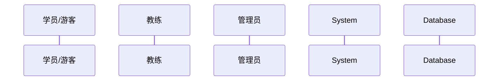
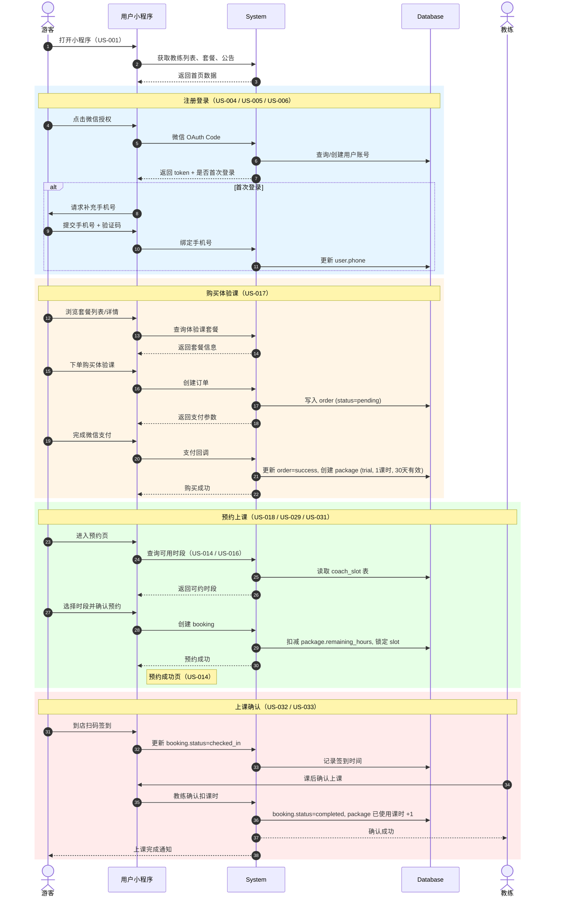
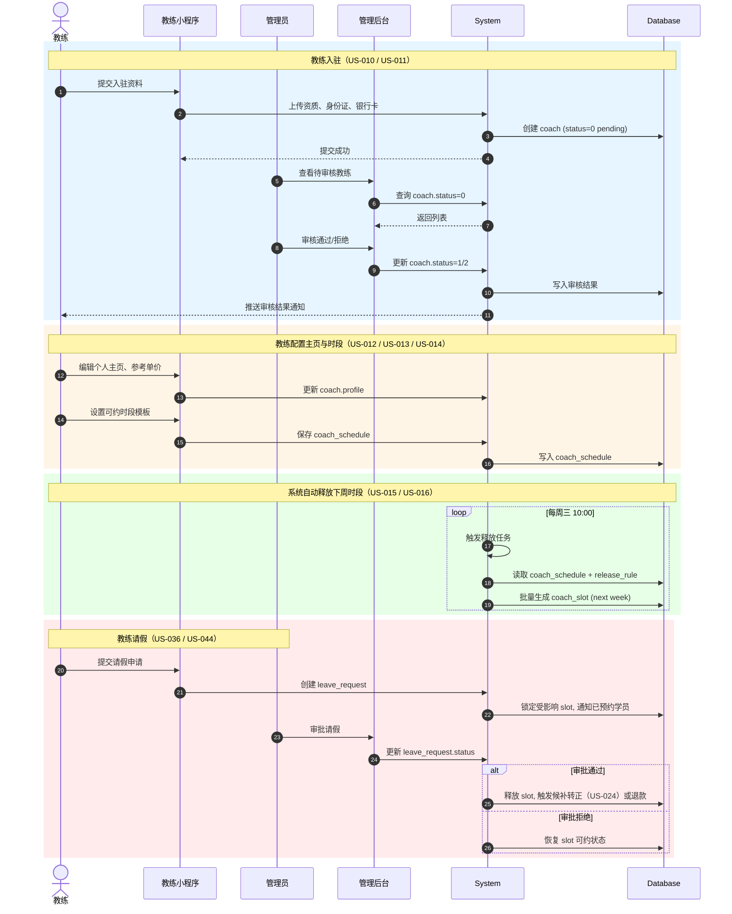
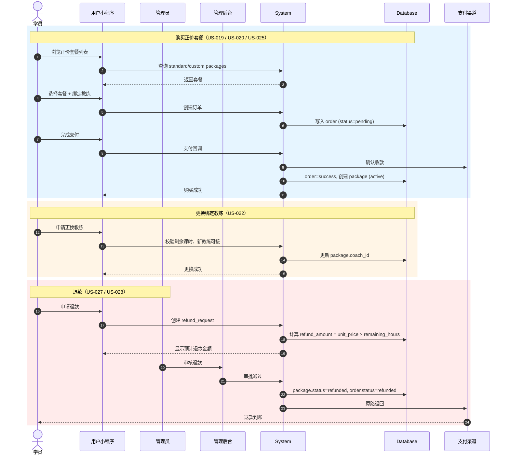
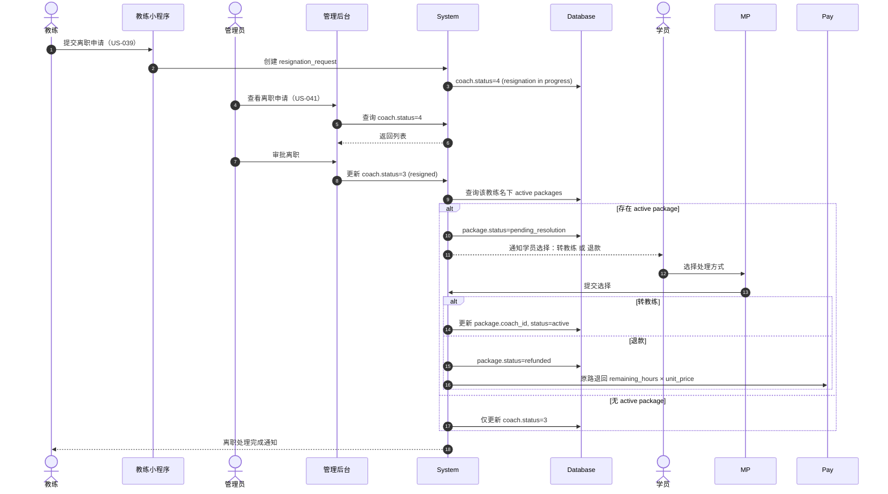
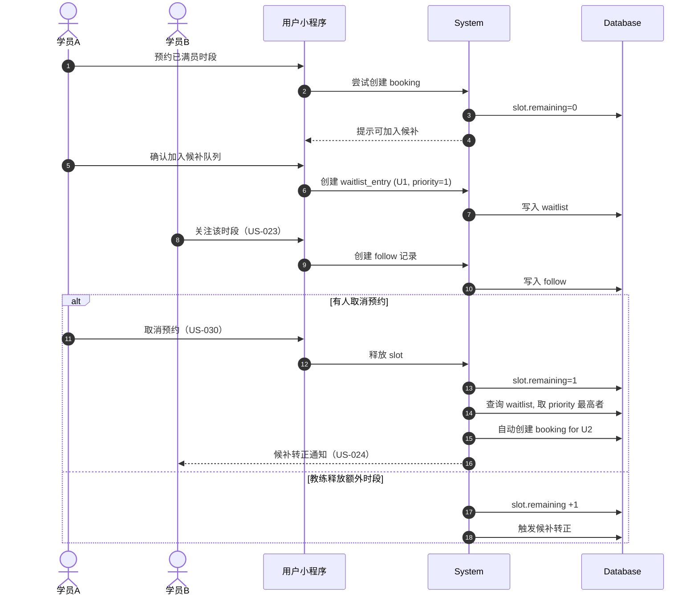
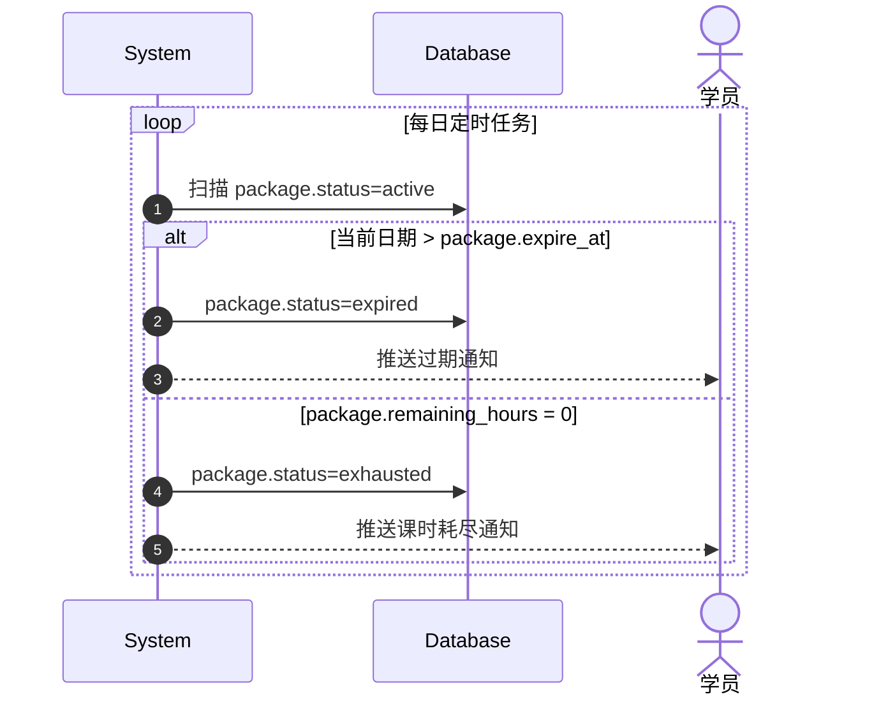

# MVP 端到端时序图（E2E Sequence Diagrams）

> **文档用途**：用 Mermaid 时序图可视化 MVP 核心流程中「学员 / 教练 / 管理员 / 系统」四方的交互，帮助判断 50 个 US 在逻辑上是否能顺畅串接。
> **最后更新**：2026-07-30

---

## 1. 什么是 E2E 时序图？

E2E（End-to-End）时序图是一种**按时间顺序展示多方角色/系统如何交互**的逻辑梳理图。

它回答的问题：
- 谁（Actor）在什么时机触发了什么动作？
- 系统/后台如何处理？
- 数据/状态如何流转？
- 异常分支在哪里出现？

它不是 UI 设计图，也不是 API 详细文档，而是**业务逻辑层面的流程骨架**。

---

## 2. 图例说明



- **实线箭头 `->>`**：同步调用/请求
- **虚线箭头 `-->>`**：返回/回调
- **矩形块 `rect`**：同一流程内的子步骤
- **alt/opt/loop**：分支、可选、循环

---

## 3. 主线 1：游客注册 → 购买体验课 → 首次上课

覆盖 US：US-001 ~ US-005, US-017, US-018, US-029 ~ US-033



### 逻辑检查点

| 检查项 | 状态 |
|--------|------|
| 游客未登录也能浏览教练/套餐 | ✅ US-001~US-003 |
| 购买体验课前必须完成注册 | ✅ US-004 / US-005 |
| 体验课有效期 30 天 | ✅ US-017 |
| 预约时校验套餐剩余课时 | ✅ US-018 / US-029 |
| 上课记录需教练确认 | ✅ US-033 |

---

## 4. 主线 2：教练入驻 → 排班 → 可约时段释放

覆盖 US：US-010 ~ US-016, US-036



### 逻辑检查点

| 检查项 | 状态 |
|--------|------|
| 教练状态机 0→1 需管理员审核 | ✅ US-011 |
| 已入驻教练才能管理主页/排班 | ✅ US-012~US-014 |
| 时段释放由系统定时触发 | ✅ US-016 |
| 请假需管理员审批并处理已有预约 | ✅ US-036 / US-044 |

---

## 5. 主线 3：正价套餐购买 → 退款

覆盖 US：US-019 ~ US-022, US-025 ~ US-028



### 逻辑检查点

| 检查项 | 状态 |
|--------|------|
| 正价套餐绑定教练 | ✅ US-020 |
| 更换教练需校验 | ✅ US-022 |
| 退款按剩余课时计算 | ✅ US-028 |
| 退款原路退回 | ✅ US-028 |

---

## 6. 主线 4：教练离职 → 管理员处理 → 系统自动退款

覆盖 US：US-039 ~ US-041



### 逻辑检查点

| 检查项 | 状态 |
|--------|------|
| 教练状态机 1→4→3 | ✅ US-039 / US-041 |
| 离职教练对用户隐藏 | ✅ US-041 |
| 非学员主动离职 100% 退款 | ✅ US-041 |
| 学员可选择转教练或退款 | ✅ US-041 |

---

## 7. 主线 5：候补与自动转正

覆盖 US：US-023, US-024



### 逻辑检查点

| 检查项 | 状态 |
|--------|------|
| 满员时段可候补 | ✅ US-023 |
| 用户可关注时段 | ✅ US-023 |
| 取消/释放时按优先级自动转正 | ✅ US-024 |
| 转正后通知用户 | ✅ US-024 |

---

## 8. 主线 6：套餐过期与课时耗尽

覆盖 US：US-050



### 逻辑检查点

| 检查项 | 状态 |
|--------|------|
| 过期状态自动转换 | ✅ US-050 |
| 课时耗尽状态自动转换 | ✅ US-050 |
| 状态转换后通知用户 | ✅ US-050 |

---

## 9. MVP 全局逻辑通顺性总结

### 9.1 主线是否完整

| 主线 | 完整性 |
|------|--------|
| 游客 → 注册 → 体验课 → 上课 | ✅ 完整 |
| 教练入驻 → 排班 → 释放时段 | ✅ 完整 |
| 正价套餐 → 预约 → 退款 | ✅ 完整 |
| 教练离职 → 处理 → 退款/转教练 | ✅ 完整 |
| 候补 → 转正 | ✅ 完整 |
| 套餐过期/耗尽 | ✅ 完整 |

### 9.2 关键依赖关系

```
US-004/005/006 登录注册 → US-017 体验课 → US-018 预约
US-010 入驻 → US-011 审核 → US-012/013/014 主页/排班 → US-016 自动释放
US-020 购买 → US-021 查看 → US-029 预约 → US-032 签到 → US-033 确认
US-023 候补 → US-024 自动转正
US-039 离职 → US-041 处理 → 转教练 / 退款
```

### 9.3 潜在风险点（建议重点 review）

1. **体验课与正价套餐的预约页是否共用？** US-018 和 US-029 可能共享同一预约页，需确认字段差异。
2. **教练请假时已预约学员的处理**：US-036 和 US-044 中，请假审批通过后是转教练还是退款？需与 US-041 保持一致。
3. **候补与关注的优先级**：US-023 中候补和关注的区别是否足够清晰？转正时是否优先候补再通知关注用户？
4. **管理后台权限粒度**：US-042 ~ US-049 中管理员是否统一为超级管理员，还是分角色？

---

## 10. 如何使用本文档

1. **PM 评审时**：对照时序图检查 `user-story.md` 中的流程是否覆盖图中每一步。
2. **设计师出图时**：把每条主线映射为 Figma 的多个页面 frame。
3. **开发联调时**：用时序图作为接口联调的参考主线。
4. **测试用例设计时**：每条时序图的主路径 + 每个 alt/loop 分支都可转化为测试用例。
