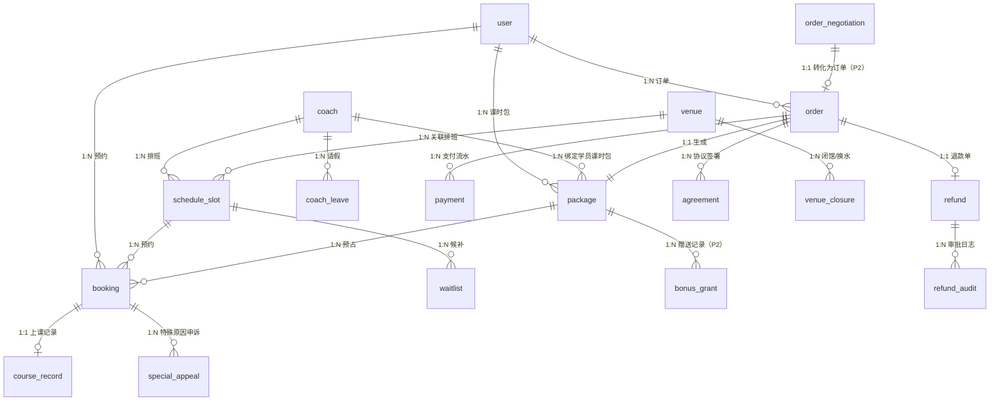

# 【乐游】游泳约课系统 - 产品需求文档（v11 最终落档版）

## 1. 项目概述

### 1.1 产品定位
打造一个面向游泳场馆的教练与学员约课沟通平台，解决游泳教练与学员之间预约、沟通、记录、评价等环节信息化不足的问题，覆盖小程序端与后台管理系统，未来可扩展为移动端 App。`[MVP]`

### 1.2 核心价值
- **对潜在用户**：透明化教练、套餐、场馆信息，降低决策门槛。
- **对学员**：数字化管理课时、记录成长轨迹、获取教学反馈。
- **对教练**：数字化管理学员与课时，通过数据优化教学策略。
- **对场馆**：提升运营效率，沉淀数据资产，辅助经营决策。

### 1.3 目标平台
1. 微信小程序（用户端）`[MVP]`
2. 微信小程序（教练端）`[MVP]`
3. Web 后台管理系统（仅管理员使用）`[MVP]`
4. 未来可扩展：iOS / Android App（与小程序数据互通）`[P3]`

### 1.4 文档结构
- §1-2：概述与版本规划
- §3-4：用户身份与套餐模型（v10 核心）
- §5：各角色功能模块
- §6：核心业务规则（包含预约/订单状态机）
- §7：消息通知体系
- §8：核心流程图
- §9-10：数据模型与看板
- §11-12：合规与非功能需求
- §13：MVP 范围与 Out of Scope
- §14：8 处规则冲突澄清
- §15：启动前置条件
- §16：决策清单
- §17：变更日志
- 附录：术语表、待确认事项

---

## 2. 版本规划

### 2.1 MVP（第一阶段）：核心约课闭环 `[MVP]`
**目标**：让注册用户能变成学员，教练能上课，管理员能管理。

| # | 能力 | 核心特性 |
|---|------|----------|
| 1 | 游客浏览 | 公开信息浏览（教练、套餐、公告、场馆） |
| 2 | 用户注册登录 | 微信 OAuth + 手机号 |
| 3 | 教练入驻 + 可约时间 | 资质审核 + 排班 + 状态 |
| 4 | 体验课购买 + 体验课预约 | 1 节/30 天 |
| 5 | 正价套餐购买 + 学员身份 | 一对一 / 多课时 |
| 6 | 每周固定释放时段 | 周三 10:00（后台可配置） |
| 7 | 候补 + 关注 | 满员时段排队 + 提醒 |
| 8 | 微信/支付宝支付 | 原路退回 3-7 工作日 |
| 9 | 上课记录 + 课时消耗 | 教练确认扣课时 |
| 10 | 管理员：用户/订单/数据看板 | 5 项基础看板 |

### 2.2 第二阶段：体验优化与运营提效 `[P2]`
- 周期性预约 / 固定课程
- 完整退款/退课流程（含手续费）
- 发票/收据管理
- 教练绩效与收入结算
- 评价与反馈闭环
- 学员等级与能力评估体系
- AI 数据查询助手
- 物化视图启用
- 营销标签体系（VIP/新用户）
- 多端身份同步

### 2.3 第三阶段：智能化与增长 `[P3]`
- 固定搭档 / 一对多拼课
- AI 视频动作分析
- 学员画像与教练推荐
- 营销裂变（老带新、拼团、优惠券）
- 社区/打卡/内容库
- 物联网硬件联动（闸机、手环、智能柜）
- 多场馆支持
- App 端开发
- 跨教练套餐
- 套餐转赠
- 多租户数据隔离

---

## 3. 用户身份体系

### 3.1 身份类型 `[All]`

系统中存在 **三种用户身份**：

| 身份 | 定义 | 触发条件 | 可访问功能 |
|------|------|----------|-----------|
| **游客** | 未注册访问者 | 未登录 | 浏览公开信息（教练列表、套餐、公告） |
| **注册用户** | 已注册无有效套餐 | 注册成功，0 个 active 套餐 | 注册、购课 |
| **学员** | 已注册有有效套餐 | ≥1 个 active 套餐 | 上述 + 预约课程、查看课时、查看记录 |

**关键说明**：
- 游客与注册用户是**互斥**状态（同一时间只能一个）
- 注册用户与学员是**同一主体**的不同状态（可切换）
- 教练是**独立角色**，不与用户身份重叠
- 系统管理员也是独立角色

### 3.2 身份状态机 `[MVP]`

```
                   [注册成功]
[游客] ─────────────────────→ [注册用户] ←──┐
   ↑                                 │      │ [主动注销/封禁/账户失效]
   │                                 │      │
   │                                 │ [购买+支付成功] │ [退订所有 active]
   │                                 ↓      │      ↓
   │                            [学员] ─────┘      │
   │                                 │             │
   │ [全部 active 套餐失效]            │ [新增同教练 active] │
   └─────────── [注册用户] ←──────────┘             │
                                                    │
   [教练切换] 学员 → [退订所有 active] → 注册用户 → [购新教练] → 学员
                                                  (必经中转)
```

**图例**：
- `→` 单向转换
- `[动作]` 触发动作
- 教练切换必经"注册用户"中转，不可直接跳转

### 3.3 转换触发条件 `[MVP]`

| 转换 | 触发动作 | 后置状态 |
|------|----------|----------|
| 游客 → 注册用户 | 微信 OAuth / 手机号注册 | 注册成功 |
| 注册用户 → 学员 | 支付成功 + 创建 package（active）| 身份 = 学员 |
| 学员 → 注册用户 | 不存在任何有效套餐（status=active）| 身份回退 |
| 学员 → 学员（同教练加课） | 购买该教练的额外套餐 | 身份保持学员，套餐数 +1 |
| 学员 → 注册用户 → 学员（**教练切换**，必经中转） | (1) 退订所有 active 套餐 → (2) 购买新教练套餐 | 身份经"注册用户"中转，**不直接跳转** |
| 学员 → 学员（封禁） | 管理员后台封禁 | 身份保持"学员"标签但所有操作拒绝 |
| 学员 → 学员（主动注销） | 用户主动注销 | 保留订单/套餐历史 90 天，超期匿名化 |
| 学员 → 学员（教练离职） | coach.status 4→3 时：该教练名下所有 active 套餐 → frozen（详见 §4.2.1）；reserved→available；身份保持（学员），但 `package.coach_id` 仍指向已离职教练；学员可主动换新教练（v10 必经中转）或申请退款（100% 退） | 身份保持，套餐冻结 |
| 学员 → 学员（套餐耗尽） | 单个 active 套餐 available=0 且 reserved=0 → exhausted | 身份保持（如有其他 active） |
| 注册用户 → 注册用户 | 已购套餐已全部失效 | 保持 |

### 3.4 状态与计数对照表 `[MVP]`

本节明确区分两套独立的状态系统，避免混淆：

#### 3.4.1 系统 A：套餐状态（`package.status`，单值枚举）

| 状态 | 含义 | 触发 |
|------|------|------|
| `active` | 有效，未过期，total_hours > 0 | 订单支付成功 |
| `exhausted` | 课时耗尽（available=0 且 reserved=0） | 应用层事件：available=0 且 reserved=0 时自动 |
| `expired` | 时间过期（now() >= expire_at） | 定时任务：每小时巡检 |
| `refunded` | 用户退款 | 退款流程完成 |

**特点**：单值、互斥、终态（除 active 外其余均为终态）。

#### 3.4.2 系统 B：课时计数（三个累加字段）

| 字段 | 含义 | 业务动作 |
|------|------|---------|
| `available` | 可被预约的课时 | 预约时 -1，取消时 +1 |
| `reserved` | 已预约但教练未确认的课时 | 预约 +1，确认或取消 -1 |
| `consumed` | 教练已确认扣除的课时 | 教练确认 +1（仅此入口） |

**恒等式**：`reserved + consumed + available = total_hours`（任何时刻成立）

**特点**：三值联动、可独立累加、变化是状态转换的"原因"。

#### 3.4.3 典型组合示例

| 套餐状态 | available | reserved | consumed | 业务含义 |
|---------|-----------|----------|----------|----------|
| active | 10 | 0 | 0 | 刚购买 |
| active | 9 | 1 | 0 | 预约了 1 节（明日 9:00）|
| active | 0 | 1 | 9 | 最后一节在预占中 |
| active | 0 | 0 | 10 | 即将变 exhausted（教练确认最后一节）|
| `exhausted` | 0 | 0 | 10 | 全部上完（终态）|
| `expired` | 5 | 2 | 3 | 过期时还有 5 节可用 + 2 节预占 |
| `refunded` | 0 | 0 | 3 | 退款时已消耗 3 节（consumed 被 freeze，不参与退款）|

#### 3.4.4 关键不变量（防止状态机与计数错位）

1. **状态由计数触发**：active → exhausted 必须是 available=0 时才发生（不是计数任意变化）
2. **计数不被状态变更**：套餐状态从 active → refunded 时，consumed 字段**不**清零，仅 freeze
3. **计数变化是唯一来源**：reserved 增加只能来自"用户预约"；consumed 增加只能来自"教练确认"
4. **状态-计数对应关系**：
   - `active` → 必有 `available + reserved > 0`（否则应是 exhausted）
   - `exhausted` → 必有 `available = 0` 且 `reserved = 0`（即 `consumed = total_hours`）
   - `expired` → 必有 `now() >= expire_at`（与计数无关）
   - `refunded` → 必有 `refunded_at IS NOT NULL`（与计数无关）

#### 3.4.5 与其他章节的引用关系

- 套餐状态转换详见 §4.2 套餐状态机
- 课时计数变化规则详见 §6.3.1 预占规则
- 时序示例见 §6.3.2
- "有效套餐"定义见 §3.5（本节之后）

### 3.5 关键约束 `[MVP]`

- **"有效套餐"** 定义：`package.status = active`
- **同一时间仅 1 名教练**：用户购买新套餐时校验"是否已有 active 套餐中包含其他教练"，如有则**购买失败**，提示"您已持有其他教练的有效套餐，需先退订后方可购买新教练套餐"
- **退级触发机制（应用层事件 + 定时任务兜底）**：
  - **应用层事件**：package status 变更时（active→exhausted/expired/refunded）通过消息队列（如 Kafka）触发身份重算，事件入队 ≤ 100ms
  - **定时任务兜底**：每小时巡检一次身份视图与 `package` 实际状态差异，修正遗漏（防事件丢失）
  - **最大延迟**：事件路径 ≤ 1 秒，兜底路径 ≤ 1 小时
  - **幂等保证**：身份重算用 `user_id` 作幂等键，重跑结果一致
- **退级不可跳过**：达到退级条件时事件**立即入队**（非阻塞），无需用户操作

### 3.6 退款状态期间身份判定 `[MVP]`

| 订单状态 | package.status | 用户身份 | UI 文案 |
|---------|---------------|---------|---------|
| 已支付-正常 | active | 学员 | "当前有效套餐 N 节" |
| 退款审批中 | active | 学员 | "退款处理中，预计 3-7 工作日到账" |
| 争议退款处理中 | active | 学员 | "争议处理中，3 工作日内反馈结果" |
| 已退款 | refunded | 注册用户（如无其他 active 套餐）| "退款已到账，您的套餐已失效" |
| 退款被拒 | active | 学员 | "退款未通过，原因为：{reason}" |

**关键约束**：
- 退款申请提交后，package.status 仍为 active，**直到"已退款"才变**
- 中间状态身份保持"学员"（包未真退），但 UI **必须**显式提示"退款处理中"
- **退款审批中 / 争议退款处理中 的订单，关联 package 冻结约课**：不可新增预约，已预约课程自动取消并释放课时
- "已退款"触发时，身份重算（异步事件）
- "退款被拒"时，package.status 回 active，身份无变化，已释放课时**不自动恢复**，UI 提示原因

### 3.7 边界场景处理 `[MVP]`

| 场景 | 处理 | 备注 |
|------|------|------|
| 用户被管理员封禁 | 身份保持"学员"，所有操作拒绝 | 需记录封禁原因和解封时间 |
| 用户主动注销 | 身份冻结，订单/套餐历史保留 90 天 | 90 天后匿名化 |
| 教练离职 | coach.status 4→3 时：所有 active 套餐 → frozen（frozen_reason='coach_resigned'）；reserved→available；身份保持（学员）；学员端 [我的套餐] 可见 frozen 状态，列表/搜索中已离职教练完全不可见 | 学员可主动换新教练（v10 必经中转）或申请退款（100% 退）；不主动 push 通知学员 |
| 单个套餐耗尽 | status: active → exhausted | 身份按"是否还有其他 active"判定 |
| 套餐过期 | status: active/exhausted → expired | 定时任务触发 |
| 退款完成 | status: active → refunded | 身份重算 |

### 3.8 用户身份相关 Phase 标签汇总

| 能力 | Phase |
|------|-------|
| 微信 OAuth 注册 | `[MVP]` |
| 手机号注册 | `[MVP]` |
| 三种身份状态机 | `[MVP]` |
| 状态机事件触发 | `[MVP]` |
| 状态机兜底定时任务 | `[MVP]` |
| 身份被封禁 | `[MVP]` |
| 主动注销 | `[MVP]` |
| 教练离职处理 | `[MVP]` |
| 用户画像分析 | `[P2]` |
| 营销标签（VIP/新用户） | `[P2]` |
| 多端身份同步 | `[P2]` |

---

## 4. 套餐模型

### 4.1 套餐类型 `[MVP]`

| 类型 | 数量约束 | 有效期 | 备注 |
|------|----------|--------|------|
| 体验套餐 | 1 份/用户（active 或 exhausted 状态）| 30 天 | 价格较低，1 课时 |
| 正式套餐（一对一） | 多份/用户 | 灵活（购买时选） | 同一教练 |

**套餐扣减规则**：
- **FIFO 自动扣减**：最早 active 套餐先扣，用户预约时**不可手动选套餐**
- 理由：避免用户选过期近的套餐导致其他套餐"卡死"
- **体验课优先级**：先扣体验套餐（因为 30 天过期），再扣正式套餐
- 后期可优化为"用户手动选 + 提示"

### 4.2 套餐状态机 `[MVP]`

```
                              [支付成功]
[无] ──────────────────────────→ [active]
                                     │
              ┌──────────┬───────────┼──────────────────┐
              │          │           │                  │
              ↓          ↓           ↓                  ↓
         [exhausted] [expired]   [frozen]          [refunded]
         (课时耗尽)  (过期)      (冻结)             (退款)
              ↓          ↓           ↓                  ↓
           (终态)    (终态)     (中间态)            (终态)
```

| 状态 | 含义 | 转换触发 |
|------|------|----------|
| active | 有效 | 订单支付成功 |
| **exhausted** | **已耗尽** | **应用层事件：available=0 且 reserved=0（即 consumed=total_hours）时自动转换** |
| **frozen** | **冻结（中间态）** | **教练离职 / 管理员手动 / 投诉处理中（详见 §4.2 frozen 状态机）** |
| expired | 过期 | 定时任务：expire_at 到期自动 |
| refunded | 已退款 | 退款流程完成 |

**状态终态**：`expired` / `refunded` / `exhausted`（超过 expire_at 后）= 终态，**不再转换**。
**`frozen` 是中间态**：可恢复到 active（换新教练 / 管理员解冻），也可转为 refunded（退款完成），**不**直接到 exhausted/expired。

### 4.3 套餐字段 `[MVP]`

```
package:
  package_id PK
  user_id FK
  coach_id FK        -- 1 名教练约束
  package_type       -- 0=体验 / 1=正式
  total_hours
  reserved_count
  consumed_count
  available_count    -- = total - reserved - consumed
  expire_at
  status             -- active / exhausted / expired / refunded
  purchased_at
  exhausted_at       -- 耗尽时间（status=exhausted 时填入）
  refunded_at        -- 退款时间（status=refunded 时填入）
```

### 4.4 关键不变量 `[MVP]`

```
# 数量不变量
reserved_count + consumed_count + available_count = total_hours

# 状态不变量
status = active     → exhausted_at IS NULL AND refunded_at IS NULL
status = exhausted  → consumed_count = total_hours
                      AND available_count = 0
                      AND reserved_count = 0
                      AND exhausted_at IS NOT NULL
status = expired    → now() >= expire_at (或 previous status ∈ {active, exhausted})
status = refunded   → refunded_at IS NOT NULL AND consumed_count 已 freeze

# 状态自动转换（应用层事件 + 定时任务）
active → exhausted: 应用层事件检测 available = 0 且 reserved = 0（即 consumed = total_hours）时触发
active → expired:   定时任务每小时巡检，now() >= expire_at
exhausted → expired: 定时任务每小时巡检，now() >= expire_at
任何状态 → refunded: 退款流程

# 教练不变量
同一 user_id 下，所有 status = active 的 package.coach_id 必须相同
（exhausted/expired/refunded 状态的套餐不参与约束）

# 业务含义
- 同一教练名下可有多份 active 套餐（按时长、课时数区分）
- 不同教练的 active 套餐不能共存，必须经"注册用户"中转（先退旧 → 购新）
- 验证时机：购买新套餐时、教练离职转接套餐时

# 体验不变量
package_type = 体验 → 用户名下 status ∈ {active, exhausted} 的同类型套餐不超过 1 份
（expired 且 available > 0 / refunded 状态的体验课不占用"1 份"名额，可再次购买）
```

### 4.5 体验课特殊规则 `[MVP]`

| 场景 | 行为 |
|------|------|
| 首次购买体验课 | 允许，状态：active，30 天有效 |
| 体验课已 active 状态时再次购买 | 拒绝（"您已有体验套餐"） |
| 体验课耗尽（status=exhausted）| 拒绝再购（已完整体验过） |
| 体验课过期（status=expired 且 available > 0）| 允许再购 |
| 体验课退款（status=refunded）| 允许再购 |

**扣减优先级**：体验套餐 > 正式套餐（先扣体验课，避免过期浪费）。

### 4.6 套餐过期与续期 `[MVP]`

**过期处理**：
- 定时任务每小时巡检 `now() >= expire_at` 的 active/exhausted 套餐
- 状态转换为 expired
- 触发通知："您的 XX 套餐已过期"
- 触发身份重算（如该套餐是最后一个 active，用户退级为注册用户）

**续期处理**（v10 取消"续费"概念）：
- 不再有"续费"按钮
- 用户在套餐过期后/前，可随时购买新套餐
- 新套餐与旧套餐可共存（同一教练下多份 active 套餐合法）
- 购买时选择教练 + 课时数，无前置条件

**管理员手动延期**（后台"保留"操作）：
- 仅允许对 `status = expired` 且 `available + reserved > 0` 的套餐执行延期
- 延期操作：更新 `expire_at`，并将 `status` 从 `expired` 恢复为 `active`
- `available` 保持原样，延期只延长使用时间，不增加课时
- 过期时被释放的 `reserved` **不自动恢复**，用户需重新预约
- `status = exhausted` 或 `refunded` 的套餐**不允许**延期，提示"课时已耗尽/已退款，请购买新套餐"

### 4.7 套餐相关 Phase 标签汇总

| 能力 | Phase |
|------|-------|
| 体验套餐（1 节/30 天）| `[MVP]` |
| 正式套餐（一对一）| `[MVP]` |
| 同教练多份套餐 | `[MVP]` |
| 套餐状态机（active/exhausted/expired/refunded）| `[MVP]` |
| FIFO 自动扣减 | `[MVP]` |
| 体验课优先扣减 | `[MVP]` |
| 套餐过期定时任务 | `[MVP]` |
| 教练切换（先退后买）| `[MVP]` |
| 套餐退款 | `[MVP]` |
| 课时包合并/拆分 | `[P2]` |
| 跨教练套餐 | `[P3]`（当前不实施）|
| 套餐转让 | `[P3]` |

---

## 5. 各角色功能模块

### 5.1 游客功能 `[MVP]`

1. 浏览教练列表与教练详情（姓名、证书、任教年限、评分、评价）。
2. 查看系统套餐及价格。
3. 查看场馆公告：开放时间、换水时间、拥挤情况。
4. 查看场馆信息：名称、地址、导航。
5. 查看下周预约释放时间公告与倒计时。
6. 触发注册：预约体验课、购买套餐时需先注册登录。

### 5.2 注册用户功能 `[MVP]`

#### 5.2.1 注册登录
1. 支持微信授权登录，首次登录后补充手机号、用户名、密码、邮箱。
2. 支持手机号验证码登录。
3. 支持账号密码登录。
4. **账号注销**：用户注销后账号进入软删除状态，无法继续登录，但历史订单、交易记录等数据落档保留（用于审计与纠纷追溯）；用户下次使用小程序时需重新注册登录，系统生成新账号，与原账号数据不做绑定。

#### 5.2.2 账号安全
1. 手机号换绑、密码修改、邮箱绑定。
2. 登录设备管理。
3. 隐私协议授权与撤回。

#### 5.2.3 转化入口
1. 购买体验课，获得有效体验套餐，可预约对应教练的体验课。
2. 购买正课套餐，获得有效正式套餐，绑定教练，可约正课。

### 5.3 学员功能（已购正价套餐）`[MVP]`

#### 5.3.1 教练与套餐浏览
1. 查看所有教练列表与详情（姓名、证书、任教年限、评分、评价、可约时间、实时状态）。
2. 教练实时状态包括：空闲中、上课中、休息中、已下班、请假中；在教练列表卡片和详情页以圆点 / 标签形式展示。
3. 教练详情页展示微信二维码与手机号，学员可直接扫码加微信或拨打电话联系。
4. 教练详情页提供「发起聊天」按钮；若教练处于上课中 / 已下班 / 休息中，系统提示「教练当前较忙，可能延迟回复」。
5. 查看系统套餐：标准套餐（1/6/8/10 节）+ 自定义套餐。
6. **更换绑定教练规则**：见 §6.7 教练切换。

#### 5.3.2 预约功能
1. 学员进入预约页面时，默认显示已绑定教练的可约时间段，无需再次选择教练。
2. 查看教练可约时间段，可预约未来 7 天内的课程。
3. **预约释放规则**：每周三上午 10:00 统一释放下周（周一至周日）的可约时段；具体释放时间、释放范围由管理员在后台配置。
4. 首页显示释放倒计时：释放前 24 小时显示「距离下周预约开放还有 XX 小时」；释放当天显示「今日 10:00 开放下周预约」。
5. **预约锁单机制**：用户点击「提交预约」后，系统立即锁定该时段，其他用户看到该时段为「已锁定」或「已约满」；同一时段多人并发提交时，仅第一个成功，其余用户收到「已被他人预约」提示。
   - **"时段"唯一性**：`schedule_slot` 是 `(coach_id, start_time)` 组合（DATETIME 级别唯一，详见 §9.2.4）。同一日同时段（如同为后日 9:00）只能预约 1 节；跨日同时段（明日 9:00 + 后日 9:00）不冲突；同一日不同时段（后日 9:00 + 后日 14:00）不冲突。
6. **正价套餐学员**：提交预约即预约成功，系统自动从课时包中预占 1 节课时；课程结束后由教练确认并手动点击「扣除课时」，系统才正式扣减课时；课前 24 小时外取消则释放预占课时。
7. **学员签到方式**：学员到馆后可在小程序内点击「一键签到」，或经前台扫码 / 闸机刷脸完成入场登记；签到仅用于通知教练已到场，不强制签到，也不扣除课时。游泳过程中不带手机，以教练端记录为准。课程结束后由教练点击「确认上课并扣除课时」，系统才正式扣减课时。
8. **学员端预约卡片展示规则**：
   - 卡片展示每个时间段的时间、教练实时状态（空闲中 / 上课中 / 休息中 / 已下班 / 请假中）。
   - 已约满 / 已被锁定的时段显示为置灰或「已满」状态，不展示具体预约人信息，保护用户隐私。
   - 只要上课时间未到，已满时段支持「加入候补」或「关注」操作。
   - 可约时段正常展示，用户点击后提交预约。
   - 用户成功预约后，在自己的「我的预约」中查看专属预约卡片，显示时间、教练、状态，并支持日程提醒（可同步至手机日历）。
9. **取消预约规则**：
   - 开课前 24 小时外可随时取消，释放预占课时。
   - 开课前 24 小时内取消需教练审批，审批通过后立即释放预占课时；若教练在 24 小时内未处理，默认视为拒绝取消。
   - **特殊原因取消**：开课前 N 小时内（默认 2 小时，后台可配置）的取消申请，即使教练未处理或拒绝，用户仍可提交「特殊原因取消」工单（如突发疾病、交通事故等），并上传证明材料；客服事后审核，审核通过则返还课时，审核不通过则按旷课处理。
10. **学员未到场（旷课）处理**：学员未取消也未签到，教练可在课程结束后标记「学员未到课」，系统自动扣减该节课时；教练可填写未到课原因或备注，供客服核查与学员申诉使用。特殊情况下，管理员可在后台手动返还课时。
11. 满员时段可排队候补；有人取消时按候补顺序自动转正并通知。
12. **候补规则**：用户可同时加入多个时段的候补队列；若其中一个时段候补成功，其他候补订单自动取消。
13. **关注时段**：用户可关注心仪时段，释放前或有人取消时收到提醒；关注不强制排队，适合不希望被自动预约的用户。
14. 候补与关注为两种可选方式，用户可根据偏好选择。

#### 5.3.3 课时与上课记录
1. 查看总课时、已上课时、剩余课时。
2. **多套餐课时消耗顺序**：FIFO（见 §4.1）。
3. 查看历史上课记录：时间、教练、内容。
4. 每节课后填写自我总结：身体感受、学习效果、问题反馈。
5. 对教练进行评价：`[P2]`

#### 5.3.4 购买与支付
1. 购买套餐生成订单，支持微信支付、支付宝支付。
2. 查看订单列表与支付状态。
3. 申请退款 / 退课（按比例计算，见 §6.4）。
4. **退款手续费**：MVP 暂不收取手续费（见 §6.4.3）。
5. 申请电子发票：`[P2]`

#### 5.3.5 视频与学习 `[P3]`
1. 查看教练上传的本节课视频。
2. 上传自己的游泳视频（可选）。
3. AI 视频动作分析。

### 5.4 教练功能 `[MVP]`

#### 5.4.1 入驻与资料
1. 首次注册需上传：证书、任教年限、总学员数、总课时数、个人简介。
2. 入驻资质需管理员审核。
3. 个人主页展示任教年限、证书、总课时、带过的学生总量、评分、评价、微信二维码、手机号。
4. **教练名片分享**：教练可将个人主页生成卡片或海报，分享到微信好友或朋友圈；其他用户点击后可直接查看教练详情、可约时间、套餐信息，并支持一键预约体验课或购买套餐，起到引流获客作用。
5. 教练可设置一节课的参考单价，作为系统套餐定价和自定义套餐金额计算的基准；实际订单金额可在审批时协商调整。
6. 教练可设置自己的实时状态：空闲中、上课中、休息中、已下班、请假中。
7. 系统根据教练当前课程安排自动切换状态：课程开始前 15 分钟自动变为「上课中」，课程结束后 15 分钟自动恢复为「空闲中」或「已下班」（根据当日排班）。
8. 教练手动设置的状态优先级高于自动状态，但请假状态由请假审批自动同步。

#### 5.4.2 预约管理
1. 以日 / 周 / 月 / 年维度查看预约卡片。
2. **教练端预约卡片展示规则**：
   - 卡片通过颜色 / 图标 / 标签区分课程类型：体验课、正价课。
   - 显示当前预约状态：已预约、待上课、上课中、已完成、已取消、候补中、被关注。
   - 显示排队候补人数、关注该时段的用户数，便于教练判断时段热度。
   - 点击卡片查看预约详情：学员姓名、年龄、手机号、游泳等级、学习泳姿、基础情况、已上课时、剩余课时。
3. 上课前 10 分钟查看学员入场状态，未入场可一键提醒。
4. 教练可帮学员代约：教练代替学员提交预约，系统按正常预约规则从学员课时包中预占 1 节课时。
5. 教练可将空闲可约时段分享到朋友圈，吸引新用户预约体验课或正课。

#### 5.4.3 上课记录
1. 记录每节课时间、内容、学员学习情况。
2. 记录课时消耗：总课时、已用课时、剩余课时；课程结束后教练手动点击「确认上课并扣除课时」，系统才正式从学员课时包中扣减。教练需在课程结束后 24 小时内完成确认，超时未确认系统自动扣减该节课时并通知学员与教练。
3. 支持结构化标签：今日重点、掌握程度、课后作业。
4. 支持语音输入快速记录。
5. 上传照片 / 视频作为本节课记录。

#### 5.4.4 学员信息维护
1. 教练可维护自己关联学员的信息切片。
2. 默认从学员自填信息带入，教练可根据沟通情况更新。
3. 仅影响该教练视角，不影响其他教练或学员本人信息。
4. 可查看学员评价、反馈、历史总结。
5. **未成年人保护**：
   - 教练可标记学员是否为未成年人，并维护监护人联系方式。
   - 未成年人购买套餐时，系统强制要求填写监护人手机号，并发送知情短信。
   - 未成年人首次上课时，系统向监护人发送上课通知短信，必要时要求监护人在线确认。

#### 5.4.5 请假处理
1. 教练提交请假申请，管理员审批。
2. 请假审批通过后，系统根据请假时间自动取消已预约的课程，并自动发送取消通知给相关学员。
3. 教练可填写取消原因或改约建议，一并通知学员。
4. 学员收到通知后可选择改约其他可用时间或保留课时。

#### 5.4.6 收入结算 `[P2]`
1. 教练收入模式支持按场馆 / 按教练配置：平台抽成、固定课时费、或混合模式。
2. 具体计费规则需在上线前结合市场调研确定。
3. 教练可在个人中心查看收入明细、提现申请。

#### 5.4.7 申请离职 `[MVP]`

**入口**：[教练端] 我的 → 申请离职（仅 `coach.status = 1` 可发起）

**流程**：
1. 教练点击"申请离职"，可选填离职原因（**非必填**），提交后 `coach.status: 1 → 4`（申请中）。
2. 系统生成"离职工单"（仅教练自己可见，**不**通知学员）：
   - 学员清单（学号/姓名/剩余课时）
   - 处理进度："X / N 个学员已处理"
   - 每个学员的 3 个操作：[转新教练] / [全额退款] / [继续上完]
3. 教练**私下**与学员沟通后，在工单登记处理结果（每份 active 套餐独立处理，可"这份转那份退"）。
4. 教练处理完毕或主动提交后，进入管理员审批队列。

**状态 4 期间行为**：
| 维度 | 行为 |
|------|------|
| 教练列表可见性 | ✅ 仍可见（**不**显示"申请中"标签，强隐私）|
| 购买该教练套餐 | ❌ 按钮置灰/隐藏（hover 提示"暂不可购买"）|
| 老学员约课 | ✅ 仍可约（`package.status` 仍 `active`）|
| 已预约课程 | ✅ 继续上课 |
| 排班 | ✅ 继续生成 |

**状态 4 期间 coach UI 隐私规则**：
- 个人主页/列表**不**显示"申请离职中"标签
- 学员端、教练端列表/搜索**不**展示该状态
- 完整状态**仅在离职工单内**可见

#### 5.4.8 重新入驻 `[MVP]`

- 状态 3（已离职）的教练可重新申请入驻
- 重新申请时 `coach.status: 3 → 0`（待审核），走与新教练相同的审核流程
- 历史评分/评价**保留但只对老学员可见**（不展示给新学员，避免新学员被旧数据误导）
- 已 frozen 的老学员 package 仍 frozen，等待老学员主动换回原教练或退款

#### 5.5 管理员功能 `[MVP]`

#### 5.5.1 用户管理
1. 查看所有游客、注册用户；按身份、注册时间筛选与统计。
2. 重置密码、手机号、邮箱。
3. 配置角色权限。
4. 教练入驻资质审核。
5. 教练离职审批（详见 §5.5.1.1）。
6. 管理员手动冻结/解冻 package（详见 §5.5.1.2）。
5. **教练离职 / 取消入驻处理**：
   - 管理员取消教练入驻资格或教练主动离职时，系统自动将该教练未上完的学员课时标记为待处理；管理员可为受影响学员安排其他教练承接剩余课时，或按退款流程处理。
   - 该教练名下未使用的体验课订单，管理员可在后台为学员更换体验课教练，或学员可主动申请全额退款。

##### 5.5.1.1 教练离职审批 `[MVP]`

**入口**：[管理员] 用户管理 → 教练离职审批队列

**审批流程**：
1. 教练提交离职申请后（`coach.status: 1 → 4`），系统自动加入审批队列。
2. 管理员打开工单，查看：
   - 教练基本信息（姓名/入职时间/历史评分）
   - 离职工单进度（X / N 个学员已处理）
   - 每个学员的处理结果（转新教练 / 全额退款 / 继续上完）
3. 管理员检查清单（**全部通过才可批准**）：
   - ① active 学员数 = 0 ✓
   - ② 所有学员处理结果已登记 ✓
   - ③ 教练费已结算（含未消耗课时）✓
   - ④ 排班未来时段已清空 ✓
4. 审批通过：`coach.status: 4 → 3`，同步事务：
   ```sql
   -- 1. 该教练所有未来 booking 自动取消
   UPDATE booking SET status = '已取消', cancel_reason = '教练离职'
   WHERE coach_id = ? AND status IN ('已预约', '待支付', '待上课');
   -- 2. reserved → available 转换
   UPDATE package SET reserved_count = 0,
     available_count = available_count + reserved_count
   WHERE coach_id = ? AND status = 'active';
   -- 3. 所有 active package → frozen（教练离职场景，frozen_reason='coach_resigned'，与 §3.7/§6.4.5 枚举一致）
   UPDATE package SET status = 'frozen', frozen_reason = 'coach_resigned'
   WHERE coach_id = ? AND status = 'active';
   -- 4. 隐藏未来排班
   UPDATE schedule_slot SET status = 'hidden'
   WHERE coach_id = ? AND start_time > NOW();
   ```
5. 审批拒绝：`coach.status: 4 → 1`，**不**回滚已登记的学员处理（已转/已退维持现状），教练可立即重新申请。

**教练费结算**：
- 离职时一次性清算已消耗课时（`consumed_count × price_per_hour × 分成比例`）
- 后续未结算的可继续结算（按月度补结）
- 学员退款成功后，**教练费同步扣回**

##### 5.5.1.2 手动冻结/解冻 package `[MVP]`

**冻结触发场景**（`frozen_reason` 字段为 VARCHAR(32)，全项目统一 3 值枚举）：
| 场景 | frozen_reason | 触发方 | 学员端文案 |
|------|---------------|--------|-----------|
| 教练离职 | `coach_resigned` | 系统自动（§4.2.1/§5.5.1.1）| "教练已离职，请换新教练或申请退款" |
| 退款处理中 | `refund_pending` | 系统（US-027/US-028 触发）| "套餐处理中，请等待" |
| 管理员手动冻结 | `admin_frozen` | 管理员（含投诉处理/异常订单/司法冻结等细分原因，细分原因记录在 audit_log）| "套餐已冻结，请联系客服" |

> **枚举裁决说明**（v3 评审 P0-1）：原 §5.5.1.2 使用 `pending_review/admin_manual/court_order` 三值与 §3.7 `coach_resigned`、§5.5.1.1 整数 0 不一致，现统一为 `coach_resigned / refund_pending / admin_frozen` 三值。原 `pending_review` 并入 `refund_pending`；原 `admin_manual/court_order` 并入 `admin_frozen`（细分场景由 audit_log.remark 记录）。

**操作流程**：
1. 管理员在 [用户管理] → [套餐管理] 找到目标 package
2. 点击"冻结"→ 选择原因 → 确认 → `package.status: active → frozen`
3. 学员端 [我的套餐] 立即显示 frozen 状态及对应文案
4. 管理员可"解冻"→ `package.status: frozen → active`，frozen_reason 清除

**frozen 状态行为统一**（无论触发原因）：
- ❌ 约课被阻止
- ✅ 学员可主动换新教练（v10 流程）
- ✅ 学员可申请退款（按 §6.4.5 frozen 规则）

#### 5.5.2 教练排班与预约释放管理
1. 查看所有教练排班表。
2. 添加、删除、修改排班时间。
3. 查看请假申请，同意或拒绝。
4. 配置下周可约时间并一键发布到小程序。
5. **预约释放规则配置**：
   - 设置每周固定释放时间（默认周三 10:00）。
   - 设置释放范围（如下周整周或未来 7 天）。
   - 设置是否启用候补队列、候补有效期。
   - 设置关注提醒提前时间。
   - 特殊情况下可手动提前或延迟释放。
   - **节假日处理**：若节假日不营业，管理员可提前释放下一周可约时段，并通过公告通知用户。
6. **预约规则说明**：单个课程预约采用先抢先得机制，无需教练二次确认；教练确认 / 协商环节仅在购买套餐时触发。

#### 5.5.3 套餐与订单
1. **标准套餐配置**：由管理员在后台预设固定套餐。
2. **自定义套餐配置**：学员在购买时可自由选择。
3. **教练课时单价参考**：每个教练可设置一节课的参考单价，作为套餐定价的基准。
4. 查看所有订单，确认或拒绝订单。
5. 处理退款、价格调整、套餐次数调整。
6. **订单生效规则**：
   - 用户支付成功后订单立即生效，身份 = 学员。
   - 教练协商 / 价格修改属于 P2 功能，MVP 阶段不实施；MVP 期间教练私下与学员沟通优惠，平台不感知。

#### 5.5.4 场馆与公告
1. 配置场馆名称、地址、导航、开业年限、泳池状态。
2. 场馆闭馆 / 换水设置：管理员设置闭馆日期后，系统自动检测受影响的预约，自动跳过并通知相关学员与教练。
3. 配置免责声明、健康申报模板。
4. **配置《用户须知》**：
   - 管理员可在后台编辑、发布、更新《用户须知》内容，支持版本管理。
   - 用户首次购买套餐前必须阅读并同意当前版本，后台可查看用户签署记录及对应版本号。
   - 更新《用户须知》后，系统向所有注册用户推送变更提醒，并引导用户在下次购买前重新阅读并同意新版本；版本未变更时无需重复同意。

#### 5.5.5 通知栏与首页运营
1. **首页通知栏（Notice Bar）**：用于展示轻量、时效性强的公告。
2. **首页 Banner 配置**：上传游泳馆照片、活动海报。
3. **首页卡片配置**：用于运营活动和功能入口。
4. **卡片可见范围配置**：每张卡片可设置对哪些用户身份 / 角色可见。
5. **排序与有效期**：支持配置通知栏公告顺序、卡片展示顺序、上线时间、下线时间。
6. **预览机制**：配置首页通知栏、Banner、卡片时，支持实时预览效果，无需审核直接生效。

#### 5.5.6 数据看板（见 §10）

#### 5.5.7 客服与工单 `[MVP]`
1. 接收学员投诉、建议、换教练申请。
2. 工单流转：提交 → 处理 → 反馈 → 关闭。

#### 5.5.8 AI 配置 `[P3]`
1. 选择 AI 模型（OpenAI、DeepSeek、通义千问等）。
2. 配置温度、最大 Tokens、提示词。
3. 配置 AI 可访问的数据范围。
4. AI 视频分析服务可选本地或云端，云端按使用量计费。

### 5.6 通用功能

#### 5.6.1 注册登录 `[MVP]`
- 微信 OAuth + 手机号 + 账号密码

#### 5.6.2 通知渠道 `[MVP]`
- 小程序内消息中心
- 微信订阅消息 / 服务通知
- 短信通知（重要事件）

#### 5.6.4 IM（即时通讯）`[P3]`
- 一对一临时会话
- 一对多临时群聊
- 聊天记录默认保留 1 年（后台可配置）

#### 5.6.5 财务 `[P2]`
- 退款（原路退回 3-7 工作日）
- 电子发票

#### 5.6.6 评价反馈 `[P2]`
- 学员课程结束后 7 天内可评价
- 教练可公开回复，回复后学员不可修改评价

#### 5.6.7 视频与 AI `[P3]`
- 学员上传视频
- 教练上传教学视频
- AI 视频动作分析

---

## 6. 核心业务规则

### 6.1 预约状态机 `[MVP]`

#### 6.1.1 状态机图

```
[无]
 ↓ 提交预约
[待支付(仅体验课)]  ─支付→  [已预约]
[无] ─────────────→ [已预约] → 上课前 10 分钟 → [待上课]
                                                ↓ 上课开始
                                            [上课中]
                                                ↓ 教练确认
                                          [已完成]
```

#### 6.1.2 状态定义

| 状态 | 含义 | 触发 | 终态 |
|------|------|------|------|
| 0 - 无 | 初始 | 初始 | — |
| 1 - 待支付 | 体验课需先支付 | 用户提交体验课预约 | 否 |
| 2 - 已预约 | 锁单 + 预占课时 | 支付成功 / 正式课直接提交 | 否 |
| 3 - 待上课 | 距开课 ≤ 10 分钟 | 定时任务 | 否 |
| 4 - 上课中 | 开课中 | 系统时间 | 否 |
| 5 - 已完成 | 教练确认扣课时 | 教练点击确认 | 是 |
| 6 - 已取消 | 取消预约 | 用户取消/教练取消/平台取消 | 是 |
| 7 - 候补中 | 加入候补队列 | 用户加入候补 | 否 |
| 8 - 旷课 | 未到场 | 教练标记 | 是 |

### 6.2 订单状态机 `[MVP]`

#### 6.2.1 状态机图

```
[无]
 ↓ 用户提交订单
[待支付]
 ↓ 支付成功              ↓ 超时未支付（24h）
[已支付] ────────────→ [已取消]
 ↓ 申请退款
[退款审批中]
 ↓
 ├─ 教练同意(24h 内) → 进入管理员审批（3 工作日）
 │                       ↓ 管理员批准（阶段 1 受理）
 │                    [退款处理中]（中间态，等待渠道回调）
 │                       ↓ 渠道退款成功回调（阶段 2 成功）
 │                    [已退款]  ← 终态
 │                       ↓ 渠道退款失败（阶段 2 失败）
 │                    [退款审批中]（回滚，进入重试队列）
 │
 └─ 教练拒绝/超时 → [已支付](保持)
                       ↓ 提交特殊原因申诉
                    [争议退款处理中]
                       ↓ 管理员决定
                    [已退款] / [已支付](申诉被拒)
```

> **两阶段退款时序说明**（v11.1 新增）：管理员批准退款后，订单先进入「退款处理中」中间态（阶段 1 受理），等待微信/支付宝渠道异步回调。渠道成功 → 已退款（终态）；渠道失败 → 回滚为退款审批中，进入重试队列。此设计避免原"批准即已退款"与渠道失败场景的矛盾。

#### 6.2.2 状态定义

| 状态 | 含义 | 触发 |
|------|------|------|
| 0 - 无 | 初始 | 初始 |
| 1 - 待支付 | 订单创建后 | 提交订单 |
| 2 - 已支付 | 支付成功 | 支付回调 |
| 3 - 已取消 | 超时未支付 / 用户主动取消 | 定时任务 / 用户操作 |
| 4 - 退款审批中 | 用户提交退款后 | 用户提交退款 |
| 5 - 争议退款处理中 | 特殊原因申诉 | 用户提交申诉 |
| 6 - 已退款 | 退款完成 | 渠道退款成功回调 |
| 7 - 退款被拒 | 申诉失败 | 管理员驳回 |
| 8 - 退款处理中 | 管理员已批准，等待渠道回调 | 管理员批准（阶段 1 受理） |

### 6.3 课时预占/扣除/回滚模型 `[MVP]`

#### 6.3.1 预占规则

```
[用户预约]  →  预占 +1
[用户取消]  →  预占 -1
[课程开始]  →  无变化（预占保持，状态切换不影响课时池）
[教练确认]  →  预占 -1, 消耗 +1
[课程取消]  →  预占 -1 (释放)
[退款申请提交]  →  冻结约课 + 释放全部 reserved
```

#### 6.3.2 时序示例（10 课时套餐）

| # | 操作 | reserved | consumed | available | 备注 |
|---|------|----------|----------|-----------|------|
| 1 | 初始状态 | 0 | 0 | 10 |  |
| 2 | 预约 明日 9:00 | 1 | 0 | 9 | 明日 9:00 锁单 |
| 3 | 预约 明日 14:00 | 2 | 0 | 8 | 明日不同时段，OK |
| 4 | 预约 后日 9:00 | 3 | 0 | 7 | 跨日同时段，OK |
| 5 | 取消 明日 14:00 | 2 | 0 | 8 | 释放 1 节预占 |
| 6 | 明日 9:00 开课 | 2 | 0 | 8 | 预占保持，不变 |
| 7 | 教练确认 明日 9:00 | 1 | 1 | 8 | 正式扣 1 节 |
| 8 | 取消 后日 9:00 | 0 | 1 | 9 | 释放 1 节预占 |
| 9 | 继续上完 8 节（重复 6-7） | 0 | 9 | 1 |  |
| 10 | 预约 最后 1 节 | 1 | 9 | 0 | 可用耗尽 |
| 11 | 教练确认 | 0 | 10 | 0 | 触发 active → exhausted |

**时段约束**（参考 §5.3.2 时段唯一性）：
- ❌ 同一日同时段（如同为后日 9:00）只能预约 1 节
- ✅ 跨日同时段（明日 9:00 + 后日 9:00）允许
- ✅ 同一日不同时段（后日 9:00 + 后日 14:00）允许

#### 6.3.3 不变量

```
在任何时刻，单个 package 满足：
  reserved + consumed + available = total_hours
```

#### 6.3.4 异常场景处理

| 异常 | 处理 |
|------|------|
| 支付成功但课时包创建失败 | 事务回滚；重新尝试创建 |
| 预占时发现可用课时不足 | 拒绝预约，提示"课时不足" |
| 教练确认扣课时失败 | 重试 + 通知管理员 |
| 退款时 reserved 未释放 | 强制释放 reserved 后退款 |
| 退款中尝试预约 | 拒绝预约，提示"该套餐正在退款中，暂不可预约" |
| 课程开始但状态未自动切换 | 定时任务兜底 |

### 6.4 退款规则 `[MVP]`

#### 6.4.1 退款触发场景

| 触发方 | 场景 | 处理 |
|--------|------|------|
| 用户 | 主动申请退款 | 标准退款流程 |
| 用户 | 24h 内取消被教练拒绝 + 特殊原因申诉 | 争议退款流程（3 工作日内处理）|
| 用户 | expired 套餐剩余课时退款 | 允许退款，按 `available` 比例计算；退款通过后 `package.status: expired → refunded` |
| 教练 | 课程质量问题 / 教练请假导致课程取消 | 触发自动退款 |
| 平台 | 场馆闭馆 / 教练离职 / 系统异常 | 强制退款 |
| 管理员 | 订单异常审核 | 强制退款 |

#### 6.4.2 退款金额计算

**单 package 公式**（每个 package 独立计算）：
```
可退金额 = paid_amount × (total_hours - consumed_count) / total_hours
```

其中：
- `paid_amount`：实付金额（标准 package = standard_amount；赠送 package = 0）
- `consumed_count`：该 package 已消耗节数
- `reserved_count`：退款申请时全部释放

**赠送课时的退款处理**：
- 赠送是独立 package（paid_amount=0），按其公式退款金额 = 0；
- 赠送不参与标准 package 的退款金额计算；
- 标准 package 退款时，关联的赠送 package **一起作废**（`status = refunded`），不退还给用户。

**为什么不需要白嫖漏洞防护**：
- 扣减顺序：**标准节优先，赠送节仅在标准 exhausted 后才可扣**（见 §6.3.1）；
- 状态机判断消耗只看**标准节**，赠送节不影响 package 状态；
- 学员用完标准节后，赠送节才能用；赠送节用完前，标准已 exhausted；
- 退款只算标准，赠送已消耗不影响标准可退金额。

**举例**：
- 标准 10 节（1800）+ 赠送 1 节（独立 package, paid=0）
- 用户上 9 节标准 + 1 节赠送
  - 前 10 次预约：扣标准 10 节，赠送未动
  - 标准 exhausted 后：第 11 次预约才能扣赠送
- 此时用户申请退款
  - 标准可退 = 1800 × (10-10)/10 = 0 元
  - 赠送可退 = 0 元
  - **总退款 = 0 元** ✓
- 用户实付 1800，用完 10 节标准 + 1 节赠送，全部消耗完毕

- 另一种场景：上 9 节标准 + 0 节赠送，申请退款
  - 标准可退 = 1800 × (10-9)/10 = 180 元
  - 赠送 package 跟着标准作废（用户未用过赠送节，但标准退了则赠送也作废）
  - **总退款 = 180 元** ✓
  - 用户实付 1800，扣 1620（9 节 × 180/节），剩 180 ✓

**协商订单退款**：退款金额按 `paid_amount` 计算，不按 `standard_amount` 计算。

#### 6.4.3 退款手续费 `[MVP]`

**MVP 阶段暂不收取任何手续费**：

| 触发原因 | 退款时点 | 手续费 |
|---------|---------|--------|
| 学员个人原因 | 任意 | **0** |
| 教练原因 | 任意 | **0** |
| 平台原因（场馆闭馆 / 教练离职）| 任意 | **0** |

**系统行为**：
- **不弹窗**提示手续费
- 退款金额 = 套餐价 × 未消耗课时比例
- 客服在退款审批中**可手动调整金额**，但**不**强制手续费

**未来启用**：如需启用手续费，需先修改本节档位表 → 在管理端开启开关 → 法务审核 → 通过《用户须知》变更通知所有用户。

#### 6.4.4 退款到账时效
- 微信支付 / 支付宝**原路退回**
- 时效：**3-7 工作日**

#### 6.4.5 frozen 状态退款（教练离职 / 平台原因）

**触发场景**：`package.status = 'frozen'`（详见 §4.2.1）

**学员可执行的操作**：
| 操作 | 是否允许 | 状态转换 |
|------|---------|----------|
| 约课 | ❌ 阻止 | - |
| 换新教练 | ✅ 走 v10 流程 | frozen → active (新教练) |
| 申请退款 | ✅ 走 §6.4 流程 | frozen → refunded |

**退费比例**（按 frozen_reason 分，与 §5.5.1.2 枚举一致）：
| frozen_reason | 退费比例 | 备注 |
|---------------|---------|------|
| `coach_resigned`（教练离职）| **100%** | 非学员原因 |
| `admin_frozen`（管理员手动冻结）| 按 §6.4.2 公式 | 需先联系管理员解冻 |
| `refund_pending`（退款处理中）| 需先处理退款申请 | 申诉完成后由管理员决定 |

**管理员审核 "平台原因" 退款**：
- 学员可随时选"平台原因"作为退款理由（**不**仅 frozen 状态）
- 管理员审核真实性：检查 `coach.status`、系统日志、订单记录等
- 平台原因真实（如教练确实离职）→ 100% 退款
- 平台原因不真实 → 驳回，学员可重新申请
- 驳回后学员需重新选择原因（个人原因 70% / 重新举证平台原因）

**金额计算**（非学员原因 100% 退）：
```
可退金额 = price_per_hour × (reserved_count + available_count)
```
- `price_per_hour` = `paid_amount / total_hours`（按实付金额分摊）
- `consumed_count` 永远**不**参与退款
- 优惠部分 MVP 不实施（P2 讨论）
- 退到原支付渠道（3-7 工作日）

### 6.5 取消与改约 `[MVP]`

#### 6.5.1 取消时间窗

| 距开课时间 | 规则 |
|-----------|------|
| ≥ 24h | 用户可自由取消，预占课时直接释放（无需教练审批）|
| < 24h | 需教练审批（24h 内未处理视为拒绝）|
| < 2h（特殊原因）| 用户可在预约详情页提交"特殊原因申诉"（必填原因 + 证明材料）|

#### 6.5.2 特殊原因申诉（24h 内被拒后）

```
[学员 24h 内发起取消]
    ↓
    ├─ 提交申请 → 进入 [待教练审批 24h]
    │     ├─ 教练同意 → 释放课时 ✓
    │     ├─ 教练拒绝 → 状态保持 [已预约]
    │     └─ 教练超时 → 视为拒绝
    │
    └─ [被教练拒绝/超时] 后，学员可在 2h 阈值（默认 2h，后台可配置）内
       在「预约详情页」提交"特殊原因申诉"（必填原因 + 证明材料）
       → 进入 [争议退款处理中]
       → 管理员 3 工作日内决定
```

**关键约束**：
- 3 条机制**串行触发**，不互斥
- "特殊原因申诉"仅在教练拒绝/超时**之后**才能发起，不能跳过教练审批
- 24h 外取消**不进入**此流程，直接释放课时

### 6.6 请假处理 `[MVP]`

| 请假方 | 触发 | 处理 |
|--------|------|------|
| 学员 | 学员请假 | 走 §6.5 取消流程 |
| 教练 | 教练请假 | 系统自动取消课程 + 释放预占 + 通知学员改约 |
| 场馆 | 场馆闭馆 / 换水 | 系统自动取消课程 + 释放预占 + 通知学员改约 |

**关键约束**：
- 教练请假和换水都是**主动取消**，预占必须**释放**
- "保留"操作**不进入**自动化流程，仅管理员手动延期时使用

### 6.7 教练切换 `[MVP]`

教练切换是必经"注册用户"中转的两步操作：

```
[学员想换教练]
    ↓
[1. 退订当前教练的所有 active 套餐]
    → 触发身份重算 → 退级为"注册用户"
    ↓
[2. 购买新教练的套餐]
    → 触发身份重算 → 升级为"学员"
```

**关键约束**：
- 退订 + 购买**不并发**，用户必须二选一
- 不允许"过渡期"（同时持有 2 名教练的 active 套餐）
- 换教练的退款按 §6.4 退款规则

### 6.8 套餐续期 `[MVP]`

- **不再有"续费"按钮**（v10 取消该概念）
- 用户在套餐过期前/后，可随时"购买新套餐"
- 新套餐与旧套餐可共存（同一教练下多份 active 套餐合法）
- 购买时选择教练 + 课时数，无前置条件

### 6.9 签署流程 `[MVP]`

签署对象：

| 协议 | 触发时机 | 频率 |
|------|---------|------|
| 隐私协议 | 首次注册 | 1 次，长期有效 |
| 健康承诺书 | 首次购课前 | 1 次，长期有效 |
| 免责协议 | 首次购课前 | 1 次，长期有效 |
| 《用户须知》 | 每次购买前 | 版本变更时需重签 |

**关键规则**：
- 隐私协议、健康承诺书、免责协议**签署 1 次长期有效**
- 《用户须知》**版本变更时需重新签署**，未变更时无需重复同意
- 用户可在个人中心**随时查看最新版《用户须知》**

### 6.10 争议退款/申诉 `[MVP]`

#### 6.10.1 触发条件
- 24h 内取消被教练拒绝
- 2h 阈值内提交"特殊原因申诉"（默认 2h，后台可配置）
- 必填原因 + 证明材料

#### 6.10.2 处理流程
- 进入 [争议退款处理中] 状态
- 管理员 **3 工作日** 内给出处理结果
- 需用户补充材料的，**以材料提交齐全后起算**

#### 6.10.3 处理结果
- 批准：释放课时 + 触发退款
- 拒绝：保持原状态，UI 提示原因

### 6.11 业务规则相关 Phase 标签汇总

| 能力 | Phase |
|------|-------|
| 预约状态机 | `[MVP]` |
| 订单状态机 | `[MVP]` |
| 课时预占/扣除/回滚模型 | `[MVP]` |
| 标准退款流程 | `[MVP]` |
| 退款金额计算 | `[MVP]` |
| 退款手续费（暂不收）| `[MVP]` |
| 24h 取消 + 教练审批 | `[MVP]` |
| 特殊原因申诉 | `[MVP]` |
| 教练请假处理 | `[MVP]` |
| 场馆闭馆处理 | `[MVP]` |
| 教练切换 | `[MVP]` |
| 套餐续期（购买新套餐）| `[MVP]` |
| 协议签署 | `[MVP]` |
| 争议退款 | `[MVP]` |
| 教练协商 / 价格调整 | `[P2]` |
| 赠送课时发放 | `[P2]` |
| 周期性预约 | `[P2]` |
| 转赠套餐 | `[P3]` |
| 套餐合并/拆分 | `[P2]` |

### 6.12 教练协商（购买定制方案）`[P2]`

**MVP 阶段不实施**，数据模型预留（`order_negotiation` / `bonus_grant` 表已定义）。

**业务定位**：教练协商是教练**主动给予**的特殊优惠，不是学员申请的折扣。学员端始终只看到标准价。

**核心规则**：
- 协商订单转化为正式订单后，**不再有"待教练确认"状态**，走标准订单状态机；
- 价格差异通过 `order.standard_amount` 与 `order.amount` 体现，不污染主流程；
- 赠送课时是**独立 package**（paid_amount=0，package_type=2），通过 `bonus_grant` 关联到标准 package；
- 扣减顺序：**标准优先，赠送仅在标准 exhausted 后才可扣**；
- 状态机仅看标准节，赠送节不影响 package 状态；
- 标准 package 退款时，关联的赠送 package **一起作废**（status=refunded）。

**触发场景**（P2 实施时参考）：
- 老学员续费激励；
- 老带新活动；
- 节日/双 11 活动；
- 投诉补偿。

---

## 7. 消息通知体系

### 7.1 通知渠道 `[MVP]`

1. **小程序内消息中心**
2. **微信订阅消息 / 服务通知**
3. **短信通知**（重要事件）：当微信订阅消息未送达或事件优先级较高时启用，例如支付成功、退款到账、课程取消、场馆临时闭馆、账号安全相关操作等。

### 7.2 通知场景清单 `[MVP]`

| # | 场景 | 渠道 | 优先级 |
|---|------|------|--------|
| 1 | 预约成功 / 失败 / 取消 / 协商 | 微信订阅消息 | 中 |
| 2 | 排队候补转正通知 | 微信订阅消息 | 中 |
| 3 | 预约释放前提醒（24h/1h 前） | 微信订阅消息 | 中 |
| 4 | 节假日提前释放公告通知 | 微信订阅消息 + 短信 | 高 |
| 5 | 关注时段空出提醒 | 微信订阅消息 | 中 |
| 6 | 课前提醒（学员与教练可自定义提前时间） | 微信订阅消息 | 高 |
| 7 | 入场通知（学员入场提醒教练） | 微信订阅消息 | 中 |
| 8 | 教练提醒学员入场 | 微信订阅消息 | 中 |
| 9 | 订单状态变更 | 微信订阅消息 + 短信 | 中 |
| 10 | 场馆闭馆 / 开放时间变更 | 微信订阅消息 + 短信 | 高 |
| 11 | 套餐状态变更通知（如购买成功后获得新套餐） | 微信订阅消息 | 中 |
| 12 | 《用户须知》内容更新提醒 | 微信订阅消息 | 高 |
| 13 | 教练请假导致课程取消的通知 | 微信订阅消息 + 短信 | 高 |
| 14 | 退款到账通知 | 微信订阅消息 + 短信 | 高 |
| 15 | 账号安全操作通知 | 短信 | 高 |

### 7.3 通知优先级 `[MVP]`

| 优先级 | 渠道 | 失败降级 |
|--------|------|----------|
| 普通 | 微信订阅消息 | — |
| 提醒 | 微信订阅消息 + 短信 | 微信未送达时短信 |
| 紧急 | 微信订阅消息 + 短信 + 应用内红点 | 全渠道并发 |

---

## 8. 核心流程图

### 8.1 注册流程

```
[用户打开小程序]
    ↓
[微信 OAuth 授权]
    ↓
[是否已注册]
    ├─ 否 → 补充手机号 → 完成注册
    └─ 是 → 直接登录
```

### 8.2 购课流程

```
[注册用户]
    ↓
[选择套餐（体验/正式）+ 教练]
    ↓
[判断是否需审批]
    ├─ 否 → 支付 → 完成
    └─ 是 → 教练确认/拒绝/协商 → 用户确认 → 支付
    ↓
[支付成功] → [创建 package(status=active)]
    ↓
[身份重算] → 注册用户 → 学员
```

### 8.3 预约流程

```
[学员] → [查看教练可约时段] → [选择时段]
    ↓
[系统锁定时段（< 3s）]
    ↓
[从 package 预占 1 节课时]
    ↓
[预约成功 + 通知]
    ↓
[距开课 10 分钟] → [状态: 待上课]
    ↓
[开课] → [状态: 上课中]
    ↓
[课程结束] → [教练点击确认扣课时]
    ↓
[package.consumed +1, available -1, reserved -1]
```

### 8.4 退款流程

```
[用户发起退款]
    ↓
[系统计算可退金额] → [释放 reserved]
    ↓
[判断退款类型]
    ├─ 标准退款 → [进入退款审批中] → [教练 24h 内审批] → [管理员 3 工作日审批] → [原路退款 3-7 工作日]
    └─ 争议退款 → [进入争议处理中] → [管理员 3 工作日决定] → [退款/拒绝]
```

### 8.5 教练请假/场馆闭馆流程

```
[教练提交请假/管理员设置闭馆]
    ↓
[管理员审批]
    ↓
[系统自动检测受影响的预约]
    ↓
[系统自动取消课程]
    ↓
[释放预占课时]
    ↓
[通知学员改约]
```

### 8.6 身份重算流程

```
[package 状态变更]
    ↓
[触发应用层事件]
    ↓
[消息队列] → [异步重算 v_user_status]
    ↓
[用户身份更新]
    ↓
[定时任务（每小时）]
    ↓
[兜底巡检 + 修正]
```

---

## 9. 数据模型（ERD v0.1）

### 9.1 ERD 概览 `[MVP]`



### 9.2 核心实体 `[MVP]`

#### 9.2.1 `user`（注册用户）

| 字段 | 类型 | 索引 | 备注 |
|------|------|------|------|
| user_id | BIGINT PK | UK | 雪花 ID |
| phone | VARCHAR(20) | UK | 手机号（脱敏存储） |
| wechat_openid | VARCHAR(64) | UK | 微信开放 ID |
| nickname | VARCHAR(64) | | 昵称 |
| avatar_url | VARCHAR(255) | | 头像 |
| status | TINYINT | IDX | 0=正常 1=软删除 2=封禁 |
| created_at | DATETIME | IDX | |
| updated_at | DATETIME | | |

#### 9.2.2 `coach`（教练档案，独立角色）

| 字段 | 类型 | 索引 | 备注 |
|------|------|------|------|
| coach_id | BIGINT PK | | |
| phone | VARCHAR(20) | UK | |
| name | VARCHAR(64) | | |
| avatar_url | VARCHAR(255) | | |
| certificates_json | JSON | | 证书列表 |
| years_teaching | INT | | |
| total_students | INT | | |
| total_hours | INT | | |
| intro | TEXT | | |
| rate | DECIMAL(2,1) | | 评分（0-5） |
| price_per_hour | DECIMAL(10,2) | | 课时单价 |
| status | TINYINT | IDX | 0=待审核 1=已通过 2=驳回 3=已离职 |
| created_at | DATETIME | | |

#### 9.2.4 `schedule_slot`（教练排班时段）

| 字段 | 类型 | 索引 | 备注 |
|------|------|------|------|
| slot_id | BIGINT PK | | |
| coach_id | BIGINT FK | IDX | |
| venue_id | BIGINT FK | | |
| start_time | DATETIME | IDX | |
| end_time | DATETIME | | |
| status | TINYINT | IDX | 0=未发布 1=待预约 2=已锁定 3=已预约 4=已关闭 |
| release_at | DATETIME | | 释放到"待预约"的时间 |

#### 9.2.5 `booking`（预约）

| 字段 | 类型 | 索引 | 备注 |
|------|------|------|------|
| booking_id | BIGINT PK | | |
| slot_id | BIGINT FK | IDX | |
| user_id | BIGINT FK | IDX | |
| coach_id | BIGINT FK | | 冗余便于查询 |
| package_id | BIGINT FK | | 关联课时包 |
| status | TINYINT | IDX | 见预约状态机 |
| lock_expire_at | DATETIME | | 锁定中（< 3s）超时 |
| course_type | TINYINT | | 0=体验课 1=正价课 |
| created_at | DATETIME | | |
| updated_at | DATETIME | | |

#### 9.2.6 `package`（课时包，**核心不变量**）

| 字段 | 类型 | 索引 | 备注 |
|------|------|------|------|
| package_id | BIGINT PK | | |
| user_id | BIGINT FK | IDX | |
| coach_id | BIGINT FK | IDX | 同一用户所有 active 套餐的 coach_id 必须相同（详见 §4.4 教练不变量）|
| order_id | BIGINT FK | | 关联订单（赠送 package 为 NULL）|
| package_type | TINYINT | | 0=体验 1=正式一对一 2=赠送（P2）|
| total_hours | INT | | 总课时 |
| reserved_count | INT | | 预占中 |
| consumed_count | INT | | 已消耗 |
| available_count | INT | | 可用 = total - reserved - consumed |
| standard_amount | DECIMAL(10,2) | | 套餐标准金额（赠送 package 为 0）|
| paid_amount | DECIMAL(10,2) | | 实付金额（≤ standard_amount；赠送 package 为 0）|
| source | TINYINT | | 0=标准购买 1=教练协商 2=赠送/活动发放 |
| expire_at | DATETIME | IDX | |
| status | TINYINT | IDX | active/exhausted/expired/refunded |
| purchased_at | DATETIME | | |
| exhausted_at | DATETIME | | status=exhausted 时填入 |
| refunded_at | DATETIME | | status=refunded 时填入 |

**不变量**：
```
reserved_count + consumed_count + available_count = total_hours  -- 事务内校验
paid_amount <= standard_amount
```

**关键设计**：
- 赠送课时是**独立 package**（paid_amount=0，package_type=2），不通过字段附加到标准 package；
- **扣减顺序**：体验套餐 > 标准套餐 > 赠送套餐（标准优先，赠送仅在标准 exhausted 后才可扣）；
- **状态机判断**：仅看标准节，赠送节不影响 package 状态；
- 赠送 package 过期时间可短于标准 package（独立 `expire_at`）；
- 标准 package 退款时，关联的赠送 package **一起作废**（`status = refunded`）。

#### 9.2.7 `order`（订单）

| 字段 | 类型 | 索引 | 备注 |
|------|------|------|------|
| order_id | BIGINT PK | | |
| user_id | BIGINT FK | IDX | |
| package_id | BIGINT FK | | 生成课时包后回填 |
| coach_id | BIGINT FK | | |
| amount | DECIMAL(10,2) | | 订单实际金额 |
| standard_amount | DECIMAL(10,2) | | 套餐标准金额（协商场景下 amount ≤ standard_amount）|
| source | TINYINT | | 0=标准购买 1=教练协商 2=管理员后台发放 |
| course_type | TINYINT | | 0=体验课 1=正价一对一 |
| status | TINYINT | IDX | 见订单状态机 |
| payment_method | TINYINT | | 0=微信 1=支付宝 |
| created_at | DATETIME | | |
| paid_at | DATETIME | | |
| closed_at | DATETIME | | |

#### 9.2.8 `payment`（支付流水，幂等）

| 字段 | 类型 | 索引 | 备注 |
|------|------|------|------|
| payment_id | BIGINT PK | | |
| order_id | BIGINT FK | IDX | |
| idempotency_key | VARCHAR(64) | UK | 订单号 + 操作类型 |
| channel | TINYINT | | 0=微信 1=支付宝 |
| channel_trade_no | VARCHAR(64) | UK | 第三方流水号 |
| amount | DECIMAL(10,2) | | |
| status | TINYINT | | 0=待支付 1=成功 2=失败 3=已退款 |
| paid_at | DATETIME | | |

#### 9.2.9 `refund`（退款单）

| 字段 | 类型 | 索引 | 备注 |
|------|------|------|------|
| refund_id | BIGINT PK | | |
| order_id | BIGINT FK | UK | 1:1 |
| reason | VARCHAR(500) | | |
| amount | DECIMAL(10,2) | | |
| type | TINYINT | | 0=标准 1=争议 |
| status | TINYINT | IDX | 见退款状态机 |
| applicant_id | BIGINT FK→user | | |
| handler_id | BIGINT FK→admin | | |
| created_at | DATETIME | | |
| completed_at | DATETIME | | |

#### 9.2.10 `order_negotiation`（教练协商订单，`[P2]` MVP 不实施）

| 字段 | 类型 | 索引 | 备注 |
|------|------|------|------|
| negotiation_id | BIGINT PK | | |
| coach_id | BIGINT FK | IDX | 发起协商的教练 |
| user_id | BIGINT FK | IDX | 协商对象学员 |
| package_type | TINYINT | | 0=体验 1=正式 |
| total_hours | INT | | 标准课时 |
| bonus_hours | INT | | 赠送课时 |
| original_amount | DECIMAL(10,2) | | 套餐原价 |
| negotiated_amount | DECIMAL(10,2) | | 协商价（≤ original_amount）|
| bonus_reason | VARCHAR(200) | | 赠送原因（老带新/双11/投诉补偿等）|
| status | TINYINT | IDX | 0=待学员确认 1=已接受 2=已拒绝 3=已过期 |
| proposed_at | DATETIME | | 教练提出时间 |
| expire_at | DATETIME | | 学员确认有效期（默认 48h）|
| user_confirmed_at | DATETIME | | |
| created_order_id | BIGINT FK→order | | 学员接受后生成的标准订单 |
| created_at | DATETIME | | |

**流程**：
```
教练发起协商 → [order_negotiation.status=0]
  ├─ 学员接受 → 生成 order（source=1）+ package → 状态=1
  ├─ 学员拒绝 → 状态=2
  └─ 48h 未响应 → 状态=3
```

**说明**：
- MVP 阶段此表不写入任何数据，仅保留数据模型用于 P2；
- 协商订单转化为正式订单后，走标准订单状态机（无"待教练确认"状态）；
- 价格差异在 `order.standard_amount` 和 `order.amount` 中体现。

#### 9.2.11 `bonus_grant`（赠送课时记录，`[P2]` MVP 不实施）

| 字段 | 类型 | 索引 | 备注 |
|------|------|------|------|
| grant_id | BIGINT PK | | |
| package_id | BIGINT FK | IDX | 关联"标准"课时包（赠送挂载到哪个标准包）|
| target_package_id | BIGINT FK | IDX | 关联"赠送"课时包（实际的赠送 package）|
| user_id | BIGINT FK | | 受益学员 |
| coach_id | BIGINT FK | | 发起教练 |
| grant_type | TINYINT | | 0=教练赠送 1=管理员补偿 2=系统活动 |
| hours | INT | | 赠送节数（= target_package.total_hours）|
| reason | VARCHAR(200) | | 赠送原因 |
| status | TINYINT | | 0=待领取 1=已生效 2=已过期 |
| created_at | DATETIME | | |

**说明**：
- 赠送是**独立 package**（paid_amount=0，package_type=2），不是附加字段；
- `bonus_grant` 是关联表，记录"哪个标准包对应哪个赠送包"；
- 扣减顺序：标准 package 的课时优先扣，标准 exhausted 后才可扣赠送 package；
- 标准 package 退款时，关联的赠送 package **一起作废**（status=refunded）。

#### 9.2.12 `agreement`（协议签署记录）

| 字段 | 类型 | 索引 | 备注 |
|------|------|------|------|
| agreement_id | BIGINT PK | | |
| user_id | BIGINT FK | IDX | |
| agreement_type | TINYINT | | 0=隐私 1=用户须知 2=健康承诺 3=免责 |
| version | VARCHAR(32) | | 版本号（如 v1, v1.1） |
| signed_at | DATETIME | | |
| ip_address | VARCHAR(45) | | 审计 |

#### 9.2.13 `notice`（首页通知栏）

| 字段 | 类型 | 索引 | 备注 |
|------|------|------|------|
| notice_id | BIGINT PK | | |
| type | TINYINT | | 0=开放 1=换水 2=释放 3=紧急 |
| priority | TINYINT | | 0=普通 1=提醒 2=紧急 |
| title | VARCHAR(64) | | |
| content | TEXT | | |
| visible_scope | VARCHAR(32) | | all / student / coach |
| start_at | DATETIME | | |
| end_at | DATETIME | | |
| created_by | BIGINT FK→admin | | |

#### 9.2.14 `audit_log`（操作日志，append-only）

| 字段 | 类型 | 索引 | 备注 |
|------|------|------|------|
| log_id | BIGINT PK | | |
| actor_type | TINYINT | | 0=user 1=coach 2=admin 3=system |
| actor_id | BIGINT | IDX | |
| action | VARCHAR(64) | IDX | |
| target_type | VARCHAR(32) | | |
| target_id | BIGINT | IDX | |
| before_json | JSON | | |
| after_json | JSON | | |
| ip_address | VARCHAR(45) | | |
| created_at | DATETIME | IDX | |

### 9.3 状态机强制约束 `[MVP]`

```sql
-- 状态机 CHECK 约束（PG 12+/MySQL 8.0.16+ 支持）
ALTER TABLE package ADD CONSTRAINT chk_package_status CHECK (
  (status = 'active'
    AND (reserved_count + consumed_count + available_count) = total_hours
    AND exhausted_at IS NULL
    AND refunded_at IS NULL)
  OR
  (status = 'exhausted'
    AND consumed_count = total_hours
    AND available_count = 0
    AND reserved_count = 0
    AND exhausted_at IS NOT NULL)
  OR
  (status = 'expired')
  OR
  (status = 'refunded' AND refunded_at IS NOT NULL)
);

-- 体验套餐全局唯一（PostgreSQL 专用，partial index）
CREATE UNIQUE INDEX idx_user_one_experience 
ON package(user_id) 
WHERE package_type = 0 AND status IN ('active', 'exhausted');

-- MySQL 兼容方案：应用层唯一性校验
-- 事务中执行：
--   SELECT COUNT(*) AS cnt FROM package 
--   WHERE user_id = ? AND package_type = 0 AND status IN ('active', 'exhausted') FOR UPDATE;
--   若 cnt > 0 则拒绝购买并返回"您已有体验套餐"

-- 单教练约束（应用层校验，DB 仅索引辅助）
CREATE INDEX idx_user_active_coach 
ON package(user_id, coach_id) 
WHERE status = 'active';

-- 状态转换触发（应用层事件 + 定时任务，不在 DB 层）
-- 1. 应用层事件: package status 变更 → 消息队列 → 异步重算 v_user_status
-- 2. 定时任务: 每小时巡检 active → exhausted 和 active/exhausted → expired
```

### 9.4 身份状态视图 `[MVP]`

```sql
CREATE OR REPLACE VIEW v_user_status AS
SELECT
    u.user_id,
    CASE
        WHEN COUNT(p.package_id) > 0 THEN 1  -- 学员
        ELSE 0                                -- 注册用户
    END AS status,
    COUNT(p.package_id) AS active_package_count,
    MAX(p.updated_at) AS last_status_change_at
FROM user u
LEFT JOIN package p
    ON u.user_id = p.user_id
    AND p.status = 'active'
    AND p.expire_at > NOW()
    AND (p.reserved_count + p.consumed_count) < p.total_hours
GROUP BY u.user_id;
```

**视图字段说明**：
- `user_id`: BIGINT
- `status`: TINYINT（0=注册用户 1=学员）
- `active_package_count`: INT（当前 active 套餐数）
- `last_status_change_at`: DATETIME（最后状态变更时间）

### 9.5 性能优化 `[P2]`

```sql
-- 物化视图（数据量 > 10w 用户时启用）
CREATE MATERIALIZED VIEW mv_user_status AS SELECT ... ;  -- 同 v_user_status 结构
REFRESH MATERIALIZED VIEW CONCURRENTLY mv_user_status;  -- 每小时刷新
```

### 9.6 数据模型相关 Phase 标签汇总

| 能力 | Phase |
|------|-------|
| 12 个核心实体 | `[MVP]` |
| 状态机 CHECK 约束 | `[MVP]` |
| 身份状态视图 | `[MVP]` |
| 物化视图 | `[P2]` |
| 跨表分库分表 | `[P3]` |
| 多租户数据隔离 | `[P3]` |

---

## 10. 数据看板

### 10.1 5 项看板一览 `[MVP]`

| # | 看板名称 | 图表类型 | 刷新频率 | 数据源 |
|---|---------|----------|----------|--------|
| 1 | 游泳高峰期 | 折线图（24h 分布） | 每小时 | v_booking_hourly |
| 2 | 学习游泳高峰期 | 折线图（24h 分布） | 每小时 | v_booking_hourly |
| 3 | 每月总课时 + 各教练课时 | 柱状图 | 每日 | course_record |
| 4 | 教练评分 | 排行榜 | 每日 | coach.rate |
| 5 | 学员画像 | 饼图（多维度） | 每日 | v_user_status + user |

### 10.2 看板指标 SQL 草案 `[MVP]`

**指标 1: 游泳高峰期（体验课）**

```sql
SELECT 
    HOUR(b.start_time) AS hour_of_day,
    COUNT(*) AS booking_count
FROM booking b
WHERE b.start_time BETWEEN ? AND ?
    AND b.status IN (3, 4, 5)  -- 已预约/上课中/已完成
    AND b.course_type = 0       -- 体验课
GROUP BY HOUR(b.start_time)
ORDER BY hour_of_day;
```

**指标 2: 学习游泳高峰期（正价课）**

```sql
SELECT 
    HOUR(b.start_time) AS hour_of_day,
    COUNT(*) AS booking_count
FROM booking b
WHERE b.start_time BETWEEN ? AND ?
    AND b.status IN (3, 4, 5)
    AND b.course_type = 1       -- 正价课
GROUP BY HOUR(b.start_time)
ORDER BY hour_of_day;
```

**指标 3: 每月总课时 + 各教练课时**

```sql
SELECT
    DATE_FORMAT(cr.completed_at, '%Y-%m') AS month,
    c.coach_id,
    c.name,
    SUM(cr.hours) AS total_hours
FROM course_record cr
JOIN booking b ON cr.booking_id = b.booking_id
JOIN coach c ON b.coach_id = c.coach_id
WHERE cr.completed_at BETWEEN ? AND ?
GROUP BY month, c.coach_id;
```

**指标 4: 教练评分**

```sql
SELECT
    coach_id,
    name,
    rate,
    total_students,
    total_hours
FROM coach
WHERE status = 1  -- 已通过
ORDER BY rate DESC
LIMIT 50;
```

**指标 5: 学员画像（5 子指标）**

```sql
-- 5.1 学员总数
SELECT 
    DATE(last_status_change_at) AS date,
    COUNT(*) AS student_count
FROM v_user_status
WHERE status = 1
GROUP BY DATE(last_status_change_at)
ORDER BY date DESC;

-- 5.2 学员 vs 注册用户 转化漏斗
SELECT 
    '已注册' AS stage, COUNT(*) AS cnt FROM user
UNION ALL
SELECT 
    '有 active 套餐' AS stage, COUNT(*) AS cnt FROM v_user_status WHERE status = 1
UNION ALL
SELECT 
    '有 2 份+ 套餐' AS stage, COUNT(*) AS cnt FROM v_user_status WHERE active_package_count >= 2;

-- 5.3 学员持套餐数分布
SELECT 
    active_package_count, COUNT(*) AS user_count
FROM v_user_status
WHERE status = 1
GROUP BY active_package_count
ORDER BY active_package_count;

-- 5.4 单教练下学员分布（top 10）
SELECT 
    c.coach_id, c.name, 
    COUNT(DISTINCT p.user_id) AS student_count
FROM coach c
JOIN package p ON c.coach_id = p.coach_id
WHERE p.status = 'active' AND p.expire_at > NOW()
GROUP BY c.coach_id, c.name
ORDER BY student_count DESC
LIMIT 10;

-- 5.5 体验套餐 vs 正式套餐 占比
SELECT 
    CASE WHEN package_type = 0 THEN '体验套餐' ELSE '正式套餐' END AS type,
    COUNT(*) AS package_count,
    SUM(total_hours) AS total_hours_sum
FROM package
WHERE status = 'active' AND expire_at > NOW()
GROUP BY package_type;
```

### 10.3 看板相关 Phase 标签汇总

| 能力 | Phase |
|------|-------|
| 5 项基础看板 | `[MVP]` |
| 看板导出 CSV | `[MVP]` |
| 看板权限管理 | `[MVP]` |
| 高级数据分析 | `[P2]` |
| AI 趋势预测 | `[P3]` |
| 实时大屏 | `[P3]` |

---

## 11. 数据与合规

### 11.1 数据安全 `[MVP]`
1. 用户手机号、邮箱、支付信息加密存储。
2. 敏感操作（支付、退款、修改价格）需二次确认。
3. 操作日志记录，支持审计。
4. 数据库定期备份。

### 11.2 隐私合规 `[MVP]`
1. 首次注册需用户同意隐私协议。
2. 明确告知数据用途，支持撤回授权。
3. 符合 GDPR、CCPA、国内《个人信息保护法》要求。
4. 未成年人信息需监护人授权。

### 11.3 健康与免责 `[MVP]`

#### 11.3.1 健康承诺
- 首次购课或首次预约体验课前需电子签署健康承诺书
- 确认自身无心脏病、皮肤病、感冒发热等不适宜下水的情况
- 签署一次长期有效，每次入馆前应自行确认当日健康状况
- 系统不再强制每次签到前进行健康确认

#### 11.3.2 免责协议
- 新学员首次购课或入场前电子签署免责协议
- 签署一次后长期有效
- 用户可在个人中心查看已签署协议

#### 11.3.3 《用户须知》
- 购买正价套餐或体验课前，用户需阅读并同意《用户须知》
- **查看与更新机制**：
  - 用户签署后仍可在个人中心随时查看最新版《用户须知》
  - 管理员更新《用户须知》内容后，系统向所有注册用户推送变更提醒
  - 用户下次进入购买流程前需重新阅读并同意新版本
  - **未变更版本无需重复同意**
- **必含内容**：
  - 退款规则
  - 约课规则
  - 取消预约规则
  - 旷课处理
  - 教练审批规则
  - 健康与免责
  - 争议处理

### 11.4 审计日志 `[MVP]`
- 所有敏感操作（支付、退款、套餐变更、用户身份变更）记录操作日志
- 包含操作人、操作时间、操作前后状态、IP 地址
- 日志不可修改，仅可追加
- 保留时长：3 年（后台可配置）

### 11.5 数据与合规 Phase 标签汇总

| 能力 | Phase |
|------|-------|
| 数据加密 | `[MVP]` |
| 隐私协议 | `[MVP]` |
| 健康承诺 + 免责 | `[MVP]` |
| 《用户须知》版本管理 | `[MVP]` |
| 审计日志 | `[MVP]` |
| 高级数据脱敏 | `[P2]` |
| 国际化合规（GDPR/CCPA）| `[P3]` |

---

## 12. 非功能性需求

### 12.1 性能 `[MVP]`
1. 小程序首页加载时间 < 2 秒。
2. 预约高峰期并发支持 1000 QPS。
3. 视频上传支持断点续传：`[P3]`

### 12.2 可用性 `[MVP]`
1. 系统可用性 99.9%。
2. 支付链路具备重试与对账机制。
3. 关键操作支持降级方案。

### 12.3 安全性 `[MVP]`
1. HTTPS 全链路加密。
2. 敏感数据加密存储（AES-256）。
3. 防 SQL 注入 / XSS / CSRF。
4. 接口限流 + 验证码。

### 12.4 兼容性 `[MVP]`
1. 微信 iOS / Android 全版本兼容。
2. 微信开发者工具最新 3 个版本。
3. 系统响应式布局（移动端优先）。

### 12.5 可扩展性 `[All]`
1. 预留多场馆、多城市扩展能力。
2. 预留物联网硬件接入接口。
3. AI 模型可配置切换。
4. 首期只做微信小程序，服务端接口预留 App 复用能力。

### 12.6 多端一致性 `[All]`
1. 小程序与 App 数据互通（App 阶段）。
2. 教练复杂操作建议在 Web 后台完成。

---

## 13. MVP 范围冻结表

### 13.1 10 项 MVP 能力

| # | 能力 | 详细功能 | 涉及页面对应 |
|---|------|----------|--------------|
| 1 | 游客浏览 | 教练列表/详情、套餐、公告 | 1, 2, 3 |
| 2 | 注册登录 | 微信 OAuth + 手机号 | 4, 5 |
| 3 | 教练入驻 + 可约时间 | 资质审核 + 排班 + 状态 | 6, 7, 8 |
| 4 | 体验课购买 + 预约 | 1 节/30 天 | 9, 10, 11, 12 |
| 5 | 正价套餐购买 + 学员 | 一对一 / 多课时 | 9, 10, 11, 12 |
| 6 | 每周固定释放时段 | 周三 10:00 | 13, 14 |
| 7 | 候补 + 关注 | 满员时段排队 + 提醒 | 15 |
| 8 | 微信/支付宝支付 | 原路退回 3-7 工作日 | 16, 17 |
| 9 | 上课记录 + 课时消耗 | 教练确认扣课时 | 18, 19, 20 |
| 10 | 管理员：用户/订单/数据看板 | 5 项基础看板 | 21-55 |

### 13.2 Out of Scope for MVP `[MVP]`

明确**不实施**的功能，避免范围蔓延：

| 功能 | 实施阶段 |
|------|----------|
| 固定搭档 / 一对多拼课 | `[P3]` |
| 评价与反馈闭环 | `[P2]` |
| 周期性预约 / 固定课程 | `[P2]` |
| 视频上传（教练/学员） | `[P3]` |
| AI 视频动作分析 | `[P3]` |
| 应用内即时通讯（IM） | `[P3]` |
| 营销活动（优惠券/拼团/老带新） | `[P3]` |
| 多场馆支持 | `[P3]` |
| App 端 | `[P3]` |
| 发票管理 | `[P2]` |
| 退款手续费 | `[MVP 暂不收]`，P2 启用时按 §6.4.3 流程 |
| 跨教练套餐 | `[P3]` |
| 套餐转让 | `[P3]` |
| 用户画像分析 | `[P2]` |
| 营销标签（VIP/新用户） | `[P2]` |

### 13.3 MVP 核心页面清单（55 个 ★）`[MVP]`

| 编号 | 页面 | 主要功能 | Phase |
|------|------|----------|-------|
| 1 | 启动页 | Logo + 跳转 | `[MVP]` |
| 2 | 首页 | 通知栏 + 套餐入口 + 教练入口 | `[MVP]` |
| 3 | 场馆公告页 | 公告列表 | `[MVP]` |
| 4 | 微信授权页 | 微信 OAuth | `[MVP]` |
| 5 | 补充手机号页 | 首次注册补充 | `[MVP]` |
| 6 | 教练列表页 | 筛选/排序 | `[MVP]` |
| 7 | 教练详情页 | 资料 + 评价 + 套餐 | `[MVP]` |
| 8 | 教练排班页 | 选时段 | `[MVP]` |
| 9 | 套餐列表页 | 标准/自定义 | `[MVP]` |
| 10 | 套餐详情页 | 套餐信息 | `[MVP]` |
| 11 | 订单确认页 | 选择教练 + 课时 | `[MVP]` |
| 12 | 支付页 | 微信/支付宝 | `[MVP]` |
| 13 | 预约页 | 选时段 + 锁定 | `[MVP]` |
| 14 | 预约成功页 | 提示 + 日历 | `[MVP]` |
| 15 | 候补/关注页 | 候补队列 | `[MVP]` |
| 16 | 订单列表页 | 我的订单 | `[MVP]` |
| 17 | 订单详情页 | 订单信息 + 退款 | `[MVP]` |
| 18 | 我的预约页 | 预约卡片 | `[MVP]` |
| 19 | 预约详情页 | 完整信息 + 取消 + 改约 + 申诉 | `[MVP]` |
| 20 | 上课记录页 | 历史课程 | `[MVP]` |
| 22-35 | 教练端页面 | 微信小程序 | `[MVP]` |
| 36-55 | 管理端页面 | Web 后台 | `[MVP]` |

### 13.4 4.x 功能 Phase 标签映射

| 4.x 小节 | MVP 状态 |
|----------|----------|
| §5.1 游客功能 | MVP |
| §5.2 注册用户功能 | MVP |
| §5.3 学员功能（基础）| MVP |
| §5.3 学员功能（视频/AI）| P3 |
| §5.4 教练功能（基础）| MVP |
| §5.4 教练功能（收入结算）| P2 |
| §5.5 管理员功能（基础）| MVP |
| §5.5 管理员功能（AI 配置）| P3 |
| §5.6 IM | P3 |
| §5.6 财务 | P2 |
| §5.6 评价反馈 | P2 |

---

## 14. 8 处规则冲突澄清

> v9 §1 解决的 8 处冲突，本节作为最终落档。

### C1: 24h 取消 vs 特殊原因取消 vs 申诉

**最终方案**：
- 24h 外取消 → 直接释放课时，无需审批
- 24h 内取消 → 教练审批（24h 内未处理视为拒绝）
- 2h 阈值内（如突发急事）→ 提交"特殊原因申诉"（必填原因 + 证明材料）→ 争议退款
- 3 条机制**串行触发**，不互斥

### C2: 预占课时在请假/换水/过期的处理

**最终方案**：
- 教练请假 → 自动取消课程 + 释放预占 + 通知学员改约
- 换水 → 自动取消课程 + 释放预占 + 通知学员改约
- 套餐过期 → 释放预占（如有）+ status → expired
- **关键**："保留"操作**不进入**自动化流程，仅管理员手动延期时使用

### C3: 退款时 `reserved` 课时是否计入已消耗

**最终方案**：
- 退款申请提交时，**立即释放 reserved**
- 退款金额 = 套餐价 × (available + reserved) / total_hours
- `consumed` **不参与退款**
- `reserved` 释放是退款的前置条件

### C4: "已支付-正常"是否打"学员"标签

**最终方案**（v10 覆盖）：
- 取消"学员标签"概念
- 身份由 §3.2 状态机决定：≥1 个 active 套餐 = 学员
- 拼课订单（P2）独立处理，MVP 不实施

### C5: 续费 vs 换教练的并发场景

**最终方案**（v10 覆盖）：
- 取消"续费"概念，改为"购买新套餐"
- 换教练必经中转（先退旧 → 购新）
- 退订 + 购买**不并发**

### C6: 通知场景 12 依赖应用内通讯（IM 是 P2）

**最终方案**：
- IM 在 MVP 不实施
- 通知通过**微信订阅消息 + 短信**实现
- IM 相关功能在 P3 启用

### C7: 5 项数据看板具体内容

**最终方案**（v9 + v10 重构）：
1. 游泳高峰期（体验课，24h 分布）
2. 学习游泳高峰期（正价课，24h 分布）
3. 每月总课时 + 各教练课时
4. 教练评分（排行榜）
5. 学员画像（5 子指标，见 §10.2）

### C8: 退款手续费规则

**最终方案**（v9 + v10 重构）：
- **MVP 不收取任何手续费**
- 退款金额 = 套餐价 × 未消耗课时比例
- **不弹窗**提示手续费
- P2 启用手续费时按 §6.4.3 流程

---

## 15. 启动 §9 SDD 工作流前置条件

启动 [AGENTS.md §6 SDD 工作流](file:///d:/AI%20Agent/leyoSwimming/AGENTS.md) 前必须满足：

### 15.1 文档完备性 ✅
- [x] 用户故事级 PRD（v11 本文 + 待拆分 US）
- [x] GWT 验收标准模板
- [x] ERD v0.1（§9.2）
- [x] 5 项看板定义 + SQL（§10.2）
- [x] 状态机（§3.2, §4.2, §6.1, §6.2）

### 15.2 决策确认 ✅
- [x] 8 处规则冲突澄清（§14）
- [x] 13 条身份状态机决策 D1-D13（§16.1）
- [x] 70 条产品决策（§16）
- [x] v9 附录 C 6 项待审阅（v10 已整合）
- [x] v10.1 附录 A 7 项待审阅（v10 已整合）

### 15.3 技术选型
- [ ] 后端框架（建议：Node.js + Nest.js / Java + Spring Boot / Python + Django）
- [ ] 数据库（建议：PostgreSQL 12+ 或 MySQL 8.0.16+）
- [ ] 缓存（建议：Redis）
- [ ] 消息队列（建议：Kafka / RabbitMQ）
- [ ] 实时通讯（建议：WebSocket）
- [ ] 支付（微信支付 + 支付宝）

### 15.4 MVP 范围确认
- [x] 10 项 MVP 能力清单（§13.1）
- [x] 55 个 ★ 核心页面（§13.3）
- [x] Out of Scope 清单（§13.2）
- [x] MVP 不实施固定搭档 / IM / 视频 / AI

### 15.5 工程规范（[AGENTS.md](file:///d:/AI%20Agent/leyoSwimming/AGENTS.md)）
- [x] 4 步上线检查（PRD → UI → 联调 → 测试）
- [x] §9 SDD 工作流
- [x] TDD 严格 RED → GREEN → REFACTOR
- [x] 测试覆盖率 ≥ 80%

---

## 16. 决策清单

### 16.1 MVP 阶段决策 `[MVP]`

| 编号 | 决策 | 状态 |
|------|------|------|
| D1 | 用户身份 = 状态机（游客/注册用户/学员），无独立标签表 | **新增** |
| D2 | 学员身份 = 至少 1 个有效套餐 | **新增** |
| D3 | 退级条件 = 所有 active 套餐都失效 | **新增** |
| D4 | 同时仅 1 名教练 | **保留** |
| D5 | 同教练可多份套餐 | **新增** |
| D6 | 体验套餐仅 1 份（active 或 exhausted 状态，过期/退款后允许再购）| **新增** |
| D7 | 取消"续费"概念，改为"购买新套餐" | **新增** |
| D8 | 换教练必经"注册用户"中转（先退旧 → 购新）| **新增** |
| D9 | 体验课过期/退款后允许再购 | **新增** |
| D10 | 套餐扣减 FIFO 自动，体验课优先 | **新增** |
| D11 | 套餐状态机 = active → exhausted → expired（终态）/ refunded | **新增** |
| D12 | 退级双机制（应用层事件 ≤ 1s + 定时任务兜底 ≤ 1h）| **新增** |
| D13 | 退款中间状态保持"学员"，UI 显式提示"处理中" | **新增** |
| D14 | 24h 内取消需教练审批，超时视为拒绝 | **保留** |
| D15 | 2h 阈值（特殊原因申诉，后台可配置）| **新增** |
| D16 | 特殊原因申诉 → 争议退款 → 管理员 3 工作日处理 | **新增** |
| D17 | 退款原路退回，3-7 工作日 | **保留** |
| D18 | MVP 不收取退款手续费 | **新增** |
| D19 | 套餐可包含 6/8/10/自定义课时 | **保留** |
| D20 | 12 个核心实体（无 user_tag 表）| **新增** |
| D21 | 5 项管理端数据看板 | **新增** |
| D22 | 教练请假 → 自动取消 + 释放预占 + 通知改约 | **新增** |
| D23 | 套餐过期前 7 天通知用户 | **保留** |
| D24 | 套餐过期后保留历史 90 天 | **保留** |
| D25 | 体验课购买后暂不打"学员"标签 | **保留** |
| D26 | 购买正价套餐需选择教练 | **保留** |
| D27 | 候补与关注两种方式都支持 | **保留** |
| D28 | 课程结束后教练需 24h 内确认扣课时，超时系统自动扣 | **保留** |
| D29 | 教练不可锁课保留时段，仅可代约 | **保留** |
| D30 | 多套餐 FIFO 扣减，管理员可调整 | **保留** |
| D31 | 教练离职后所有 active 套餐 → frozen（frozen_reason='coach_resigned'），reserved→available，学员可主动换新教练或申请 100% 退款（详见 §4.2.1 / §6.4.4）| **新增** |
| D72 | coach.status 扩展为 5 态：0=待审核 / 1=已通过 / 2=驳回 / 4=申请离职 / 3=已离职 | **新增** |
| D73 | package 新增 frozen 状态 + frozen_reason 字段；frozen 状态可换新教练或申请退款，不直接到 exhausted/expired | **新增** |
| D74 | 平台原因退款是通用选项（不限于教练离职），管理员审核真实性，虚假可驳回 | **新增** |
| D32 | 健康承诺 / 免责 / 隐私 / 用户须知 签署机制 | **保留** |
| D33 | 《用户须知》版本变更需重新签署 | **保留** |
| D34 | 周期预约 P2 启用 | **新增** |
| D35 | 固定搭档 / 一对多拼课 P3 启用 | **新增** |
| D36 | 评价与反馈 P2 启用 | **新增** |
| D37 | 视频上传 / AI 分析 P3 启用 | **新增** |
| D38 | IM P3 启用 | **新增** |
| D39 | 营销活动 P3 启用 | **新增** |
| D40 | 多场馆 P3 启用 | **新增** |
| D41 | App 端 P3 启用 | **新增** |
| D42 | 优惠券/折扣 MVP 不实施 | **保留** |
| D43 | 未成年人需监护人手机号 + 知情短信 | **保留** |
| D45 | 用户注销后数据软删除，保留 90 天 | **保留** |
| D46 | 聊天记录 IM 启用后保留 1 年 | **保留** |
| D47 | 公告无需审核，预览机制直接生效 | **保留** |
| D48 | 订单支付后无需管理员确认 | **保留** |
| D49 | 教练请假后自动通知学员 | **保留** |
| D50 | 体验课可退款 | **保留** |
| D51 | 退款金额公式：套餐价 × (available + reserved) / total_hours | **新增** |
| D52 | 退款手续费 MVP 0，P2 按 §6.4.3 启用 | **新增** |
| D53 | 套餐过期后不"续费"，需购买新套餐 | **新增** |
| D54 | 候补/关注不互斥，用户可同时加入 | **保留** |
| D55 | 24h 取消教练超时视为拒绝 | **保留** |
| D56 | 周期预约一对多仅支持固定搭档 | **保留** |
| D57 | 不固定搭档模式不强制条件匹配 | **保留** |
| D58 | 预约卡片不展示其他预约人信息 | **保留** |
| D59 | 教练端预约卡片需区分课程/套餐/状态 | **保留** |
| D60 | 预约卡片数据留档用于分析 | **保留** |
| D61 | 同时仅可绑定 1 名教练 | **保留** |
| D62 | 课前 24h 取消可随时取消，< 24h 需教练审批 | **保留** |
| D63 | 签到为自愿行为，不扣课时 | **保留** |
| D64 | 教练 24h 内未审批订单自动取消 | **废弃**（MVP 不实施教练审批订单，协商功能 P2）|
| D65 | 争议退款 3 工作日内处理 | **保留** |
| D66 | 微信/支付宝原路退回 3-7 工作日 | **保留** |
| D67 | 退款到账 3-7 工作日 | **保留** |
| D68 | 学员评价 7 天内提交，逾期不可补评 | **保留** |
| D69 | 教练可回复评价，回复后学员不可修改 | **保留** |
| D70 | 教练协商 P2 实施（数据模型已预留，MVP 不实施）| **新增** |
| D71 | 家长账号首期不单独设计 | **保留** |

### 16.2 第二阶段决策 `[P2]`

| 编号 | 决策 |
|------|------|
| P2-D1 | 引入"用户标签"体系（VIP/新用户/老带新资格等营销标签）|
| P2-D2 | 物化视图 mv_user_status 启用（数据量 > 10w 时）|
| P2-D3 | 高级数据分析（续费率、转化漏斗深度分析）|
| P2-D4 | 周期性预约 / 固定课程 |
| P2-D5 | 退款 / 退课流程自动化（含手续费档位）|
| P2-D6 | 发票 / 收据管理 |
| P2-D7 | 教练绩效与收入结算 |
| P2-D8 | 评价与反馈闭环 |
| P2-D9 | 学员等级与能力评估体系 |
| P2-D10 | 课时包合并/拆分 |
| P2-D11 | AI 数据查询助手 |
| P2-D12 | 多端身份同步 |
| P2-D13 | 退款手续费启用机制 |

### 16.3 第三阶段决策 `[P3]`

| 编号 | 决策 |
|------|------|
| P3-D1 | 固定搭档 / 一对多拼课 |
| P3-D2 | AI 视频动作分析 |
| P3-D3 | 学员画像与教练推荐 |
| P3-D4 | 营销裂变（老带新、拼团、优惠券）|
| P3-D5 | 社区 / 打卡 / 内容库 |
| P3-D6 | 物联网硬件联动（闸机、手环、智能柜）|
| P3-D7 | 多场馆支持 |
| P3-D8 | 跨教练套餐 |
| P3-D9 | 套餐转赠 |
| P3-D10 | 多租户数据隔离 |
| P3-D11 | 应用内即时通讯（IM）|
| P3-D12 | 视频上传（教练/学员）|
| P3-D13 | iOS / Android App |

---

## 17. 变更日志

| 版本 | 日期 | 变更 |
|------|------|------|
| v7 | 2026-07-28 | 70 条产品决策 |
| v8 | 2026-07-28 | MVP 冻结表、状态机、课时模型、55 个页面 |
| v9 | 2026-07-28 | 8 处冲突澄清、ERD、5 项看板 |
| v10 | 2026-07-28 | 身份模型重构（状态机驱动）|
| v10.1 | 2026-07-28 | 修复 P0/P1（exhausted、退款身份矩阵、教练切换中转等）|
| v10.2 | 2026-07-28 | 规范化（v7 格式、Phase 标签、自包含）|
| **v11** | **2026-07-28** | **完整 PRD 合并版（v7+v8+v9+v10 整合，70 条决策 + Phase 标签）** |

---

## 附录 A 待您审阅确认事项

| 编号 | 待确认 | 涉及章节 | 建议裁决 |
|------|--------|---------|----------|
| Q1 | 技术栈选型（后端/数据库/缓存/MQ）| §15.3 | 待选型 |
| Q2 | MVP 试点用户故事 | §13.1 | 建议"游客上传视频做 AI 分析"（不在 MVP）→ 改"注册用户注册" |
| Q3 | 物化视图启用阈值（10w vs 50w）| §9.5 | 建议 10w（保守）|
| Q4 | 套餐扣减顺序（FIFO vs 用户手动选）| §4.1 | FIFO（v10 已定）|
| Q5 | 营销话术（取消"续费"后）| §4.6 | 建议"再购一份"、"加量"|
| Q6 | 教练切换 UI 提示方式 | §6.7 | 建议"正在换教练"loading |

---

## 附录 B 术语表

| 术语 | 英文 | 含义 |
|------|------|------|
| 游客 | Visitor | 未注册访问者 |
| 注册用户 | Registered User | 已注册，0 个 active 套餐 |
| 学员 | Student | 已注册，≥1 个 active 套餐 |
| 套餐 | Package | 用户购买的课时包 |
| 体验套餐 | Experience Package | 1 节/30 天的特价套餐 |
| 正式套餐 | Regular Package | 一对一课时包 |
| 预约 | Booking | 用户对教练时段的约课 |
| 候补 | Waitlist | 时段满员后排队 |
| 课时预占 | Reserve | 预约成功时锁定 1 节课时 |
| 课时消耗 | Consume | 课程完成时扣除 1 节课时 |
| 课时释放 | Release | 取消/退款时释放预占课时 |
| 退级 | Demote | 学员 → 注册用户 |
| 升级 | Promote | 注册用户 → 学员 |
| 状态机 | State Machine | 状态转换规则集合 |
| 物化视图 | Materialized View | 预计算并存储的视图 |
| 幂等键 | Idempotency Key | 防重复操作的唯一标识 |
| 释放时间 | Release Time | 每周固定释放下周可约时段 |
| 锁单 | Lock | 提交预约后锁定时段 < 3s |
| 候补转正 | Promote from Waitlist | 候补用户在有人取消时自动转正 |
| 旷课 | No-show | 未取消也未签到 |
| 特殊原因申诉 | Special Appeal | 2h 阈值内的争议退款申请 |
| 预占 | Reserved | 已预约但未上课的课时 |
| 已消耗 | Consumed | 已完成课程的课时 |
| 可用 | Available | 未预占也未消耗的课时 |

---

## 附录 C 参考竞品

- **ClassPass**：灵活约课、余额、候补、多场馆。
- **Mindbody**：会员管理、支付、报表、营销自动化。
- **超级猩猩 / 乐刻**：课程日历、排队候补、签到、评分。
- **Keep**：运动记录、社区打卡、内容课程。
- **美团 / 大众点评**：评价、套餐、优惠券、商家主页。
- **博物馆预约系统**：固定时间释放未来第 N 天库存、倒计时公告。

---

**文档结束**
