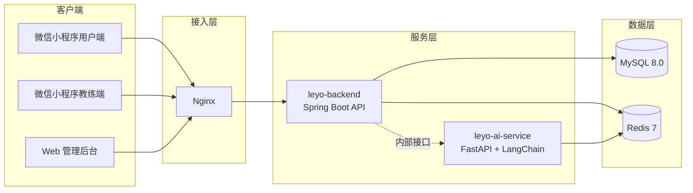

# 乐游游泳约课系统（leyoSwimming）

[]()
[]()
[]()
[]()
[]()
[]()

> 面向游泳场馆的教练与学员一站式约课 SaaS 平台，覆盖「浏览-购课-预约-上课-记录-退款」完整业务闭环。

---

## 项目简介

**乐游游泳约课系统** 是为游泳教练、学员及场馆运营方设计的数字化约课平台，核心解决传统游泳教学中存在的约课难、排期乱、沟通成本高、课时管理混乱等问题。

### 核心价值

| 角色 | 核心能力 |
|------|----------|
| 学员 | 浏览教练/套餐、购买体验课与正价套餐、预约时段、候补排队、查看上课记录 |
| 教练 | 提交入驻资料、管理可约时段、查看学员预约、确认上课扣课时、提交请假/离职 |
| 管理员 | 审核教练入驻、管理用户/教练/管理员账号、管理套餐模板与订单、处理退款、查看数据看板 |

### 目标平台

- 微信小程序 — 用户端（学员）
- 微信小程序 — 教练端
- Web 后台管理系统 — 管理员端
- 未来可扩展：iOS / Android App

---

## 系统架构



### 架构说明

- **前后端分离**：小程序与 Web 后台通过统一后端 API 交互。
- **多端复用**：用户端与教练端小程序基于同一套 Taro + React 技术栈，共享 `@leyo/shared` 公共包。
- **AI 服务独立**：推荐/对话能力通过 FastAPI + LangChain 独立服务提供，与 Java 后端通过内部 Token 认证接口通信。
- **数据库与缓存**：MySQL 作为业务主库，Flyway 管理版本化迁移；Redis 用于会话、缓存、分布式锁与限流。

---

## 技术栈

### 后端（backend/）

| 技术 | 版本/说明 |
|------|-----------|
| Java | 21 |
| Spring Boot | 3.2.8 |
| Spring Security | JWT + Filter 分端认证（用户/教练/管理员） |
| MyBatis-Plus | 3.5.8（数据访问层） |
| MySQL | 8.0 |
| Redis | 7 + Redisson 3.34.1（分布式锁） |
| Flyway | 数据库版本迁移 |
| Springdoc OpenAPI | 2.5.0（Swagger 文档） |
| JJWT | 0.12.6 |
| MapStruct | 1.5.5.Final |
| 测试 | JUnit 5、Mockito、Testcontainers、JaCoCo |

### 用户端小程序（miniapp-user/）

| 技术 | 版本/说明 |
|------|-----------|
| Taro | 4.x |
| React | 18.x |
| TypeScript | 5.x |
| SCSS | 样式方案 |
| 状态管理 | Zustand |
| 测试 | Jest + React Testing Library |
| 适配 | 375px 基准 rpx 适配小程序；H5 支持 `<768px` 全宽与 `>=768px` 居中 375px |

### 教练端小程序（miniapp-coach/）

| 技术 | 版本/说明 |
|------|-----------|
| Taro | 4.x |
| React | 18.x |
| TypeScript | 5.x |
| SCSS | 样式方案 |
| 状态管理 | Zustand |
| 测试 | Jest |

### 管理后台（web-admin/）

| 技术 | 版本/说明 |
|------|-----------|
| Vue | 3.4.x |
| Vite | 5.x |
| TypeScript | ~5.4 |
| Element Plus | 2.8.x |
| Pinia | 状态管理 |
| TanStack Vue Query | 服务端状态管理 |
| Vue Router | 4.x |
| 测试 | Vitest + Vue Test Utils |

### AI 服务（ai-service/）

| 技术 | 版本/说明 |
|------|-----------|
| Python | 3.11+ |
| FastAPI | 0.111+ |
| LangChain / LangChain-OpenAI | 0.3.x |
| Redis | 会话缓存 |
| 限流 | slowapi |
| 测试 | pytest |

### 基础设施与部署

| 技术 | 说明 |
|------|------|
| Docker / Docker Compose | 本地开发与生产容器化部署 |
| Nginx | 反向代理与静态资源托管 |
| PowerShell 部署脚本 | `scripts/deploy-first-stage.ps1`，支持 Hybrid 与 Native 两种部署模式 |
| systemd | Native 模式下托管 Java 后端与 AI 服务 |

---

## 项目结构

```
leyoSwimming/
├── AGENTS.md                     # AI Agent 协作规范
├── readme.md                     # 本文件
├── backend/                      # Spring Boot 后端服务
│   ├── src/main/java/...         # 控制器 / 服务 / 仓库 / 实体 / DTO
│   └── src/main/resources/db/migration/  # Flyway 迁移脚本
├── miniapp-user/                 # 微信小程序 - 用户端
├── miniapp-coach/                # 微信小程序 - 教练端
├── web-admin/                    # Vue 3 管理后台
├── ai-service/                   # FastAPI + LangChain AI 推荐服务
├── shared/                       # 跨端共享包（类型、常量、工具、OpenAPI 契约）
├── deploy/                       # Docker Compose 与 Nginx 配置
├── scripts/                      # 部署、诊断、数据初始化脚本
├── docs/                         # 产品与开发文档
│   ├── prd/prd.md                # 产品需求文档（唯一最终版）
│   ├── stories/                  # 用户故事库
│   ├── spec/                     # 规格说明
│   ├── figma/page-spec/          # 页面规格与 Calicat 设计稿关联
│   └── tech/                     # 技术标准与开发指南
├── openspec/                     # OpenSpec 变更管理
└── tools/                        # 辅助工具脚本
```

---

## 快速开始

### 环境要求

- JDK 21
- Node.js >= 20.x
- Python 3.11+（AI 服务）
- MySQL 8.0
- Redis 7
- 微信开发者工具（小程序调试）

### 方式一：Docker Compose 一键启动

```bash
cd deploy
cp .env.example .env
# 编辑 .env 填入数据库、Redis、JWT、LLM 等配置
docker compose up -d
```

服务说明：

| 服务 | 端口 | 说明 |
|------|------|------|
| MySQL | 3306 | 业务数据库 |
| Redis | 6379 | 缓存与会话 |
| backend | 8080 | Java 后端 API |
| ai-service | 8000 | AI 推荐服务 |
| nginx | 80 | 统一入口 |

### 方式二：本地分模块启动

1. 启动 MySQL 与 Redis（建议 Docker 或本地安装）。
2. 初始化/迁移数据库：

```bash
cd backend
./mvnw flyway:migrate
./mvnw spring-boot:run
```

3. 启动 AI 服务（可选，需配置 LLM API Key）：

```bash
cd ai-service
cp .env.example .env
# 编辑 .env 填入 LLM_API_KEY 等
python -m venv .venv
source .venv/bin/activate  # Windows: .venv\Scripts\activate
pip install -r requirements.txt
python app/main.py
```

4. 启动 Web 管理后台：

```bash
cd web-admin
npm install
npm run dev
```

5. 启动用户端小程序（H5 调试）：

```bash
cd miniapp-user
npm install
npm run dev:h5
```

6. 教练端小程序（H5 调试）：

```bash
cd miniapp-coach
npm install
npm run dev:h5
```

### 生产部署

使用 `scripts/deploy-first-stage.ps1` 进行远程部署，支持两种模式：

- **Hybrid 模式**：MySQL / Redis / backend / Nginx 通过 Docker 部署，AI 服务本地运行。
- **Native 模式**：所有服务通过 apt/systemd 原生部署在 Ubuntu 主机上。

```powershell
.\scripts\deploy-first-stage.ps1 -ServerIP <your-server-ip>
```

脚本特性：

- 多镜像源自动轮询拉取 Docker 镜像（腾讯云 / DaoCloud / 网易云 / USTC）。
- 自动生成 systemd unit 文件与 `nginx-native.conf`。
- 检测本地构建产物并提示是否重新构建。
- 通过 tar.gz + SCP + 服务端解压方式稳定上传目录。

---

## 核心亮点

### 1. 设计驱动开发（Calicat First）

- 所有前端页面以 Calicat 设计稿为唯一视觉来源，page-spec 只描述交互与业务规则。
- 静态资源（Logo、图标、插画）优先从设计稿导出，避免 CSS 重绘与视觉还原偏差。
- 每个页面开发前输出 `design-tokens.json` 与 `calicat-overrides.scss`，确保多端视觉一致。

### 2. 规范化需求与开发流程（OpenSpec + TDD）

- 用户故事通过 OpenSpec 变更流程管理，产出 proposal / spec / design / tasks 四件套。
- 所有新功能、Bug 修复、重构强制遵循 RED-GREEN-IMPROVE 的 TDD 流程。
- 测试覆盖率目标 >= 80%，状态机与核心业务流程优先达到 100%。

### 3. 强状态机驱动的业务核心

- 用户身份状态机：游客 / 注册用户 / 学员。
- 套餐状态机：未上架 / 已上架 / active / exhausted / expired / refunded。
- 订单状态机：待支付 / 已支付 / 已取消 / 退款审批中 / 退款处理中 / 已退款 / 退款被拒。
- 教练入驻与离职流程、预约/候补/签到流程均由状态机严格约束。

### 4. 安全与隐私优先

- 手机号与身份证号采用 AES 加密 + 随机 IV，密文不重复；手机号通过哈希列支持查询。
- JWT 密钥与加密密钥均通过环境变量注入，禁止硬编码。
- 三端独立认证 Filter：用户端、教练端、管理员端分别鉴权，避免越权。
- 文件上传增加魔数校验，不仅依赖 Content-Type。

### 5. 高并发与一致性保障

- 使用 Redisson 实现分布式锁，覆盖手机号换绑、套餐购买、预约扣减等关键路径。
- 幂等键采用 `actorType:actorId:key` 命名空间，事务异常时释放 Redis 锁。
- 可空字段使用 `updateStrategy = FieldStrategy.IGNORED`，避免误清空。

### 6. AI 智能推荐助手

- 独立的 AI 服务基于 FastAPI + LangChain 构建。
- 支持教练推荐、套餐推荐、用户画像查询、已购套餐查询等 Tool-Calling 能力。
- 会话消息通过 Redis 持久化，支持限流与历史会话列表。

### 7. 完整的订单与退款体系

- 订单号格式 `O-YYYYMMDD-xxx`，区分购买订单与退款订单。
- MVP 阶段使用 MockPaymentGateway 自动完成支付与退款回调。
- 管理员可在后台审批退款、修改退款金额；驳回后套餐自动恢复 active。

### 8. 代码质量与工程化

- 后端：Constructor Injection、Record DTO、MapStruct、JaCoCo 覆盖率、Flyway 迁移。
- 前端：ESLint + Prettier + Stylelint，组件化与 Hooks 规范，响应式适配。
- 共享包 `@leyo/shared`：统一类型、常量、工具函数，并通过 OpenAPI 生成前端契约类型。

---

## 文档导航

| 文档 | 路径 | 说明 |
|------|------|------|
| 产品需求文档 | [docs/prd/prd.md](docs/prd/prd.md) | MVP 范围、状态机、业务规则、决策清单 |
| API 规范 | [docs/tech/api-convention.md](docs/tech/api-convention.md) | RPC over HTTP，统一 POST，URL 命名规范 |
| 前端开发标准 | [docs/tech/frontend-development-standards.md](docs/tech/frontend-development-standards.md) | 响应式、Calicat 还原、组件规范 |
| AI 助手开发计划 | [docs/tech/ai-assistant-dev-plan.md](docs/tech/ai-assistant-dev-plan.md) | AI 服务架构与接口设计 |
| 用户故事索引 | [docs/stories/](docs/stories/) | 按 US 编号组织的用户故事、技术设计、测试计划 |
| 页面规格 | [docs/figma/page-spec/](docs/figma/page-spec/) | 前端页面规格与 Calicat 设计稿关联 |
| AI 协作规范 | [AGENTS.md](AGENTS.md) | AI Agent 必读规则与 Skill 触发条件 |

---

## 贡献指南

本项目采用产品经理与 AI Agent 协作的开发模式，所有代码变更需遵循：

1. 先阅读 [AGENTS.md](AGENTS.md)。
2. 新功能/修复强制走 TDD 流程。
3. 代码修改后触发 code-reviewer 进行审查。
4. 前端页面修改需通过 visual-reviewer 视觉还原检查。
5. 默认不主动推送到 GitHub，仅在明确指令下执行同步。

---

## License

TBD

---

<p align="center">
  <sub>Built by leyoSwimming Team</sub>
</p>
